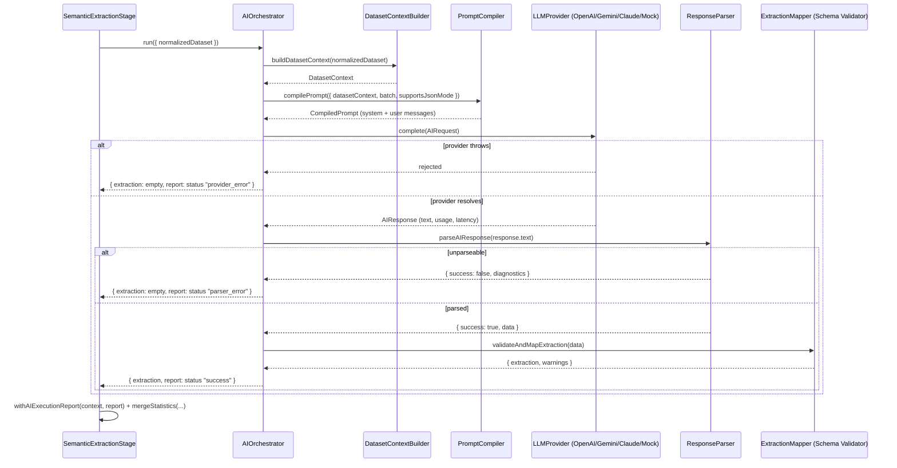

# AI Orchestration Platform

This module replaces the Semantic Extraction placeholder from Volume 2 with a
real, multi-provider AI execution layer. It is pure TypeScript — no Express,
no HTTP — so every piece (prompt compilation, a provider adapter, the
response parser, the schema validator) is constructible and testable on its
own, and the pipeline stage that calls it (`SemanticExtractionStage`) only
depends on the `AIOrchestrator` class, never on OpenAI/Gemini/Claude directly.

## Design principles

1. **Provider independence.** Everything upstream of a provider adapter
   (`AIOrchestrator`, the prompt compiler, the response parser) depends only
   on the `LLMProvider` interface and `ProviderCapabilities` flags — never on
   which provider is configured. Switching providers is a config change
   (`AI_PROVIDER` + its API key) in `provider-registry.ts`, nowhere else.
2. **Capability-driven, not identity-driven.** The prompt compiler adapts to
   `provider.capabilities.supportsJsonMode`, not to "is this Claude?" — a new
   provider with a new capability profile needs no branching elsewhere.
3. **Compile prompts at runtime, never cache them.** `compilePrompt()` is a
   pure function of dataset context + batch + capabilities. Nothing persists
   a "final prompt" — every call is reproducible from its inputs and
   `PROMPT_VERSION`.
4. **Structural validation, not business validation.** The response parser
   and `validateAndMapExtraction()` check _shape_ (valid JSON, expected keys,
   enum membership) — they are explicitly not the future Validation & Trust
   Engine. An invalid `crm_status` becomes a warning and a null value here;
   it never rejects a whole record, and confidence is a trivial
   present/absent flag, not a real score.
5. **A failed AI call is data, not a crash.** Provider errors, timeouts, and
   unparseable responses all become a typed `AIExecutionReport` with a
   `status`, never an uncaught throw — `AIOrchestrator.run()` always resolves.
6. **No retries, no parallel batches, this volume.** `AIConfig.retryPolicy`
   and the `AIBatch`/`BatchContext`/`BatchResult` interfaces in
   `contracts/batch.ts` exist so a future volume can add retry and concurrent
   batch execution without changing this volume's contracts — today, one
   call is one dataset's records, attempted once.

## Folder structure

```text
ai/
  contracts/          LLMProvider, AIRequest/AIResponse, ProviderCapabilities,
                       AIExecutionReport, AIBatch/BatchContext/BatchResult
                       (interfaces only, no concurrency), AIProviderError +
                       classifyProviderError
  schema/              The 15-field CRM output schema (CRM_OUTPUT_FIELDS,
                       CRM_STATUS_VALUES, DATA_SOURCE_VALUES) + the prompt-facing
                       schema description
  context/             DatasetContextBuilder — turns a NormalizedDataset into a
                       compact per-column summary (type hint, samples, null ratio)
                       by reusing Volume 4's per-cell NormalizedField.details,
                       never re-analyzing the raw values
  prompt/              prompt-sections.ts (7 pure section builders: Identity,
                       Mission, Business Rules, Dataset Context, Examples,
                       Output Schema, Current Batch), example-registry.ts
                       (7-category few-shot library + deterministic selection),
                       prompt-compiler.ts (compiles system + user messages)
  response/            response-parser.ts (markdown/prose stripping, JSON
                       isolation, never repairs invalid JSON), extraction-mapper.ts
                       (structural schema validation → SemanticExtractionResult)
  providers/           openai-provider.ts, gemini-provider.ts, claude-provider.ts
                       (real SDK adapters), mock-provider.ts (deterministic,
                       network-free — parses its own prompt's Current Batch
                       section and pattern-matches fields), provider-registry.ts
                       (the only place a concrete provider class is chosen)
  orchestrator/        AIOrchestrator (ties everything together), token-estimator.ts
                       (~4 chars/token estimate + illustrative per-model USD pricing)
  shared-state.ts       Typed read/write accessors for the AIExecutionReport
                       carried on PipelineContext.sharedState
```

## Execution flow



`SemanticExtractionStage` translates the orchestrator's result onto the
pipeline's `StageResult` contract: `status !== "success"` becomes
`fatal_failure` (no retry engine exists yet, so a failed AI call halts the
run like any other unrecoverable stage failure); `status === "success"` with
warnings becomes `warning`, otherwise `success`.

## Provider abstraction

| Provider | `supportsJsonMode` | `maxContextTokens`    | Notes                                                                                                                                                                                                                        |
| -------- | ------------------ | --------------------- | ---------------------------------------------------------------------------------------------------------------------------------------------------------------------------------------------------------------------------- |
| OpenAI   | true               | 128,000               | `response_format: {type: "json_object"}`                                                                                                                                                                                     |
| Gemini   | true               | 1,000,000             | `responseMimeType: "application/json"`                                                                                                                                                                                       |
| Claude   | false              | 200,000               | No native JSON mode — the prompt compiler adds an extra strictness reminder to the output-schema section when `supportsJsonMode` is false                                                                                    |
| Mock     | true               | effectively unbounded | Deterministic, network-free — parses its own compiled prompt's Current Batch JSON and pattern-matches each cell to a CRM field using the same detectors as the Normalization Engine (`pipeline/ingestion/pattern-detectors`) |

Every real SDK's thrown errors are mapped onto one structured type via
`classifyProviderError()`, keyed off an HTTP-like `status` the three SDKs all
attach: 401/403 → `AUTHENTICATION_FAILURE`, 429 → `QUOTA_ERROR` or
`RATE_LIMIT` (by sniffing "quota" in the message), 404 → `UNSUPPORTED_MODEL`,
408/504 → `PROVIDER_TIMEOUT`, `AbortError` → `PROVIDER_TIMEOUT`, anything
else → `UNKNOWN_PROVIDER_ERROR`.

## Configuration

`config/ai-config.ts`'s `loadAIConfig()` mirrors `config/index.ts`'s
fail-fast philosophy, read once at startup:

| Env var                                                | Default                                        | Notes                                                                                                                                                                                                                               |
| ------------------------------------------------------ | ---------------------------------------------- | ----------------------------------------------------------------------------------------------------------------------------------------------------------------------------------------------------------------------------------- |
| `AI_PROVIDER`                                          | `mock`                                         | Zero-config, zero-cost default — the app and its tests never need a real API key to run. If explicitly set to `openai`/`gemini`/`claude` without the matching key, `loadAIConfig` throws rather than silently falling back to Mock. |
| `AI_MODEL`                                             | provider-specific default (e.g. `gpt-4o-mini`) |                                                                                                                                                                                                                                     |
| `AI_TEMPERATURE`                                       | `0.2`                                          | 0–2                                                                                                                                                                                                                                 |
| `AI_MAX_TOKENS`                                        | `4096`                                         |                                                                                                                                                                                                                                     |
| `AI_TIMEOUT_MS`                                        | `45000`                                        |                                                                                                                                                                                                                                     |
| `OPENAI_API_KEY` / `GEMINI_API_KEY` / `CLAUDE_API_KEY` | unset                                          | Required only if `AI_PROVIDER` selects that provider                                                                                                                                                                                |

## Diagnostic endpoint

`POST /ai/extract` (`apps/api/src/modules/ai/`) runs Upload → CSV Parsing →
Normalization → Semantic Extraction directly through the same stage classes
`createPipelineRunner()` wires up, and returns the extracted records plus the
full `AIExecutionReport` (provider, model, tokens, estimated cost, timing,
warnings — never the compiled prompt or the provider's raw response text).
It exists because `PipelineRunner`'s Validation and Aggregation stages are
still not-yet-implemented placeholders that would otherwise always halt a
full run — this endpoint makes the AI layer observable over HTTP ahead of
those later volumes. See `apps/api/src/modules/ai/README.md`.

## Testing

Every test lives colocated next to its source (`*.test.ts`) and never calls a
real provider's network API. `AIOrchestrator` and `SemanticExtractionStage`
are tested against a hand-written fake `LLMProvider`; `MockProvider` is
tested directly since it is inherently network-free. The three real SDK
adapters (`openai-provider.ts`, `gemini-provider.ts`, `claude-provider.ts`)
are intentionally left without dedicated unit tests — their only
provider-specific logic is request/response field mapping, verified once at
compile time by `tsc`, and their shared error-handling path
(`classifyProviderError`) has full coverage in `contracts/ai-error.test.ts`.

## Not implemented in this volume

Per scope: no business rule validation (real confidence scoring, trust
bands), no semantic memory, no retry engine (interfaces exist —
`AIRetryPolicy`, `AIBatch`/`BatchContext`/`BatchResult` — but nothing loops
or runs batches concurrently), no repair engine (`response-parser.ts`
deliberately never attempts to fix invalid JSON, only to isolate it), no
human review. `ValidationStage` and `AggregationStage` remain the Volume 2
placeholders; the real `POST /import` flow will route through
`PipelineRunner` once those land.
