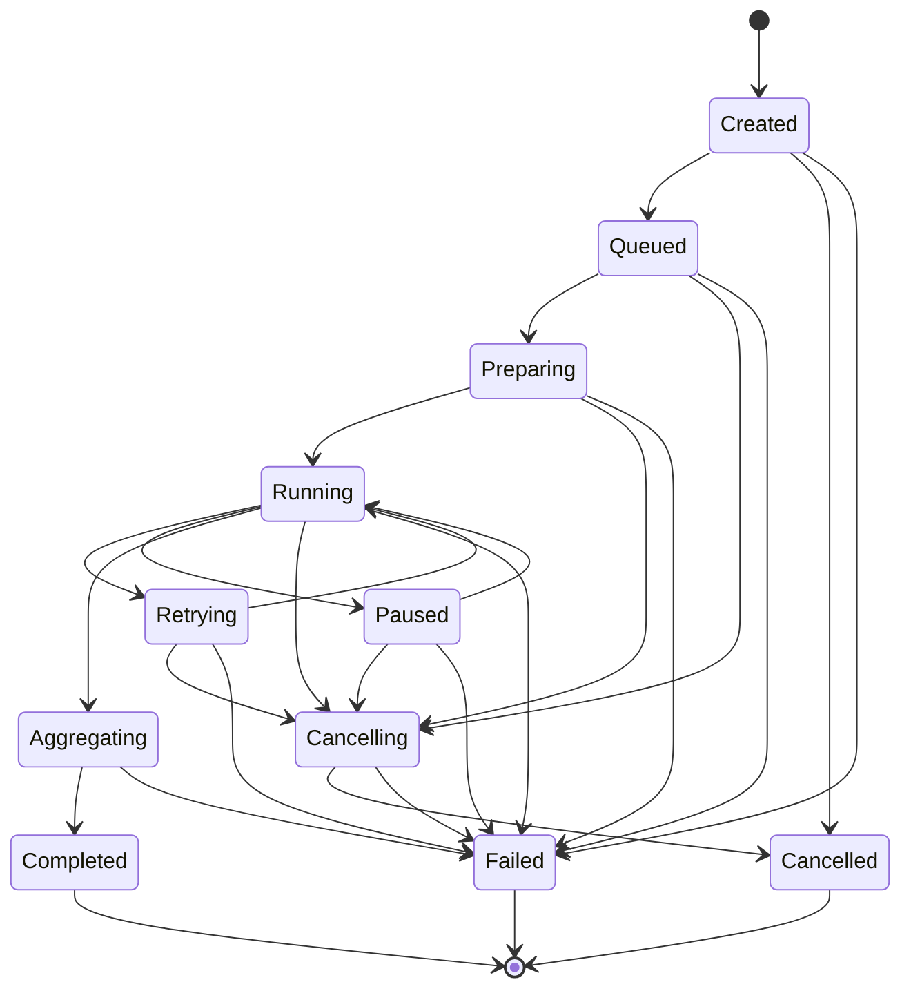

# Execution Platform

Determines **how** the pipeline executes — batching, concurrency, progress,
retries, timeouts, aggregation. It is not responsible for **what** gets
validated or how a CRM field gets extracted; the Execution Engine knows
nothing about CRM business rules. Every business component (Normalization,
the Prompt Engineering Platform, the Trust Layer) already exists from earlier
volumes and runs through this layer unchanged — extended, never rewritten.

Not:

```text
Pipeline → Execution
```

But:

```text
Execution Request
  → Execution Context
  → Batch Scheduler        (splits a ParsedDataset into ordered, independent batches)
  → Worker Pool             (config.workerCount workers pull batches off one shared queue)
  → Pipeline Runner          (each worker: Normalization -> Semantic Analysis/Prompt
                               Compilation/AI Execution -> Trust Layer, reusing the
                               existing stage classes — nothing here reimplements them)
  → Retry Coordinator          (architecture only; no policy ships this volume)
  → Progress Tracker             (pure snapshot function, called on demand)
  → Aggregation Engine             (collects every batch's Trust Layer output into one ImportResult)
  → Execution Report
```

## Folder structure

```text
execution/
  types.ts                    WorkerStatus, WorkerHandle, ExecutionTiming, ExecutionMetadata
  errors/
    execution-errors.ts        IllegalExecutionStateTransitionError, ExecutionTimeoutError, ExecutionCancelledError
  state/
    execution-state.ts         ExecutionState enum + legal transitions (mirrors import-state.ts)
  config/
    execution-config.ts        ExecutionConfig, dev/production/enterprise presets, loadExecutionConfig()
  context/
    execution-context.ts       ExecutionContext — immutable, clone-on-mutate (mirrors PipelineContext)
  batch/
    batch-model.ts              ExecutionBatch, BatchExecutionResult, BatchExecutionStatus
    batch-scheduler.ts           scheduleBatches() — splits ParsedDataset.rows by config.batchSize
  cancellation/
    cancellation-token.ts        Cooperative cancellation (AbortSignal-shaped)
  events/
    execution-event.ts           ExecutionEvent union (ExecutionStarted, BatchCreated, ...)
    execution-event-bus.ts        In-process pub/sub (mirrors PipelineEventBus)
  worker/
    worker.ts                    Worker — runs one batch through Normalization -> AI -> Trust Layer
    worker-pool.ts                 WorkerPool — N workers pulling off one shared queue
  retry/
    retry-coordinator.ts          Retry Queue + Metadata + Report + Context — no policy yet
  timeout/
    timeout-manager.ts             runWithTimeout(), TimeoutTracker, TimeoutReport
  progress/
    progress-tracker.ts             computeProgress() — pure snapshot function
  metrics/
    execution-metrics.ts             computeExecutionMetrics() — pure rollup over batch results
  aggregation/
    import-result.ts                  ImportResult — the Execution Platform's own final output
    aggregation-engine.ts               aggregateResults() — merges every successful batch
  execution-engine.ts                    ExecutionEngine.run() — ties everything together
  index.ts                                Barrel export
```

## Two state machines, not one

`ExecutionState` (this module) is distinct from `pipeline/context/import-state.ts`'s
`ImportState`. `ImportState` tracks which _data pipeline stage_ one run has
reached (Uploaded → Parsed → Normalized → ...); `ExecutionState` tracks what
the _orchestration layer_ is doing (Queued, Preparing, Running, Retrying,
Paused, Cancelling, Cancelled, Aggregating, Completed, Failed). One execution
can, in principle, span many batches, each internally driving its own worker
through the existing `PipelineStage` contract — `ExecutionState` never
touches `ImportState` and vice versa.



`Retrying` and `Paused` are legal states nothing currently drives an
execution into: the default `RetryPolicy` (`NEVER_RETRY`) never asks the
`RetryCoordinator` to queue anything, and no pause trigger exists yet. Both
exist so a future volume adds behavior, not a new state machine.

## Why the Batch Scheduler splits _before_ normalization

The spec's own worker step list — "Normalization → Semantic Analysis →
Prompt Compilation → AI Execution → Trust Layer" — puts Normalization inside
what a worker does per batch, not something that runs once globally first.
So `scheduleBatches()` slices `ParsedDataset.rows` (CSV-Parsing's own output,
still semantically raw), and each `Worker` runs `NormalizationStage` on its
own slice as the first step of its pipeline. This means Semantic
Analysis — which internally profiles column statistics (uniqueness,
entropy) — sees only its own batch's rows, not the whole file. That's a
real, accepted trade-off for a worker-pool design, not an oversight: the
spec explicitly asks for exactly this per-worker step sequence, and
"adaptive batch sizing" (a batch size chosen to keep the Semantic
Intelligence Engine's sample large enough) is explicitly listed as **future**
work — "prepare interfaces... do not implement adaptive behaviour yet."

`ai/contracts/batch.ts`'s `AIBatch`/`BatchContext`/`BatchResult` types are
deliberately **not** reused here — they anticipate a narrower,
post-normalization AI-call batch that nothing in the codebase constructs
today, and they don't fit the Scheduler's pre-normalization granularity.
They're left exactly as they were, still available for whatever volume
their original comment anticipated.

## Worker independence

"No worker should know about another worker" is structural, not just a
comment: `Worker` holds only its own `workerId` and a `WorkerStageSet` — no
reference to the pool, no reference to other workers. `WorkerPool` achieves
`config.workerCount` concurrency with a plain shared counter (`nextIndex++`)
each worker's loop increments synchronously before its first `await` — safe
without a lock because JS has no true parallelism, only interleaved async
execution. This is the same "N consumers, one counter" pattern
`p-limit`-style libraries use internally, implemented in-process with zero
external dependencies (no Redis, no BullMQ, no Kafka — explicitly out of
scope).

## Cancellation and timeout share one mechanism

`ExecutionEngine.run()` implements `config.executionTimeoutMs` by starting a
timer that calls `cancellationToken.cancel(...)` if it fires — the exact
same cooperative-cancellation path a caller-initiated cancellation would
take. `WorkerPool` checks `cancellationToken.isCancelled` before claiming
each new batch (never mid-batch), so a timeout or a cancellation both yield
every batch that finished before it fired, never a hard discard of
completed work. Batches that were never dispatched are reconciled into
explicit `"cancelled"` `BatchExecutionResult`s (`reconcileResults()`) rather
than silently vanishing from the final `ImportResult`.

## Partial success

`aggregateResults()` only ever pulls `approvedRecords`/`needsReviewRecords`/
`rejectedRecords`/`skippedRecords` from batches with `status: "completed"`.
A failed (or cancelled) batch contributes to `failedBatches` and to the
top-level `warnings`/`errors` — it never blocks or discards what every other
batch already validated. `ExecutionEngine.run()` reflects this at the state
level too: some batches failing still reaches `ExecutionState.Completed`,
not `Failed` — only a genuine execution-level exception (e.g. `scheduleBatches`
itself throwing on a misconfigured `batchSize`) reaches `Failed`.

## Not implemented in this volume

Per scope: no distributed queue (Redis/BullMQ/Kafka), no horizontal or auto
scaling, no monitoring dashboard, no retry _algorithm_ (the coordinator's
queue/metadata/report/context architecture is real; the policy that decides
_whether_ to retry is `NEVER_RETRY` until a future volume supplies one), no
external event bus (delivery beyond in-process pub/sub — SSE/webhooks/queue
— is future work `ExecutionEventBus` is structured to support without
changing).
