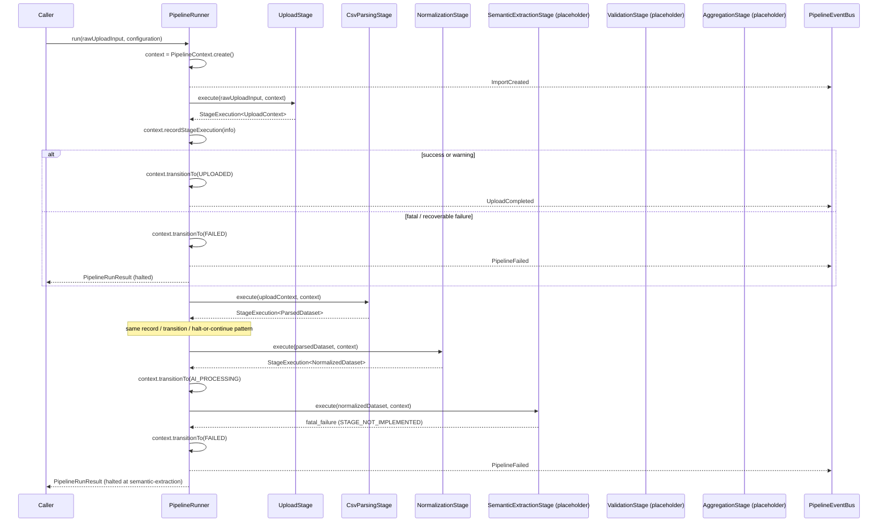

# Pipeline Architecture

This module is the processing engine at the core of AIDE: a fixed sequence of
six stages that turns a raw upload into a validated, aggregated import
result. It is pure TypeScript — no Express, no HTTP, no UI — so every piece
is constructible and testable on its own.

Volume 1 built the surrounding application (Express app, modules, DI
container). Volume 2 (this one) builds the pipeline itself: domain models,
stage contracts, the context that flows through every stage, the import
lifecycle state machine, an internal event system, and the runner that ties
it all together. Only the first three stages (Upload, CSV Parsing,
Normalization) have real logic — the rest are typed placeholders that fail
loudly and deliberately until later volumes replace them.

## Design principles

1. **Input → Pipeline → Output**, not Frontend → Backend → AI. The runner
   never knows AI exists; it only knows it is calling something that
   implements `PipelineStage<TInput, TOutput>`.
2. **Single responsibility per stage.** Each stage has one well-defined input
   type, one output type, and no knowledge of any other stage's internals.
3. **The runner owns the state machine.** No stage calls `context.transitionTo(...)`
   itself — some transitions (entering `AI_PROCESSING`) don't correspond to
   any single stage's output, so centralizing this in the runner avoids an
   inconsistent split of responsibility.
4. **A stage reports outcomes; it does not decide what happens next.** Every
   `execute()` call returns one of four outcomes — `success`, `warning`,
   `recoverable_failure`, `fatal_failure` — and the runner alone decides
   whether to continue or halt.
5. **Context is immutable.** Every stage receives a `PipelineContext` and
   returns a new one. Nothing holds a reference expecting it to mutate,
   which is what makes stages replayable and independently testable.

## Folder structure

```text
pipeline/
  domain/            Immutable entities and value objects (UploadedFile,
                      ParsedDataset, NormalizedDataset, SemanticExtractionResult,
                      ValidationResult, ImportSummary, ...)
  contracts/          StageResult, PipelineStage<TInput, TOutput>, ExecutionReport
  context/            PipelineContext (immutable), ImportState + transition rules
  events/              PipelineEvent union + in-process PipelineEventBus
  errors/               IllegalStateTransitionError, StageNotImplementedError
  stages/
    upload/                     real: verifies and wraps a raw upload
    csv-parsing/                real: delimiter detection, RFC 4180 tokenizer,
                                 header disambiguation, ragged-row recovery
    normalization/               real: whitespace, empty-token, Unicode/encoding
                                 cleanup — structural only, never semantic
    semantic-extraction/         placeholder — AI core volume
    validation/                   placeholder — validation & trust engine volume
    aggregation/                   placeholder — statistics/aggregation volume
    shared/                       stage-result-factory (timing + StageResult builder)
  runner/
    pipeline-runner.ts            the orchestrator
    pipeline-stage-set.ts          the six-stage dependency contract
  create-pipeline-runner.ts        composition root (mirrors core/container.ts)
```

## Execution flow



Today, every real run halts at Semantic Extraction with a `STAGE_NOT_IMPLEMENTED`
`fatal_failure` — that is correct, expected behavior for this volume, not a
bug. The `ExecutionReport` still shows Upload, CSV Parsing, and Normalization
completing successfully with real metadata, which is how this stage of the
pipeline is verified without an AI provider.

## Context flow

`PipelineContext` is created once per run (`PipelineContext.create`) and
threaded through every stage call. Each stage receives it, may read
`configuration` or `sharedState`, and returns a `StageExecution<TOutput>`
containing a (possibly updated) context — typically only `statistics` or
`sharedState` change inside a stage; `currentState` changes only in the
runner. After every stage call the runner folds the stage's `StageExecutionInfo`
into the context via `recordStageExecution`, which appends to `stageHistory`
and merges `warnings`/`errors` into the run-level totals. The final context
(and a derived `ExecutionReport`) is what `PipelineRunner.run()` returns.

## State machine

```text
CREATED → UPLOADED → PARSED → NORMALIZED → AI_PROCESSING → VALIDATED → AGGREGATED → COMPLETED
   ↓          ↓          ↓          ↓             ↓              ↓            ↓
   └──────────┴──────────┴──────────┴─────────────┴──────────────┴────────────┴──→ FAILED
                                (any non-terminal state, on halt)

Any non-terminal state → CANCELLED (not yet triggered by the runner; the
transition exists for a future cancellation endpoint)
```

Transitions are validated by `assertValidTransition` (`context/import-state.ts`);
an illegal transition throws `IllegalStateTransitionError` — a bug, not a
data problem, so it is non-operational and never exposed to a client as-is.

## Stage responsibilities

| Stage               | Input                      | Output                     | Status                                                                                         |
| ------------------- | -------------------------- | -------------------------- | ---------------------------------------------------------------------------------------------- |
| Upload              | `RawUploadInput`           | `UploadContext`            | Real — verifies the request, wraps it as `UploadedFile`                                        |
| CSV Parsing         | `UploadContext`            | `ParsedDataset`            | Real — delimiter detection, quote-aware tokenizing, header disambiguation, ragged-row recovery |
| Normalization       | `ParsedDataset`            | `NormalizedDataset`        | Real — whitespace, empty-token, Unicode/encoding cleanup                                       |
| Semantic Extraction | `NormalizedDataset`        | `SemanticExtractionResult` | Placeholder — AI core volume                                                                   |
| Validation          | `SemanticExtractionResult` | `ValidationResult`         | Placeholder — validation & trust engine volume                                                 |
| Aggregation         | `ValidationResult`         | `ImportSummary`            | Placeholder — statistics/aggregation volume                                                    |

## Testability

Every stage is a plain class implementing `PipelineStage<TInput, TOutput>`.
None of them import Express, `http`, or anything from `apps/web`. A stage can
be instantiated and called directly:

```ts
const stage = new CsvParsingStage();
const context = PipelineContext.create("test-import", DEFAULT_PIPELINE_CONFIGURATION);
const { result } = await stage.execute(uploadContext, context);
```

`PipelineRunner` takes its six stages through the `PipelineStageSet`
constructor parameter, so a test can substitute a stub for any stage
(e.g. a `SemanticExtractionStage` stub that returns a canned `success`) without
touching the runner or any other stage.

## Not implemented in this volume

Per scope: no AI calls, no prompt engineering, no business rules, no CRM
mapping, no batching, no retry logic. `StageOutcome` reserves
`recoverable_failure` for a future retry-aware runner, but today the runner
treats it identically to `fatal_failure` (halt) — see the comment on
`StageOutcome` in `contracts/stage-result.ts`. The pipeline is also not wired
to any HTTP route yet; `apps/api/src/modules/{upload,preview,import}` remain
the Volume 1 placeholders untouched. Wiring `POST /preview` to
`createPipelineRunner()` is a natural next step in a future volume, once
Semantic Extraction has a real implementation worth exposing.
