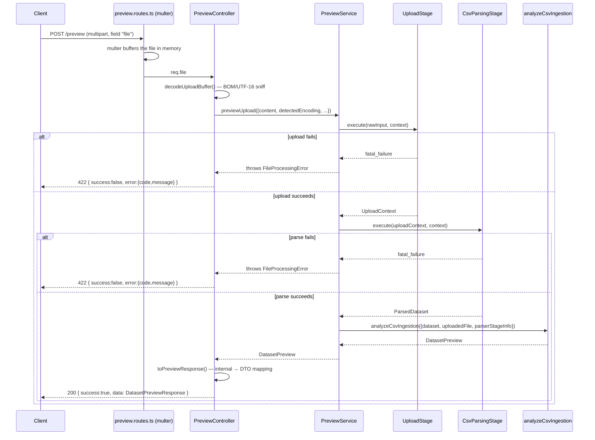

# CSV Ingestion Engine

This module is the analysis layer that powers `POST /preview`: it takes an
already-parsed dataset (Volume 2's `CsvParsingStage` output) and produces
everything a preview UI needs — normalized headers, per-column profiles,
dataset-level metadata, AI-free "likely field type" hints, and a
preview-sized row window — in one composed call.

It is framework-free (no Express, no HTTP types) and sits **outside** the
`PipelineRunner`'s fixed six-stage sequence from Volume 2. That sequence
(Upload → CSV Parsing → Normalization → AI Processing → Validation →
Aggregation) still exists unchanged; this module is invoked directly by the
`/preview` HTTP flow after Upload and CSV Parsing run, and never touches
Normalization or anything past it — preview must stay side-effect-free and
show the file _as parsed_, not as it will eventually be imported.

## Philosophy

Not:

```text
Upload → Parse CSV
```

But:

```text
Upload → File Inspection → CSV Parsing → Dataset Analysis →
Column Profiling → Dataset Metadata → Preview
```

The parser produces two things, not one: **Parsed Records** (the rows, exactly
as Volume 2 already modeled them) and **Dataset Intelligence** (everything in
this module, describing the shape and quality of those records without ever
assigning them semantic meaning).

## Folder structure

```text
pipeline/
  stages/csv-parsing/
    file-inspector.ts        File Inspection: strips a leading BOM, labels encoding
    delimiter-detector.ts    (Volume 2) votes among , ; | \t
    csv-tokenizer.ts         (Volume 2) RFC 4180 tokenizer, now generator-based
    header-disambiguator.ts  (Volume 2, extended) renames exact-duplicate/blank
                              headers; now also reports which columns collided
                              before renaming, via `wasOriginallyDuplicate`
    row-reconciler.ts        (Volume 2) blank-row detection, ragged-row pad/truncate
    csv-parsing-stage.ts     (Volume 2, extended) composes the above; every row now
                              carries rawCells/cells/status/warnings/context

  ingestion/                  This module — everything below is new in Volume 3
    header-engine.ts          Normalizes header text; detects duplicates
    pattern-detectors.ts       Deterministic email/phone/date/numeric regex checks
    column-profiler.ts         Single-pass per-column statistics + type guess
    dataset-profiler.ts         Dataset-level metadata + structural quality score
    dataset-intelligence.ts      Derived "likely X columns" grouping
    preview-generator.ts         Slices to a preview window, assembles the payload
    csv-ingestion-analyzer.ts     Single entry point composing all of the above
```

## Parsing pipeline (File Inspection → CSV Parsing)

**File Inspection** (`file-inspector.ts`) runs first, on the raw content
`CsvParsingStage` receives. Today it does one job: strip a leading UTF-8 BOM
character so it can never corrupt the first header name (a real bug in
Volume 2 — the Normalization stage only cleaned data cells, never headers).
Byte-level encoding detection (telling UTF-8 apart from UTF-16 before the
bytes become a JS string) happens one layer up, in `modules/preview/
encoding-detector.ts` — see "Encoding" below.

**CSV Parsing** (Volume 2, extended) then: detects the delimiter, tokenizes
with a quote-aware RFC 4180 state machine, disambiguates headers, and
recovers ragged rows. What changed this volume:

- The tokenizer (`csv-tokenizer.ts`) is now a generator (`iterateCsvRecords`)
  under the hood; `tokenizeCsv` collects it into an array for the current
  in-memory pipeline. See "Streaming design" below.
- `ParsedRow` gained `rawCells` (exact tokenizer output), `status`
  (`"ok" | "recovered"`), per-row `warnings`, and a `context` extensibility
  bag — previously only the reconciled `cells` array and `rowNumber` existed.
- `ParsedDataset` gained `encoding` and `headerDuplicateFlags`.
- `header-disambiguator.ts` now also returns `wasOriginallyDuplicate`, a flag
  per original column saying whether its _raw_ header text collided with
  another's — necessary because after renaming ("Email" → "Email (2)") the
  two strings no longer look related, and the Header Engine's own duplicate
  detection needs that fact preserved.

All of this is additive — `NormalizationStage` and every other Volume 2
consumer still only reads `.cells`/`.rowNumber`/`.headers`/`.rows` and is
unaffected.

## Encoding

CSV files may be UTF-8, UTF-8 with a BOM, or UTF-16 (LE or BE, both usually
BOM-prefixed). `modules/preview/encoding-detector.ts` sniffs the BOM on the
raw upload `Buffer` — the one point where bytes become the JS string the
rest of the pipeline works with — and decodes accordingly:

| BOM bytes  | Encoding    | Decoding                                                             |
| ---------- | ----------- | -------------------------------------------------------------------- |
| `FF FE`    | UTF-16LE    | `Buffer#toString("utf16le")`                                         |
| `FE FF`    | UTF-16BE    | byte-pairs swapped, then `"utf16le"` (Node has no native BE decoder) |
| `EF BB BF` | UTF-8 (BOM) | `"utf8"`, BOM bytes sliced off                                       |
| _(none)_   | UTF-8       | `"utf8"`                                                             |

The detected label flows through as `RawUploadInput.detectedEncoding` →
`UploadedFile.detectedEncoding` → `CsvParsingStage`'s File Inspection step,
which uses it verbatim instead of re-guessing from an already-decoded string
(you cannot tell UTF-8 from UTF-16 once both are just JS strings).

## Header Engine

`header-engine.ts` — normalization only, never semantic mapping. Turns
`"Customer Name"` into `customer_name`: NFC-normalize, replace non-alphanumeric
runs with `_`, lowercase, trim/collapse underscores. The original header text
is always preserved alongside the normalized form.

Duplicate detection combines two signals:

1. **Exact raw-text duplicates** — "Email" appearing twice — carried forward
   via `ParsedDataset.headerDuplicateFlags` (see above), since Volume 2's
   disambiguator already renamed them before this module ever sees them.
2. **Near-duplicates after normalization** — "Email Address" and
   "email-address" are different raw text but the same normalized key.

Either signal sets `isDuplicate: true`. This is informational only — it never
merges or drops a column.

## Column Profiling

`column-profiler.ts` makes one pass over every row (not once per column) and
updates a running accumulator per column index, so it never materializes a
column-major copy of the dataset. Per column:

- **Structural stats**: unique value count, missing count, null %, average /
  max / min length (over non-empty values), up to 5 distinct sample values.
- **Pattern detection** (`pattern-detectors.ts`, all regex-only, no AI):
  `looksLikeEmail`, `looksLikePhone` (7-15 digits, only `+()-.` punctuation
  allowed, and explicitly _not_ a value that also looks like a dashed date —
  `"2026-01-15"` is digits-and-dashes and would otherwise satisfy the phone
  shape too), `looksLikeDate` (ISO and a few common slash/dot/dash formats),
  `looksLikeNumeric` (handles thousands separators, a single leading `$`, a
  trailing `%`).
- **Type guess**: whichever pattern matches at least 50% of the column's
  non-empty values, by the highest ratio; `"text"` if nothing clears that bar,
  `"empty"` if the column has no non-empty values at all. `detectedPatterns`
  flags are independent of the winning guess — a column can be guessed
  `"phone"` while `potentialNumeric` is also `true`, if both cross 50%.

## Dataset Metadata

`dataset-profiler.ts` computes dataset-level facts, including a **parse-time
structural quality score** (0-100): starts at 100 and subtracts weighted
penalties for malformed rows (40%), blank rows (10%), missing cells (30%),
and duplicate headers (20%), each scaled by their ratio in the dataset. This
is deliberately _not_ the same thing as the future Validation & Trust
Engine's confidence score — it measures how cleanly the file parsed
structurally, not whether the data is semantically correct.

`estimatedComplexity` is a simple `totalRows × totalColumns` cell-count
threshold (`≤10,000` low, `≤200,000` medium, else high) — a heuristic for
UI decisions (e.g. warn before rendering a huge preview), not a performance
guarantee. `estimatedMemoryUsageBytes` is similarly a rough heuristic
(`sizeBytes × 3`, accounting for JS string/object overhead), documented as
an estimate rather than a measurement.

## Dataset Intelligence

`dataset-intelligence.ts` is a **pure projection** over the column profiles
already computed — it runs no analysis of its own. It groups columns by
their `dataTypeGuess` into `likelyEmailColumns`, `likelyPhoneColumns`, etc.,
each carrying the column's own confidence score. These are hints for a human
or a future prompt to read; per the assignment's explicit scope boundary,
**this module never maps a column to a CRM field** — that begins at the
(still unimplemented) Semantic Extraction stage.

## Streaming design

The tokenizer's core (`iterateCsvRecords`) is a generator, yielding a record
the moment it completes rather than requiring the whole file to be tokenized
first. `tokenizeCsv` collects it into an array today because `ParsedDataset.
rows` must be a materialized array for the rest of the (in-memory) Volume 2
architecture — but a future streaming upload path can consume
`iterateCsvRecords` directly, one record at a time, without this file
changing.

This is an honest, partial claim: the upload content itself is still a fully
materialized JS string by the time it reaches the tokenizer (Volume 2's
`RawUploadInput.content: string` contract). True end-to-end streaming — never
holding the whole file in memory, from HTTP bytes through to results — needs
a chunked-upload transport and a `ParsedDataset` representation that doesn't
require a full row array, both out of scope here. What this volume delivers
is the tokenizer boundary already being streaming-shaped, so that future work
is additive rather than a rewrite.

## Preview flow



`PreviewService` reuses Volume 2's `UploadStage` and `CsvParsingStage`
directly — the exact same classes the future full import pipeline will use —
so preview behavior can never silently drift from import behavior. It
constructs its own throwaway `PipelineContext` (`PipelineContext.create`) and
never reaches `PipelineRunner`, since preview only needs the first two stages.

`preview-response-mapper.ts` translates the internal `DatasetPreview` (built
from types in `pipeline/domain` and `pipeline/ingestion`) into the
`DatasetPreviewResponse` DTO published from `@aide/shared-types`, so the
frontend never depends on apps/api's internal module structure — only on the
published wire contract.

## Not implemented in this volume

Per scope: no AI, no semantic mapping, no CRM field mapping, no validation
rules, no business rules, no batch processing. `DatasetIntelligence` produces
hints only. True streaming (chunked upload → chunked parse, never holding
the full file in memory) is architecturally prepared but not implemented —
see "Streaming design" above.
