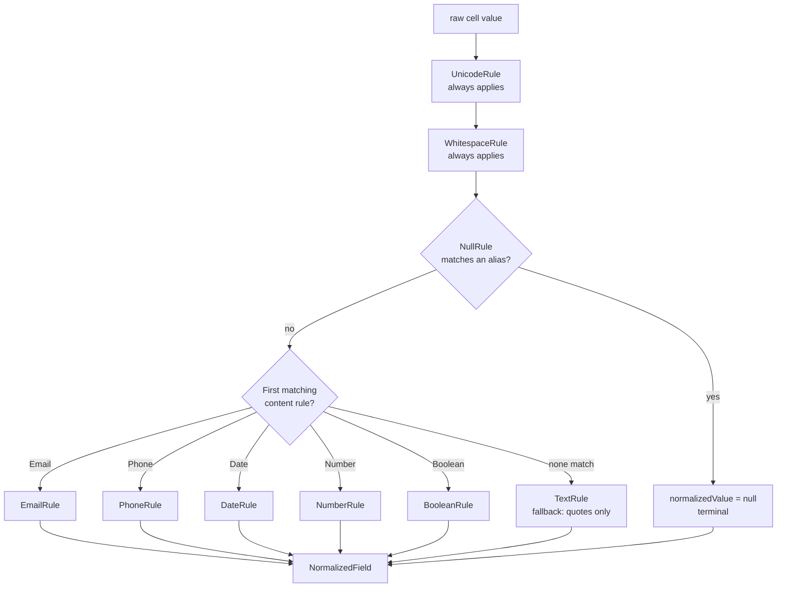

# Data Normalization Engine

This module transforms messy real-world CSV data into a canonical internal
representation, deterministically, before anything AI-related ever sees it.
It is the `NormalizationStage` in Volume 2's fixed six-stage pipeline
(Upload → CSV Parsing → **Normalization** → AI Processing → Validation →
Aggregation) — its external contract is unchanged from Volume 2
(`PipelineStage<ParsedDataset, NormalizedDataset>`); everything in this
volume is a rewrite of what happens _inside_ that stage, plus a much richer
`NormalizedDataset` output.

## Philosophy

The AI should understand **meaning**. The Normalization Engine understands
**formatting**. Whitespace, capitalization-of-quotes, phone punctuation,
email casing, Unicode form, date format, and null-token spelling are all
deterministic problems — solved here, once, so nothing downstream (a future
AI extraction stage, a human reviewer) has to re-derive them from raw text.

## Folder structure

```text
stages/normalization/
  normalization-stage.ts       The pipeline stage: orchestrates the engine
                                over every cell, tallies the dataset-level report
  rule-engine.ts                 FieldNormalizationEngine — runs one cell
                                  through the ordered rule pipeline
  unicode-normalizer.ts           (Volume 2) NFC form, strips BOM/zero-width/control chars
  whitespace-normalizer.ts         (Volume 2) trim, collapse runs, unify line breaks
  empty-token-detector.ts           (Volume 2, extended) configurable null-alias set
  rules/
    normalization-rule.ts             Shared `NormalizationRule` interface
    unicode-rule.ts                    Wraps unicode-normalizer.ts
    whitespace-rule.ts                  Wraps whitespace-normalizer.ts
    null-rule.ts                         Wraps empty-token-detector.ts, terminal
    email-rule.ts                         Trim/lowercase/validate/split-multiple
    phone-rule.ts                          libphonenumber-js — see "Why a library" below
    date-rule.ts                            Hand-rolled, fixed format list, never guesses
    number-rule.ts                           Currency/thousands/percent handling
    boolean-rule.ts                           Narrow alias set, never guesses 0/1
    text-rule.ts                               Fallback: curly quotes only, no forced casing
    location-rule.ts                           Built, tested, NOT auto-wired — see below
    index.ts

pipeline/ingestion/normalization-summary.ts   Preview-facing summary (health
                                               score + capped field-issue list)
                                               — mirrors dataset-profiler.ts's
                                               relationship to CsvParsingStage.
```

## Rule Engine architecture

Every rule implements one common interface:

```ts
interface NormalizationRule {
  readonly id: string;
  canApply(value: string, context: NormalizationRuleContext): boolean;
  apply(value: string, context: NormalizationRuleContext): NormalizationRuleOutcome;
}
```

This is what makes each rule independently constructible and testable —
a unit test instantiates one rule and calls `.apply()` directly, with zero
pipeline machinery involved. `NormalizationRuleContext` (`{header,
columnIndex}`) is carried through for a future column-aware rule to use;
no rule in this volume needs it (see Location Rule below for why one might).

`FieldNormalizationEngine.normalizeValue(rawValue, context)` runs one cell
through the pipeline:



**Universal rules** (Unicode, Whitespace) always run, in that order, on
every cell. **Null** is checked next and is terminal — nothing else needs
to normalize a value that is now `null`. **Content-shape rules** are
mutually exclusive alternatives: the engine tries them in a fixed priority
order and the first whose `canApply()` matches wins; no other content rule
runs on that value. If none match, **Text** is the fallback (quote
normalization only). This ordering is deliberate, not incidental:

- Email → Phone → Date → Number → Boolean. Email/Phone/Date are checked
  first because their shapes are more specific (a phone number is also
  digit-heavy but carries punctuation Number's pattern excludes).
- **Number is checked before Boolean** specifically so a bare `"1"` or
  `"0"` resolves to a number, not a guessed boolean — there is no column
  context here to know "this column means yes/no," so the numerically
  narrower interpretation wins. Boolean's own `canApply` only matches
  word-based aliases (`yes`/`no`/`true`/`false`/`y`/`n`), never bare digits.
- **Phone excludes date-shaped values.** A dashed value like `"2026-01-15"`
  is also digits-and-dashes and would otherwise satisfy Phone's shape —
  `looksLikePhone` (reused from the CSV Ingestion Engine's pattern
  detectors) explicitly defers to Date for those.

A rule that throws is caught inside the engine — see "Error recovery" below.

## Why a library for phone, but not for dates

`PhoneRule` uses `libphonenumber-js` rather than hand-rolled regex.
Correctly parsing international phone numbers — variable national-number
lengths, country calling codes, valid-range checks per country — is a
genuinely hard, well-solved problem; hand-rolling it would be strictly
worse than a well-established library, unlike CSV tokenizing (Volume 2),
which was tractable to hand-roll because it's a closed, well-specified
grammar. `DateRule`, by contrast, only needs to recognize a small,
explicitly enumerated set of formats (ISO, `YYYY/MM/DD`, `DD-MMM-YYYY`,
and numeric `D?/M?/Y` with any of `/ . -`) — that's tractable to hand-roll,
and hand-rolling it keeps the ambiguity-detection logic (see below) fully
auditable rather than dependent on a library's own heuristics.

## Never guess ambiguous data

Two rules explicitly refuse to resolve an ambiguous value rather than
picking a plausible-looking answer:

- **DateRule**: a numeric date like `"05/06/2026"` where both parts are
  ≤ 12 could be read as either day-first or month-first. Neither
  interpretation is preferred — `iso` stays `null`, the original value is
  preserved as `normalizedValue`, `confidence` drops to `0.3`, and an
  `AMBIGUOUS_DATE` warning is attached. Only when one part is
  unambiguously > 12 (so it must be the day) does the rule resolve
  confidently.
- **PhoneRule**: without a leading `+` (or any other signal of source
  country), there is no reliable way to know which country's numbering
  plan a national number belongs to. Rather than guessing, the rule
  extracts digits only (`nationalNumber`), leaves `e164`/`countryCode`
  `null`, drops `confidence` to `0.5`, and attaches a
  `PHONE_COUNTRY_UNKNOWN` warning.

## Location Rule: built, not auto-wired

`LocationRule` (Title Case + whitespace for Country/State/City) is fully
implemented and independently tested, but its `canApply()` always returns
`false`, so the default per-cell pipeline never triggers it. There is no
reliable signal that a bare cell value like `"Bangalore"` _is_ a place name
versus any other short capitalized phrase — that requires column context
this volume doesn't have (semantic mapping is a later, AI-powered volume).
The rule exists so a future column-aware orchestrator — once semantic
mapping identifies which columns are Country/State/City — can call
`LocationRule.apply()` directly on values from those columns.

## Field metadata

Every cell's result is a `NormalizedField`:

| Field             | Meaning                                                                                                                                                                                                                         |
| ----------------- | ------------------------------------------------------------------------------------------------------------------------------------------------------------------------------------------------------------------------------- |
| `header`          | Column name, unchanged from the source                                                                                                                                                                                          |
| `originalValue`   | Exact source text, never mutated                                                                                                                                                                                                |
| `normalizedValue` | Canonical string form, or `null`                                                                                                                                                                                                |
| `appliedRules`    | Rule ids that changed the value, in execution order                                                                                                                                                                             |
| `warnings`        | Structured issues (code + message), if any                                                                                                                                                                                      |
| `status`          | `"unchanged"` \| `"normalized"` \| `"warning"` \| `"failed"`                                                                                                                                                                    |
| `confidence`      | 0–1; 1 = fully confident                                                                                                                                                                                                        |
| `details`         | Present only for content-shape rules — a discriminated union (`kind: "email" \| "phone" \| "date" \| "number" \| "boolean"`) carrying the rule-specific structured payload (e.g. phone's `e164`/`countryCode`/`nationalNumber`) |

Both the original and canonical values are always retained — an audit or a
future review UI must be able to answer "what did the source file actually
say," not just "what did we turn it into."

## Normalization Report

`NormalizedDataset.report` is a dataset-level tally, computed in the same
single pass that builds every field (no second pass over the data):
`totalFields`, `whitespaceNormalizedCount`, `unicodeNormalizedCount`,
`nullValuesDetected`, `emailsNormalized`/`invalidEmails`,
`phonesNormalized`/`invalidPhones`, `datesParsed`/`failedDateParses`,
`numbersNormalized`, `booleansNormalized`, `fieldsWithWarnings`,
`fieldsFailed`.

`pipeline/ingestion/normalization-summary.ts` derives a **preview-facing**
summary from this report: a 0–100 health score (weighted penalty for
warning/failed field ratios) and a capped list (25) of specific
`{rowNumber, header, message, status}` field issues, with a
`totalIssueCount` so a capped list is visible as capped, never silently
truncated. This summary deliberately excludes rule ids and the `details`
payload — those are internal to the engine, not part of what a preview UI
should show a user (`DatasetPreviewResponse.normalization` in
`@aide/shared-types` mirrors this same exclusion).

## Error recovery

Normalization failures never stop the pipeline. Every risky operation
(regex matching, `libphonenumber-js` parsing, `Number()` conversion) is
wrapped by `FieldNormalizationEngine`'s own `try`/`catch`; if a rule throws
unexpectedly, the engine catches it, preserves the original value as both
`originalValue` and `normalizedValue`, sets `status: "failed"`,
`confidence: 0`, and attaches a `NORMALIZATION_RULE_ERROR` warning —
processing continues to the next cell. This is distinct from "invalid but
recognized" data (an obviously malformed email, an ambiguous date), which
gets `status: "warning"` with a best-effort or preserved value, never
`"failed"` — `"failed"` is reserved for genuine internal errors and should
not occur in normal operation. `NormalizationStage` itself always reports
`"success"` or `"warning"` outcome, never `"fatal_failure"` — only an
unrecoverable system failure (caught generically by `PipelineRunner`,
Volume 2) would ever halt the pipeline here.

## Performance strategy

Every record is processed independently, one pass over `dataset.rows`,
one pass over each row's cells — no intermediate column-major copies, no
second pass to compute the report (tallying happens inline as each field
is produced). All regexes are module-scope constants, never recompiled
per cell. This keeps normalization naturally batch/streaming-friendly:
because each record's normalization has no dependency on any other
record, a future volume could chunk `dataset.rows` across workers without
this module changing — the same "streaming-shaped, not yet streaming"
honesty Volume 3 documented for the CSV tokenizer applies here too.

## Not implemented in this volume

Per scope: no AI, no semantic mapping, no CRM field mapping, no business
rules, no validation engine. Location Rule formatting is available but not
auto-applied (see above). Field-level results are per-cell only — merging
"first email primary, rest into a future CRM note" is explicitly deferred
to whatever later volume builds CRM mapping; this volume only produces the
`primary`/`additional` split the spec asks for and stops there.
