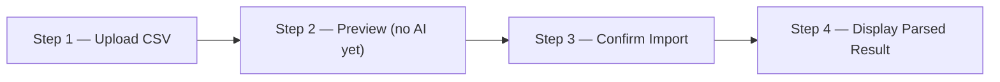

# Chapter 1 — Assignment Specification

## 1. Context

This handbook documents the design and engineering of an AI-powered CSV Importer built for the **GrowEasy** Software Developer assignment (Intern / Full-Time track).


## 2. Objective

Build an **AI-powered CSV Importer** that can intelligently extract CRM lead information from **any valid CSV format**.

> The challenge is not parsing CSV files. The challenge is allowing users to upload CSVs with different column names, layouts, and structures, while the system accurately maps and extracts the required CRM fields using AI.

The application must identify the appropriate fields in an arbitrary CSV and convert them into GrowEasy CRM format.

### 2.1 Example Input Variations

All of the following CSV origins must work:

- Facebook Lead Export
- Google Ads Export
- Excel sheets
- Real Estate CRM exports
- Sales reports
- Marketing agency CSVs
- Manually created spreadsheets

## 3. Functional Requirements

The project consists of both a **Frontend** and a **Backend**.

### 3.1 Frontend Requirements

Create a responsive web application implementing the following four-step workflow.



#### Step 1 — Upload CSV

Allow users to upload a valid CSV file. Examples:

- Drag & Drop upload
- File Picker

#### Step 2 — Preview

After upload:

- Parse the CSV
- Show a preview of uploaded rows
- Display data inside a beautiful responsive table

The table should support:

- Horizontal scrolling
- Vertical scrolling
- Sticky headers (preferred)
- Responsive design

**No AI processing should happen at this stage.**

#### Step 3 — Confirm Import

Provide a Confirm button. Only after confirmation should the frontend call the backend API.

#### Step 4 — Display Parsed Result

The backend returns AI-extracted CRM records. Display the parsed result in another responsive table, showing:

- Successfully parsed records
- Skipped records (if any)
- Total imported
- Total skipped

### 3.2 Backend Requirements

Create APIs that:

1. **Accept CSV Upload.** Accept any valid CSV file. Do not assume column names are fixed.
2. **Parse CSV.** Convert the CSV into records.
3. **AI Extraction.** Send records to an AI model in batches. The AI should intelligently map available fields into GrowEasy CRM format. OpenAI, Gemini, Claude, or any equivalent LLM may be used.
4. **Return Structured JSON.** Return extracted CRM records in JSON format.

## 4. Required CRM Fields

The AI should extract as many of the following fields as possible.

| Field | Description |
|-------|-------------|
| `created_at` | Lead creation date |
| `name` | Lead name |
| `email` | Primary email |
| `country_code` | Country code |
| `mobile_without_country_code` | Mobile number |
| `company` | Company name |
| `city` | City |
| `state` | State |
| `country` | Country |
| `lead_owner` | Lead owner |
| `crm_status` | Lead status |
| `crm_note` | Notes/remarks |
| `data_source` | Source |
| `possession_time` | Property possession time |
| `description` | Additional description |

### 4.1 Sample CRM Records

```text
created_at,name,email,country_code,mobile_without_country_code,company,city,state,country,lead_owner,crm_status,crm_note,data_source,possession_time,description
2026-05-13 14:20:48,John Doe,john.doe@example.com,+91,9876543210,GrowEasy,Mumbai,Maharashtra,India,test@gmail.com,GOOD_LEAD_FOLLOW_UP,Client is asking to reschedule demo,,,
2026-05-13 14:25:30,Sarah Johnson,sarah.johnson@example.com,+91,9876543211,Tech Solutions,Bangalore,Karnataka,India,test@gmail.com,DID_NOT_CONNECT,"Person was busy, will try again next week",,,
2026-05-13 14:30:15,Rajesh Patel,rajesh.patel@example.com,+91,9876543212,Startup Inc,Delhi,Delhi,India,test@gmail.com,BAD_LEAD,Not interested in our services,,,
2026-05-13 14:35:22,Priya Singh,priya.singh@example.com,+91,9876543213,Enterprise Corp,Pune,Maharashtra,India,test@gmail.com,SALE_DONE,"Deal closed, onboarding in progress",,,
```

## 5. AI Extraction Rules

The AI must follow these rules while extracting records.

### 5.1 Allowed CRM Status Values

`crm_status` may only be one of:

- `GOOD_LEAD_FOLLOW_UP`
- `DID_NOT_CONNECT`
- `BAD_LEAD`
- `SALE_DONE`

### 5.2 Allowed Data Source Values

`data_source` may only be one of:

- `leads_on_demand`
- `meridian_tower`
- `eden_park`
- `varah_swamy`
- `sarjapur_plots`

If none match confidently, leave it blank.

### 5.3 Date Format

`created_at` must be convertible using JavaScript:

```js
new Date(created_at)
```

### 5.4 CRM Notes

Use `crm_note` for:

- Remarks
- Follow-up notes
- Additional comments
- Extra phone numbers
- Extra email addresses
- Any useful information that doesn't fit another field

### 5.5 Multiple Emails or Mobile Numbers

If multiple email addresses exist:

- Use the first email.
- Append remaining emails into `crm_note`.

If multiple mobile numbers exist:

- Use the first mobile.
- Append remaining numbers into `crm_note`.

### 5.6 CSV Compatibility

Each record must remain a single CSV row. Avoid introducing unintended line breaks. If line breaks are necessary, escape them appropriately (for example, `\n`) so the CSV remains valid.

### 5.7 Skip Invalid Records

If a record contains **neither** an email **nor** a mobile number, skip that record.

## 6. Evaluation Criteria

Candidates are primarily evaluated on the following.

### 6.1 AI Prompt Engineering

- Ability to extract fields accurately
- Intelligent field mapping
- Handling messy datasets
- Handling ambiguous columns

### 6.2 Backend Quality

- API design
- Clean architecture
- Error handling
- Batch processing
- Maintainable code

### 6.3 Frontend Quality

- Modern UI
- Responsive layout
- Clean UX
- CSV preview experience
- Loading states
- Error handling

### 6.4 Code Quality

- Readability
- Type safety
- Folder structure
- Reusability
- Best practices

### 6.5 Overall Engineering

- Performance
- Edge case handling
- Production readiness

### 6.6 Bonus Points

Additional credit is given for implementing:

- Drag & Drop upload
- Progress indicators during AI processing
- Streaming or incremental parsing
- Retry mechanism for failed AI batches
- Virtualized table for large CSVs
- Dark mode
- Unit tests
- Docker setup
- Deployment using Vercel, Railway, Render, or similar platforms
- Well-written README with setup instructions

## 7. Tech Stack

| Layer | Technology |
|-------|------------|
| Frontend | Next.js |
| Backend | Node.js, Express |
| AI | OpenAI, Gemini, Claude, or any equivalent LLM |
| Database (optional) | Any database if required, or keep the project stateless |

## 8. Submission Requirements

Submit to **varun@groweasy.ai**. The email must include:

- Hosted application URL
- GitHub repository URL
- Position being applied for: Software Developer Intern, or Software Developer (Full-Time)

### 8.1 Final Submission Checklist

Before submitting, ensure the following are included:

- Publicly hosted application
- Public GitHub repository
- README containing setup instructions
- Position applied for (Intern / Full-Time)

---

## Related Chapters

- [Chapter 2 — Solution Analysis & Design Approach](02-solution-analysis.md) — how this specification is analyzed and turned into an engineered solution
- [Chapter 3 — Engineering Roadmap & Methodology](03-engineering-roadmap.md) — the 18-volume roadmap derived from these requirements
- [Chapter 11 — Prompt Engineering & Semantic Intelligence](11-prompt-engineering.md) — implements the AI extraction rules defined here
- [Chapter 13 — Validation, Business Rules & Trust Engine](13-validation-trust-engine.md) — enforces the allowed-value and skip rules from this specification
