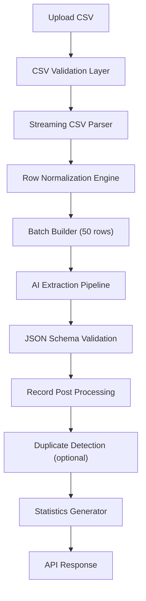
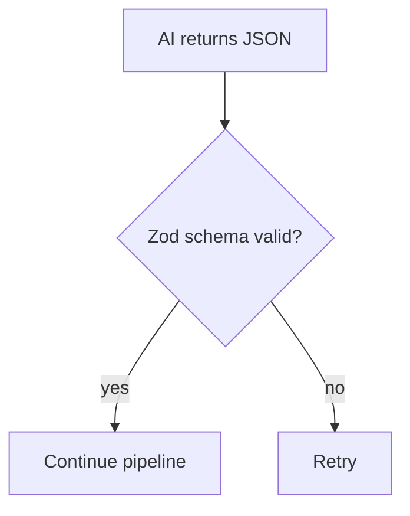
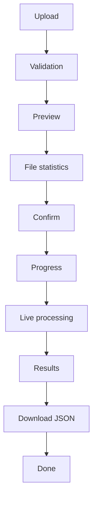

# Chapter 2 — Solution Analysis & Design Approach

## 1. Reading the Assignment Correctly

The assignment in [Chapter 1 — Assignment Specification](01-assignment-specification.md) is not a test of CSV parsing. It tests whether the builder thinks like an engineer building an AI product. Viewed through a senior reviewer's lens, submissions are weighted roughly as follows:

| Area | Weight |
|-------|---------|
| AI Pipeline | ⭐⭐⭐⭐⭐ |
| Backend Architecture | ⭐⭐⭐⭐⭐ |
| Engineering Decisions | ⭐⭐⭐⭐ |
| UI/UX | ⭐⭐⭐⭐ |
| Code Quality | ⭐⭐⭐⭐ |
| Deployment | ⭐⭐⭐ |

The task should therefore not be framed as:

> "Build a CSV importer."

but as:

> "Build a production AI data ingestion pipeline."

## 2. The Real Problem: Schema-Free Semantic Mapping

GrowEasy receives CSVs from thousands of companies, and every company exports CRM data differently.

Example 1:

```text
Customer Name
Email Address
Phone
```

Example 2:

```text
Lead
Mail ID
Contact Number
```

Example 3:

```text
Owner Name
Primary Contact
Cell
```

Example 4:

```text
Lead Details
Customer Info
```

There is **no fixed schema**. The AI must understand that `Mail ID` means `email` and `Customer Name` means `name` — without any predefined mapping. That is the real challenge.

## 3. Naive Pipeline vs Engineered Pipeline

The junior-level solution is:

```text
Frontend → POST CSV → OpenAI → Done
```

The engineered solution treats the system as a real SaaS product, where the AI call is only one small stage of a larger pipeline:



Notice how AI is only one small component of the whole.

## 4. Backend Module Architecture

The backend is separated into independent modules, each with exactly one responsibility:

```text
API

services
    csv/
    ai/
    validation/
    crm/
    batching/
    statistics/
    logging/
    prompt/
    utils/
```

This layering is elaborated in [Chapter 7 — Backend Architecture](07-backend-architecture.md).

## 5. Deterministic Preprocessing Before AI

A common mistake is sending raw CSV content straight to the AI. AI tokens are expensive; the data must be cleaned first. The cleaner the data before AI, the better the AI performs.

Normalization examples:

| Input | Normalized |
|-------|------------|
| `Phone` column value `9876543210` | `9876543210` |
| `+91-98765 43210` | `+919876543210` |
| `john @gmail.com` | `john@gmail.com` |
| `2026/05/12` | ISO date |

The preprocessing chain runs as a fixed sequence, and only then is the AI invoked:

```text
CSV
 → Trim spaces
 → Normalize encoding
 → Remove empty columns
 → Remove duplicate headers
 → Normalize dates
 → Normalize phones
 → Normalize emails
 → Detect blank rows
 → Create clean records
```

This becomes the [Data Normalization Engine (Chapter 9)](09-data-normalization-engine.md).

## 6. AI Performs Semantic Mapping, Not CSV Parsing

There is a huge difference between asking the AI to parse a CSV and asking it to perform **semantic mapping** on already-structured records.

The backend gives the AI a clean record:

```json
{
  "Customer Name": "John",
  "Contact": "9876543210",
  "Mail": "abc@gmail.com",
  "Remarks": "Interested"
}
```

The AI only answers with the mapped CRM record:

```json
{
  "name": "John",
  "mobile": "9876543210",
  "email": "abc@gmail.com",
  "crm_note": "Interested"
}
```

This is far more reliable than handing the model raw CSV text.

## 7. Prompt Design Philosophy

The prompt is arguably 40% of the assignment. A prompt of the form "Extract CRM fields." is insufficient. Instead, the prompt is designed as a contract:

```text
You are an enterprise CRM ingestion engine.

Your job is NOT to summarize.
Your job is NOT to infer imaginary values.

Only map information that exists.
Never hallucinate.
If confidence is low return null.
Return valid JSON only.

Allowed CRM status:
...

Allowed data source:
...

Rules:
...

Examples:
...

Counter Examples:
...

Output schema:
...
```

> **Principle:** Prompt quality matters more than model choice.

Full prompt design is covered in [Chapter 11 — Prompt Engineering & Semantic Intelligence](11-prompt-engineering.md).

## 8. Batch Processing

Never send 5,000 rows to the model in a single request. Instead, the CSV is split into chunks (for example, 25 rows each) which are processed in parallel:

```text
CSV → chunks → [25 rows] [25 rows] [25 rows] … → parallel AI requests
```

Production systems batch requests to balance latency, throughput, and cost. Parallelism must respect provider rate limits.

## 9. JSON Validation — Never Trust AI

This is where many projects fail. Every AI response is validated (for example, with Zod) before it is accepted:



Validation happens **always**, on every response.

## 10. Retry Strategy

Suppose the model returns broken JSON:

```text
{
"name":
```

The production response is a layered recovery ladder — never crash the entire import:

```text
Attempt 1
 → failed
 → repair JSON
 → failed
 → retry
 → failed
 → mark batch failed
 → continue next batch
```

A failed batch is isolated; the remaining batches still complete.

## 11. Confidence Checks

Instead of blindly accepting AI output, each record passes through an acceptance checklist:

```text
AI output
 → validator
 → required field present?
 → email valid?
 → phone valid?
 → status allowed?
 → date valid?
 → accept
```

## 12. Skip-Rule Engine

The assignment mandates skipping records with no email **and** no phone. Rather than an inline `if`, this is a dedicated rule engine that produces a reason for every skip:

```text
Rule Engine
 → Missing email?
 → Missing phone?
 → Skip
 → Reason: "No contact information"
```

The UI can then show each skipped record with its reason ("Skipped — Reason: No contact info"), which is a much better user experience. See [Chapter 13 — Validation, Business Rules & Trust Engine](13-validation-trust-engine.md).

## 13. Frontend Flow

Rather than the minimal Upload → Preview → Import flow, the frontend is designed as a complete ingestion journey:



### 13.1 During Preview

The preview screen shows file intelligence, not just rows:

```text
Rows
Columns
Missing Values
Duplicate Headers
Encoding
Estimated Tokens
Estimated AI Cost
Detected Delimiter
```

### 13.2 During Import

Instead of a spinner, show live pipeline progress:

```text
███████░░░░

Rows processed   350 / 1200
Current batch    8 / 24
AI requests      7 complete
Skipped          23
Imported         327
```

Even if internally this is driven by batch-completion updates, it reads as a real ingestion pipeline.

### 13.3 Result Screen

The result is a dashboard, not only a table:

```text
Imported          421
Skipped           17
Success           96%
Detected Fields   14
Unknown Columns   6
Duration          18 sec
```

## 14. Error Handling Catalogue

The system must handle, at minimum:

```text
Invalid CSV
Huge file
UTF-16
Duplicate headers
Missing delimiter
Corrupted encoding
Empty file
Malformed quotes
GPT timeout
GPT rate limit
JSON parse failure
AI hallucination
Network failure
Batch retry exhausted
```

## 15. Logging

Production applications log every stage of the import lifecycle:

```text
Import Started
 → CSV Parsed
 → Batch Created
 → Batch 1 Sent
 → AI Returned
 → Validation Passed
 → Statistics Updated
 → Completed
```

Structured logs make debugging and observability much easier (see [Chapter 15 — Observability](15-observability.md)).

## 16. Deployment Topology

```text
Next.js  → Vercel
Backend  → Railway
AI       → OpenAI
GitHub   → Actions → Auto Deploy
```

## 17. Repository Layout

```text
apps/
  web/
  api/

packages/
  shared-types/
  validation/
  prompt/
  ui/

infra/
  docker/
  github-actions/
```

Even for a small project, separating reusable pieces demonstrates architectural thinking.

## 18. Differentiating Features

Beyond the base requirements, the following features materially strengthen the solution:

1. **Schema inference before AI.** Detect obvious fields (email, phone, date) with deterministic logic and only ask the LLM to resolve ambiguous columns. This reduces cost and improves consistency.
2. **Streaming CSV parsing** so large files don't consume excessive memory.
3. **Prompt versioning** so prompt changes are tracked independently.
4. **JSON schema validation** with automatic retry on malformed responses.
5. **Observability** with request IDs, structured logs, and timing metrics.
6. **Large-file support** using virtualized tables on the frontend.
7. **Dockerized local development** with one command to start everything.
8. **Unit tests** for preprocessing, validation, and rule engine logic.
9. **Rate limiting and concurrency control** for AI requests.
10. **Download results** as CSV or JSON after processing.

## 19. Design Recommendation

The system is built as if it were the first module of a commercial AI CRM ingestion platform. That means emphasizing:

- **Clean, layered architecture** (separation of concerns)
- **AI as one component**, not the whole application
- **Deterministic preprocessing and validation** before and after the LLM
- **Fault tolerance** (batching, retries, graceful failures)
- **Excellent user experience** (preview, progress, summaries, clear errors)
- **Production engineering practices** (logging, testing, deployment, documentation)

This approach demonstrates far more than framework knowledge — it shows how to design reliable AI-powered systems that can evolve beyond a coding assignment.

## Implementation Tasks

- [ ] **Task 2.1 — Schema inference pre-pass.** Detect obvious fields (email, phone, date) deterministically and send only ambiguous columns to the LLM.
- [ ] **Task 2.2 — Streaming CSV parser.** Parse large files as streams so memory usage stays bounded.
- [ ] **Task 2.3 — Prompt versioning.** Track prompt changes independently of application code.
- [ ] **Task 2.4 — JSON schema validation with retry.** Validate every AI response against a schema and automatically retry malformed responses.
- [ ] **Task 2.5 — Observability baseline.** Add request IDs, structured logs, and timing metrics across the pipeline.
- [ ] **Task 2.6 — Virtualized preview tables.** Support large files on the frontend with virtualized rendering.
- [ ] **Task 2.7 — Dockerized development.** Provide one-command local startup for the full stack.
- [ ] **Task 2.8 — Unit tests for deterministic layers.** Cover preprocessing, validation, and rule-engine logic with unit tests.
- [ ] **Task 2.9 — Rate limiting and concurrency control.** Enforce provider-aware limits on parallel AI requests.
- [ ] **Task 2.10 — Result export.** Allow downloading processed results as CSV or JSON.

---

## Related Chapters

- [Chapter 1 — Assignment Specification](01-assignment-specification.md) — the requirements this analysis responds to
- [Chapter 3 — Engineering Roadmap & Methodology](03-engineering-roadmap.md) — turns this design approach into an 18-volume build plan
- [Chapter 4 — The Pipeline Architecture Mindset](04-pipeline-architecture.md) — deepens the pipeline/factory framing introduced here
- [Chapter 9 — Data Normalization Engine](09-data-normalization-engine.md) — full design of the deterministic preprocessing layer
- [Chapter 14 — Execution Engine, Orchestration & Concurrency](14-execution-orchestration.md) — full design of batching, retries, and parallelism
