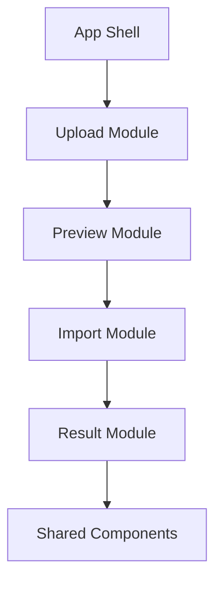
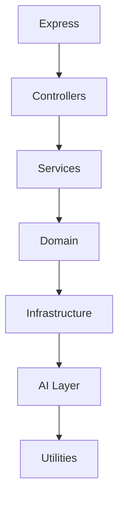
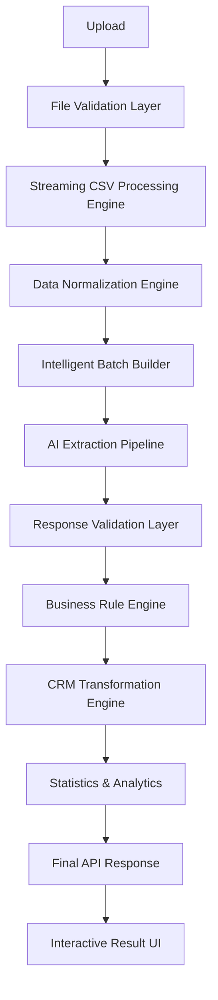

# Chapter 3 — Engineering Roadmap & Methodology

## 1. Methodology: Engineering Volumes

The system is designed and documented not as loose notes but as **engineering volumes**. Each volume ends with something that could be implemented independently and merged into production. A volume is equivalent to what a senior engineer would design before writing code.

The documentation standard for the full roadmap:

- **18 volumes**
- Around **250–400 pages** worth of engineering documentation when complete
- Every design decision justified
- Architecture diagrams, sequence diagrams, folder structures, and production considerations
- Written so the system can be both implemented and defended confidently in a technical discussion

The roadmap starts with **Volume 1 — Product Thinking & System Architecture**, because every later decision (frontend, backend, AI pipeline, deployment, testing) naturally builds on that foundation.

## 2. Project Codename

The project is deliberately not called "CSV Importer". It is built like a real product:

> **Project Codename:** **AI Data Ingestion Engine (AIDE)** — also referred to as the **GrowEasy Smart Import Engine**.

The assignment becomes merely the first client of this engine.

## 3. The 18-Volume Roadmap

### Volume 1 — Product Thinking & System Architecture

The foundation. Topics:

- Problem Analysis
- Functional Requirements
- Non-Functional Requirements
- User Personas
- System Goals
- Performance Targets
- High-Level Architecture
- Request Lifecycle
- Module Boundaries
- Design Principles
- Technology Decisions
- Scalability Considerations
- Security Considerations

Deliverables: architecture diagrams, request flow, component responsibilities, final project structure.

### Volume 2 — Frontend Architecture

Instead of thinking in pages, the frontend is designed as a module chain:



Topics: Next.js Architecture, Folder Structure, State Management, API Layer, Table Component, Upload UX, Error UX, Theme, Accessibility.

### Volume 3 — Backend Architecture

The backend is layered:



Topics: Clean Architecture, Dependency Injection, Error Handling, Logging, Middleware, Configuration, Environment Strategy.

### Volume 4 — CSV Processing Engine

A very deep volume, covering:

```text
Encoding Detection
Delimiter Detection
Header Detection
Streaming Parser
Malformed CSV Recovery
Column Statistics
Type Detection
Duplicate Headers
Blank Rows
Large File Support
```

### Volume 5 — Data Normalization Engine

One of the biggest differentiators. Normalize — before AI:

- phones
- emails
- dates
- countries
- cities
- whitespace
- unicode
- currencies
- booleans
- empty values

### Volume 6 — AI Extraction Engine

The heart of the system. Design scope:

- Prompt Engineering
- Batch Strategy
- Token Optimization
- Hallucination Prevention
- Few-shot Examples
- Retry Strategy
- JSON Mode
- Temperature
- Context Window

### Volume 7 — AI Prompt Engineering Masterclass

Prompting deserves an entire volume. Rather than a one-line "Extract fields." instruction, the enterprise-grade prompt system comprises:

```text
System Prompt
Developer Prompt
Few-shot
Validation Rules
Output Contract
Edge Cases
Negative Examples
Ambiguous Mapping
Confidence Rules
```

### Volume 8 — Validation Engine

> **Principle:** Never trust AI.

```text
Schema Validation
 → Business Rules
 → Field Validators
 → Confidence Checks
 → Repair Engine
```

### Volume 9 — CRM Mapping Engine

Map heterogeneous sources into a unified CRM format:

```text
Facebook CSV / Google Ads CSV / Excel CSV / Sales CSV / Custom CSV
 → Unified CRM
```

Scope: semantic mapping, aliases, fallback logic, unknown fields.

### Volume 10 — Batch Processing Engine

Enterprise batching. Topics:

```text
Chunk Size
Concurrency
Rate Limiting
Retries
Dead Letter Queue
Timeouts
Partial Success
Cancellation
```

### Volume 11 — Frontend UX Engineering

Design of the full workflow:

```text
Upload → Preview → Statistics → Import → Live Progress → Results → Export
```

Plus: animations, loading states, skeletons, virtualized tables, progress bars, notifications.

### Volume 12 — Error Recovery System

Production systems fail. Scope:

- malformed CSV
- timeout
- invalid AI response
- retry
- rollback
- partial imports
- recoverability

### Volume 13 — Observability

Professional engineers build observable systems: logging, metrics, tracing, import analytics, performance dashboard, request IDs, timing.

### Volume 14 — Security

Scope: CSV injection, DoS, prompt injection, file limits, rate limits, validation, secrets, authentication (future).

### Volume 15 — Testing Strategy

Scope: unit, integration, contract, AI prompt tests, CSV fixtures, mocking, regression testing.

### Volume 16 — Deployment

Scope: Docker, Railway, Vercel, environment variables, CI/CD, GitHub Actions, production build.

### Volume 17 — README & Documentation

Interview-quality README covering: architecture, flow, setup, screenshots, API, folder structure, future scope.

### Volume 18 — Future Evolution

How the system becomes an **AI Data Platform** instead of a CSV importer. Future ideas:

- Excel
- PDF
- OCR
- Images
- APIs
- CRM Connectors: Salesforce, HubSpot, Zoho
- Incremental Imports
- Human-in-the-loop review
- Fine-tuned extraction models

## 4. Target Architecture

Most naive solutions amount to:

```text
CSV → GPT → JSON
```

This roadmap instead designs the architecture of a production-grade ingestion platform:



## 5. Roadmap-to-Chapter Mapping

The detailed design chapters of this book (Chapters 5–19) follow the **final evolved structure** of the roadmap, not a one-to-one copy of the original volume numbering. The mapping is:

| Roadmap Volume(s) | Book Chapter(s) | Notes |
|-------------------|-----------------|-------|
| Volume 1 — Product Thinking & System Architecture | [Chapter 5](05-system-architecture.md) | Direct mapping |
| Volume 2 — Frontend Architecture | [Chapter 6](06-frontend-architecture.md) | Direct mapping |
| Volume 3 — Backend Architecture | [Chapter 7](07-backend-architecture.md) | Direct mapping |
| Volume 4 — CSV Processing Engine | [Chapter 8](08-csv-processing-engine.md) | Direct mapping |
| Volume 5 — Data Normalization Engine | [Chapter 9](09-data-normalization-engine.md) | Direct mapping |
| Volume 6 — AI Extraction Engine | [Chapter 10](10-ai-extraction-engine.md) | Direct mapping |
| Volume 7 — AI Prompt Engineering Masterclass | [Chapter 11](11-prompt-engineering.md) and [Chapter 12](12-semantic-intelligence.md) | Expanded into two chapters |
| Volume 8 — Validation Engine | [Chapter 13](13-validation-trust-engine.md) | Direct mapping |
| Volumes 9–10 — CRM Mapping Engine, Batch Processing Engine | [Chapter 14](14-execution-orchestration.md) | Consolidated into the Execution Engine |
| Volume 12 — Error Recovery System | [Chapter 16](16-reliability-resilience.md) | Evolved into Reliability & Resilience |
| Volume 13 — Observability | [Chapter 15](15-observability.md) | Evolved into Observability & Telemetry |
| Volume 14 — Security | [Chapter 17](17-security-ai-safety.md) | Evolved into Security & AI Safety |
| Volume 15 — Testing Strategy | [Chapter 18](18-quality-engineering.md) | Evolved into Quality Engineering |
| Volume 16 — Deployment | [Chapter 19](19-platform-engineering-devops.md) | Evolved into Platform Engineering & DevOps |
| Volumes 17–18 — README & Documentation, Future Evolution | [Chapter 20](20-future-evolution.md) | Covered by Future Evolution & Platform Vision |

In short: roadmap Volumes 1–6 map to Chapters 5–10; Volume 7 was expanded into Chapters 11 and 12; Volume 8 became Chapter 13; Volumes 9–10 were consolidated into Chapter 14; Volumes 12–16 evolved into Chapters 15–19 (Observability, Reliability, Security, Quality, Platform Engineering); and Volumes 17–18 are covered by Chapter 20. Volume 11 (Frontend UX Engineering) is absorbed into the frontend chapters (6) and the result/progress UX described throughout.

## Implementation Tasks

- [ ] **Task 3.1 — Architecture diagrams.** Produce the high-level architecture diagrams that anchor Volume 1.
- [ ] **Task 3.2 — Request flow.** Document the end-to-end request lifecycle from upload to final response.
- [ ] **Task 3.3 — Component responsibilities.** Define the responsibility of every module boundary in the system.
- [ ] **Task 3.4 — Final project structure.** Establish the definitive repository and folder structure for AIDE.
- [ ] **Task 3.5 — Volume backlog.** Sequence the 18 volumes as independently implementable, mergeable units of work.

---

## Related Chapters

- [Chapter 2 — Solution Analysis & Design Approach](02-solution-analysis.md) — the analysis this roadmap operationalizes
- [Chapter 4 — The Pipeline Architecture Mindset](04-pipeline-architecture.md) — the architectural philosophy behind the target pipeline
- [Chapter 5 — Product Thinking & System Architecture](05-system-architecture.md) — the first roadmap volume in full detail
- [Chapter 20 — Future Evolution & Platform Vision](20-future-evolution.md) — expands roadmap Volume 18
