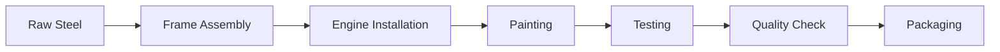
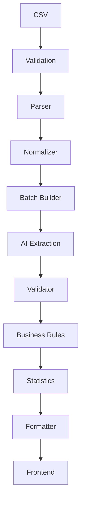
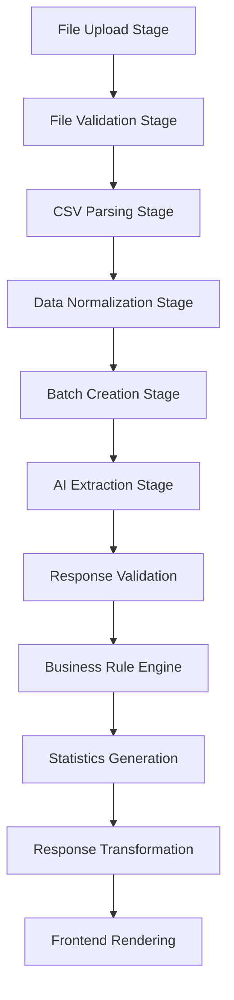

# Chapter 4 — The Pipeline Architecture Mindset

The difference between a feature-level implementation and a systems-level design of this importer comes down to one architectural choice. A straightforward implementation treats the application as a chain of requests:

```text
Frontend → Backend → OpenAI → Frontend
```

This is a **request–response architecture**. It works, but it does not scale well, because responsibilities become mixed across layers.

## The Pipeline Mindset

Instead, think of the application like a factory — a car manufacturing plant. The car is not built by one worker; it passes through multiple stations:



Every station has only one responsibility. If something goes wrong, you immediately know where.

The importer should work exactly the same way. Instead of

```text
CSV → AI → JSON
```

we build a staged pipeline:



Notice something important: only **one** stage actually uses AI. Everything else is deterministic. That makes the system much more reliable.

## Every Stage Has a Contract

A contract means:

> "This stage receives exactly this data and always returns exactly this data."

Think of contracts as APIs inside the application. The first stage, for example, accepts a raw CSV file and returns file metadata — nothing else:

```json
{
  "fileName": "...",
  "size": "...",
  "delimiter": "...",
  "encoding": "..."
}
```

The full chain of contracts:

| Stage | Input | Output |
|-------|-------|--------|
| Stage 1 — File Intake | CSV File | File Metadata (`fileName`, `size`, `delimiter`, `encoding`) |
| Stage 2 — Parser | File Metadata | `Parsed Records[]` |
| Stage 3 — Normalizer | `Parsed Records[]` | `Normalized Records[]` |
| Stage 4 — Batch Builder | `Normalized Records[]` | `Batches[]` |
| Stage 5 — AI Extraction | `Batch` | `CRM Records` |

Every stage is completely independent.

## Why This Is Powerful

Suppose the AI suddenly starts returning bad JSON. Where is the bug? Not in the frontend. Not in the parser. Not in batching. Only in the **AI Extraction Stage**. You immediately know where to debug.

Suppose CSV parsing fails. Only the **CSV Parser** stage is implicated; nothing else changes.

Suppose the company later wants Excel support. In a request–response architecture, most implementations require a broad rewrite. In a pipeline architecture, you replace the `CSV Parser` with an `Excel Parser` — everything downstream stays exactly the same. That is why enterprise systems are built around pipelines.

## Think Like Unix

The Unix philosophy says:

> One program should do one thing well.

The pipeline stages follow the same idea:

| Module | Sole Responsibility |
|--------|---------------------|
| Parser | Only parses |
| Normalizer | Only cleans |
| Batch Builder | Only creates batches |
| AI | Only extracts meaning |
| Validator | Only validates |
| Statistics | Only computes metrics |

No module should perform two unrelated responsibilities.

## Why Testing Becomes Easy

Suppose we want to test normalization. Do we need OpenAI? No. Do we need the frontend? No. Do we need Express? No.

Input:

```json
{ "phone": "+91 98765-43210" }
```

Expected output:

```json
{ "phone": "+919876543210" }
```

Done. Testing becomes extremely simple because every stage is isolated.

## Why Future Features Become Easy

Imagine the CRM team later asks for PDF imports. In the old architecture (`Frontend → Backend → AI`), that is a huge rewrite. In the pipeline architecture:

```text
PDF Parser → Normalizer → Batch Builder → AI → Validator → Done
```

Only one module changes. Everything else stays untouched.

## Error Isolation

Instead of a generic failure report such as `Import Failed`, the pipeline tells us exactly which stage failed and why:

| Failing Stage | Reason |
|---------------|--------|
| CSV Validation | Unsupported Encoding |
| AI Extraction | Malformed JSON |
| Business Rules | Missing Contact Information |

That makes debugging much easier.

## Production Systems Work This Way

Many large-scale systems follow this exact philosophy:

- **ETL pipelines**: Extract → Transform → Load
- **CI/CD pipelines**: Build → Test → Package → Deploy
- **Video processing**: Upload → Transcode → Optimize → Distribute
- **Search indexing**: Crawl → Parse → Tokenize → Rank → Index
- **ML pipelines**: Ingest → Clean → Feature Engineer → Train → Evaluate

The AI importer is really another form of a data-processing pipeline.

## The Final Pipeline

This is the architecture recommended for the entire project:



Each stage has a single, explicit responsibility and a clear input/output contract. That architecture is easier to reason about, easier to test independently, and flexible enough to support new input formats or processing steps without rewriting the rest of the system. The frontend that orchestrates this workflow is designed in [Chapter 6 — Frontend Architecture](06-frontend-architecture.md), and the backend implementation of each stage begins in [Chapter 7 — Backend Architecture](07-backend-architecture.md).

---

## Related Chapters

- [Chapter 2 — Solution Analysis & Design Approach](02-solution-analysis.md) — the initial analysis that this pipeline philosophy refines
- [Chapter 5 — Product Thinking & System Architecture](05-system-architecture.md) — the system architecture that instantiates this pipeline end to end
- [Chapter 7 — Backend Architecture](07-backend-architecture.md) — maps every backend module to a pipeline stage
- [Chapter 14 — Execution Engine, Orchestration & Concurrency](14-execution-orchestration.md) — how the pipeline stages are executed and coordinated at runtime
