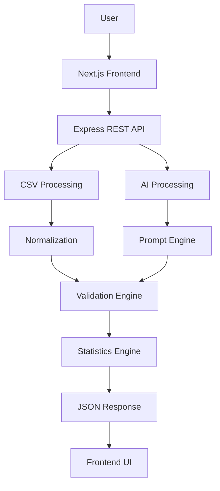
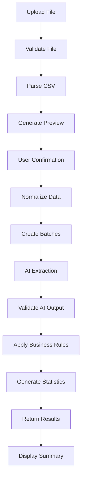

# Chapter 5 — Product Thinking & System Architecture

> **Goal:** Build a production-grade AI-powered data ingestion engine capable of intelligently extracting CRM lead information from heterogeneous CSV datasets while maintaining high accuracy, scalability, fault tolerance, and an exceptional user experience.

This chapter is written as an internal engineering design document — the kind a senior engineer would present before implementation.

## 1. Executive Summary

Modern businesses receive lead data from dozens of platforms:

- Facebook Lead Ads
- Google Ads
- Real Estate CRMs
- Marketing Agencies
- Sales Teams
- Excel Sheets
- Internal CRMs
- Manual spreadsheets

Every source exports data differently. Although the information is semantically similar, the structure varies significantly.

Example:

| CSV A | CSV B | CSV C |
|---------|---------|---------|
| Name | Customer | Full Name |
| Email | Mail ID | Contact Email |
| Phone | Mobile | Primary Contact |

Traditional CSV importers rely on predefined mappings or manual user intervention. Our objective is to eliminate manual mapping by leveraging Large Language Models (LLMs) to understand the semantic meaning of columns and automatically transform them into GrowEasy CRM's canonical schema.

The application must behave like a production-grade ingestion platform rather than a simple CSV parser.

## 2. Problem Statement

### Current Industry Problem

Organizations exchange customer data through spreadsheets every day. Unfortunately:

- Every company defines different column names.
- Data quality varies significantly.
- Some exports contain unnecessary columns.
- Important fields are mixed with notes.
- Contact information appears in inconsistent formats.
- Multiple emails and phone numbers may exist.
- Missing values are common.

A traditional importer cannot reliably handle these variations. Users spend considerable time manually mapping columns before importing data.

### Proposed Solution

Develop an AI-powered ingestion engine that:

- Accepts arbitrary CSV formats.
- Understands the semantic meaning of each column.
- Extracts CRM-compatible information.
- Validates the extracted data.
- Skips unusable records.
- Returns a clean structured dataset ready for CRM ingestion.

The user should never need to manually map columns.

## 3. Product Vision

Instead of building

> CSV → JSON Converter

we are building

> **An Intelligent Data Understanding Platform**

CSV is only the first supported input format. The architecture should be extensible enough to support:

- Excel
- JSON
- APIs
- PDFs
- OCR Documents
- Images
- CRM Connectors

without redesigning the core system. (See [Chapter 20 — Future Evolution & Platform Vision](20-future-evolution.md) for the long-term platform direction.)

## 4. Core Objectives

The system should satisfy the following objectives.

### Functional Objectives

- Accept any valid CSV.
- Parse efficiently.
- Detect column semantics.
- Extract CRM fields.
- Skip invalid records.
- Produce structured output.
- Display import statistics.
- Support thousands of rows.

### Engineering Objectives

- Modular architecture
- Clean separation of concerns
- AI isolation
- Testability
- Scalability
- Production readiness

### User Experience Objectives

The workflow should be effortless:

```text
Upload → Preview → Confirm → AI Processing → Results → Done
```

The user should understand exactly what the system is doing at every step.

## 5. Product Scope

### In Scope

- CSV Upload
- CSV Preview
- AI Field Mapping
- CRM Extraction
- Record Validation
- Skip Invalid Records
- Statistics
- Responsive UI

### Out of Scope (Current Version)

- Authentication
- Multi-user support
- Persistent database
- Import history
- Team collaboration
- Scheduling imports
- CRM write-back APIs

These can be added in future versions.

## 6. User Personas

### Persona 1 — Sales Executive

Uploads customer spreadsheets.

Needs:

- Fast imports
- Minimal manual work
- High accuracy

### Persona 2 — Marketing Agency

Receives leads from multiple platforms.

Needs:

- Automatic field mapping
- Batch imports
- Consistent CRM formatting

### Persona 3 — Operations Team

Receives data from many departments.

Needs:

- Reliable imports
- Validation
- Error visibility

## 7. Functional Requirements

### Upload Module

Responsibilities:

- Accept CSV
- Validate file type
- Validate size
- Read metadata

Output: `Raw File`

### Preview Module

Responsibilities:

- Parse CSV
- Display rows
- Display headers
- Allow user verification

No AI processing occurs here.

### Import Module

Responsibilities:

- Send confirmation
- Upload parsed records
- Track progress

### AI Engine

Responsibilities:

- Understand column semantics
- Extract CRM schema
- Ignore irrelevant information
- Handle ambiguous naming

### Result Module

Responsibilities — display:

- Imported records
- Skipped records
- Summary
- Statistics

## 8. Non-Functional Requirements

### Performance

- Preview should render quickly for typical CSV sizes.
- Batch processing should avoid excessively large AI requests.
- Memory usage should remain predictable by streaming large files where appropriate.

### Scalability

Architecture should support growth from

```text
100 rows → 10,000 rows → 100,000 rows
```

without requiring major architectural changes.

### Reliability

The system should never crash because:

- AI failed
- One batch failed
- One row was malformed
- One record contained invalid data

Graceful degradation is preferred over total failure.

### Maintainability

Every module should own one responsibility.

- No business logic should leak into UI.
- No AI prompt should be scattered across multiple files.

### Security

Protect against:

- Malicious CSV uploads
- Oversized files
- Prompt injection through CSV content
- Formula injection if exporting results later
- Invalid MIME types

## 9. Design Principles

### Separation of Concerns

Each layer performs exactly one job:

```text
CSV Parser ≠ AI Engine ≠ Validation ≠ Statistics
```

### AI as an Assistant

AI should never control the application. Instead:

```text
Application → AI → Application validates AI → Application decides
```

The application remains the source of truth.

### Deterministic Before Probabilistic

Use deterministic logic wherever possible before invoking the LLM.

Examples:

- Email detection
- Phone normalization
- Date parsing
- Empty row detection

Reserve AI for semantic understanding and ambiguous mappings.

### Fail Gracefully

If one batch fails, continue the remaining batches instead of aborting the entire import.

## 10. High-Level Architecture



## 11. Request Lifecycle

A single import request flows through the following stages:



Each stage has clearly defined inputs and outputs, making the pipeline easier to test and evolve. The pipeline philosophy behind this lifecycle is developed in depth in [Chapter 4 — The Pipeline Architecture Mindset](04-pipeline-architecture.md).

## 12. Major System Components

| Component | Responsibility |
|-----------|----------------|
| Upload Module | Accept and validate files |
| CSV Parser | Read CSV into structured records |
| Normalization Engine | Clean and standardize raw values |
| Batch Manager | Split work into manageable AI requests |
| Prompt Engine | Build structured prompts for the LLM |
| AI Client | Communicate with the selected model |
| Validation Engine | Verify schema and business rules |
| CRM Mapper | Produce canonical CRM records |
| Statistics Engine | Compute import metrics |
| Result Formatter | Shape the final API response |

## 13. Success Metrics

The project should be evaluated on more than "it works."

### Functional Success

- Correct field extraction
- Correct skipped record detection
- Valid CRM output

### Engineering Success

- Modular codebase
- Clear architecture
- Testability
- Error handling
- Documentation

### User Experience Success

- Simple workflow
- Fast feedback
- Clear progress
- Helpful error messages
- Actionable import summary

## 14. Future Evolution

The architecture is intentionally designed to grow into a generalized **AI Data Ingestion Platform**.

Potential future capabilities include:

- Excel (`.xlsx`) ingestion
- PDF table extraction
- OCR from scanned documents
- Direct CRM integrations
- Webhook-based imports
- Human-in-the-loop validation
- Import history and auditing
- Multi-tenant workspaces
- Fine-tuned domain-specific extraction models

Because responsibilities are separated into independent modules, these features can be introduced incrementally without redesigning the core pipeline. See [Chapter 20 — Future Evolution & Platform Vision](20-future-evolution.md).

> **Design Rationale:** One architectural improvement over the original assignment framing: instead of thinking in terms of **Frontend ↔ Backend ↔ AI**, the system is designed as a **processing pipeline** where each stage has a well-defined contract. That makes the system easier to test, easier to debug, and much easier to extend — see [Chapter 4 — The Pipeline Architecture Mindset](04-pipeline-architecture.md). This architecture is then translated into a production-grade frontend in [Chapter 6 — Frontend Architecture](06-frontend-architecture.md).

## Implementation Tasks

- [ ] **Task 5.1 — Product vision.** Document the product vision and long-term direction for the intelligent data-ingestion platform.
- [ ] **Task 5.2 — Problem and personas.** Capture the business problem statement and the target user personas with their needs.
- [ ] **Task 5.3 — Requirements specification.** Define the functional requirements (per module) and non-functional requirements (performance, scalability, reliability, maintainability, security).
- [ ] **Task 5.4 — Design principles.** Establish the design principles: separation of concerns, AI as an assistant, deterministic before probabilistic, and graceful failure.
- [ ] **Task 5.5 — High-level architecture.** Produce the high-level system architecture spanning frontend, API, CSV/AI processing, validation, and statistics.
- [ ] **Task 5.6 — Request lifecycle.** Define the end-to-end request lifecycle from upload through result display, with explicit inputs and outputs per stage.
- [ ] **Task 5.7 — Component inventory.** Enumerate the core system modules and assign each a single responsibility.
- [ ] **Task 5.8 — Success metrics and roadmap.** Define functional, engineering, and UX success metrics plus the future-evolution roadmap.

---

## Related Chapters

- [Chapter 1 — Assignment Specification](01-assignment-specification.md) — the original brief this architecture is designed to exceed
- [Chapter 4 — The Pipeline Architecture Mindset](04-pipeline-architecture.md) — the pipeline philosophy underlying the request lifecycle
- [Chapter 6 — Frontend Architecture](06-frontend-architecture.md) — translates this architecture into the frontend blueprint
- [Chapter 7 — Backend Architecture](07-backend-architecture.md) — implements the backend side of this architecture
- [Chapter 20 — Future Evolution & Platform Vision](20-future-evolution.md) — expands the future-evolution roadmap
