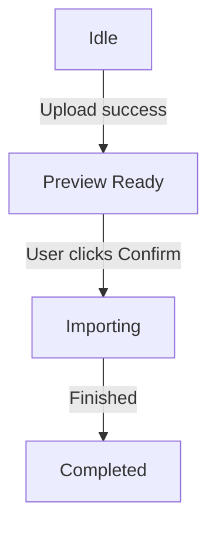
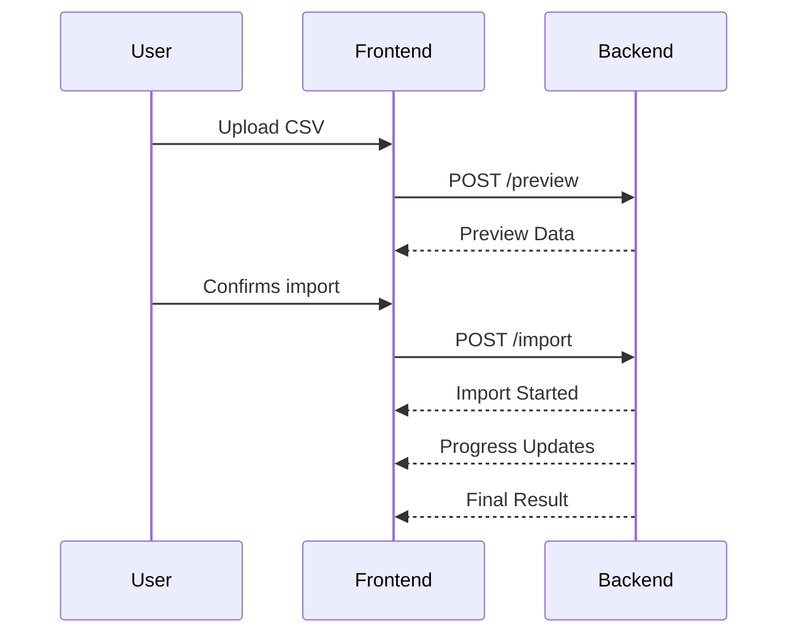
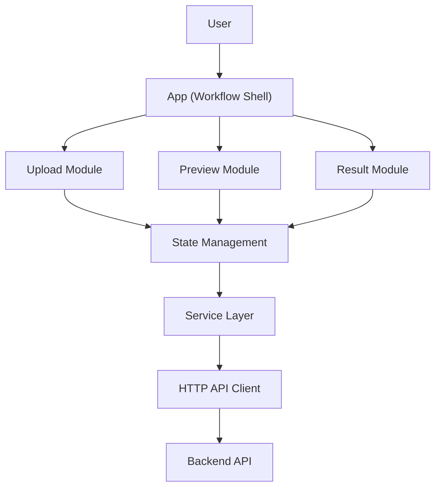

# Chapter 6 — Frontend Architecture

> **Goal:** Design a frontend that is scalable, maintainable, highly responsive, and acts as the orchestration layer for the AI Data Ingestion Engine.

The frontend is not "just a UI." In this system it acts as the **orchestrator of the user workflow**: it validates user actions, provides visibility into each processing stage, and communicates with the backend through well-defined API contracts rather than embedding business logic.

## 1. Frontend Philosophy

A typical quick solution builds the frontend as a handful of route-level pages:

```text
/pages
  Upload.tsx
  Preview.tsx
  Result.tsx
```

Everything becomes mixed together — UI, API calls, business logic, state, and validation — and eventually you get a 700-line React component.

Instead, we build it like a SaaS application. The frontend has **one responsibility**:

> Present information, collect user interactions, and orchestrate the workflow.

It should **never**:

- understand CRM mapping
- validate AI output
- normalize phone numbers
- process business rules

Those belong to backend services (see [Chapter 7 — Backend Architecture](07-backend-architecture.md)).

## 2. Frontend Responsibilities

The frontend should only do these things:

```text
Upload File → Validate Basic Constraints → Preview CSV → Ask User Confirmation
→ Start Import → Track Progress → Display Results → Allow Export
```

No AI logic. No CRM logic. No parsing logic beyond preview.

## 3. User Journey

The user experience, end to end:

```text
Landing Page → Upload CSV → CSV Preview → File Statistics → Confirm Import
→ Import Progress → Result Dashboard → Download Result
```

Each page is actually a *state*, not a route.

## 4. Single Page Application

Instead of separate routes (`/upload`, `/preview`, `/import`, `/result`), we build a single route (`/`) that renders different UI states.

Reason: the user never leaves the workflow. No page reload, no lost state — a much smoother UX.

## 5. Application State Machine

Think of the frontend as a finite state machine with six states:

- `Idle`
- `Uploading`
- `Preview Ready`
- `Importing`
- `Completed`
- `Error`

Only one state exists at a time. An example transition sequence:



This avoids dozens of boolean flags like

```text
isUploading, isLoading, isPreview, isImporting, isComplete, showTable, showResult, ...
```

Instead, a single `currentState` value controls the UI.

## 6. Folder Structure

Instead of organizing by routes, organize by features:

```text
src/
  app/
  components/
    upload/
    preview/
    import/
    result/
    shared/
  hooks/
  services/
  stores/
  lib/
  types/
  utils/
  constants/
  styles/
```

Everything has one responsibility.

## 7. Component Hierarchy

```text
App
│
├── Navbar
├── WorkflowStepper
├── UploadSection
├── PreviewSection
├── ImportProgress
├── ResultDashboard
└── Footer
```

Each section is independent.

## 8. Upload Module

Responsibilities:

- Drag & Drop
- File Picker
- Validation
- Display File Info

Nothing else. Output: `Selected File`.

## 9. Preview Module

Responsibilities — display:

- Columns
- Rows
- CSV Preview
- Scrollable Table

Show statistics:

- rows
- columns
- file size

No AI. No import.

## 10. Statistics Panel

Before importing, show useful information:

```text
Rows
Columns
File Size
Detected Delimiter
Estimated Batches
Estimated Processing Time
Estimated AI Calls
```

Surfacing this information builds user trust through transparency.

## 11. Import Module

Very small responsibility:

```text
User clicks Confirm → POST → Receive Job → Track Progress
```

No processing happens here.

## 12. Progress UI

Instead of a bare spinner (`Loading...`), build stage-aware progress:

```text
Uploading
██████████
Complete

Processing
█████░░░░░
Batch 12 / 30

Imported
321

Skipped
18
```

This is the level of feedback users expect from an enterprise product.

## 13. Result Dashboard

Instead of only a table, build a dashboard of summary metrics:

```text
Imported          420
Skipped           17
Success           96%
Time              14 sec
Batches           18
Detected Fields   15
```

Below the metrics, render two tables:

- Imported Records Table
- Skipped Records Table

## 14. Reusable Components

Never repeat UI. Create reusable components, then compose screens from them:

- Button
- Card
- Badge
- Alert
- Table
- Modal
- Progress Bar
- Stat Card
- Upload Zone
- Loading Overlay
- Empty State
- Error State

## 15. Table Component

Tables are a core requirement of the product, so build one powerful, future-proof component with these capabilities:

- Sticky Header
- Horizontal Scroll
- Vertical Scroll
- Responsive
- Virtualization
- Column Resize (optional)
- Sorting

## 16. State Management

Avoid prop drilling, and think about the different kinds of state separately.

### UI State

```text
Current Step, Dark Mode, Sidebar, Dialogs
```

### Upload State

```text
Selected File, File Size, File Name, Errors
```

### Preview State

```text
Headers, Rows, Statistics
```

### Import State

```text
Progress, Current Batch, Remaining, Completed
```

### Result State

```text
Imported, Skipped, Summary
```

Keep them separate instead of creating one massive state object.

## 17. API Layer

Never call `fetch` inside components. Instead:

```text
Component → Service → API → Backend
```

Benefits: easy to mock, easy to test, easy to replace.

## 18. Custom Hooks

Think in terms of behaviors:

- Upload Logic
- Preview Logic
- Import Logic
- Progress Logic

Components stay clean.

## 19. Error Handling

Errors are part of UX. Differentiate between error classes:

- Upload Error
- Preview Error
- Import Error
- Network Error
- Server Error
- AI Error

Each deserves different messaging.

## 20. Loading Strategy

Every async action should have a skeleton or a progress indicator. Never blank screens.

## 21. Accessibility

Support:

- Keyboard Upload
- ARIA Labels
- Focus Management
- Screen Readers
- Large Click Targets
- High Contrast

These go beyond the minimum requirements but are standard in production applications.

## 22. Responsive Design

Desktop layout:

```text
Statistics
Table
Summary
```

Mobile layout:

```text
Statistics → Cards → Scrollable Table
```

Never shrink the table — allow horizontal scrolling instead.

## 23. Theme System

Implement three modes: Light, Dark, and System. Not strictly required, but expected of a polished product.

## 24. Frontend Data Flow

The entire frontend flows in one direction:

```text
User → Upload Component → Upload State → Preview Component → Confirm
→ Import Service → Progress Store → Result Component → Dashboard
```

Everything flows in one direction. No circular dependencies.

## 25. Communication with Backend

The frontend should treat the backend as a contract-driven service. A clean sequence looks like:



Whether progress is implemented with polling or server-sent events can be decided later in the backend architecture ([Chapter 7 — Backend Architecture](07-backend-architecture.md)), but the frontend should be designed so the underlying transport can change without affecting UI components.

## 26. Frontend Design Principles

Every design decision in this chapter follows these principles:

- **Single Responsibility:** Each component has one purpose.
- **Composition over Monoliths:** Build complex screens from small reusable pieces.
- **Feature-Based Organization:** Group code by business capability, not file type.
- **Unidirectional Data Flow:** Data moves predictably from user actions to UI updates.
- **Backend as Source of Truth:** Business rules and AI logic remain on the server.
- **Reusable Contracts:** Components consume typed data models instead of raw API responses.

## 27. Final Frontend Architecture



The frontend never performs CRM extraction, normalization, or AI reasoning. Its role is to provide an intuitive workflow, maintain application state, and render the results of the backend pipeline (see [Chapter 4 — The Pipeline Architecture Mindset](04-pipeline-architecture.md)).

## Implementation Tasks

- [ ] **Task 6.1 — Workflow state machine.** Implement the single-page workflow as a finite state machine (`Idle`, `Uploading`, `Preview Ready`, `Importing`, `Completed`, `Error`) driven by a single `currentState`.
- [ ] **Task 6.2 — Feature-based folder structure.** Set up the `src/` structure organized by feature (upload, preview, import, result, shared) with hooks, services, stores, lib, types, utils, constants, and styles.
- [ ] **Task 6.3 — Component hierarchy.** Build the App shell with Navbar, WorkflowStepper, UploadSection, PreviewSection, ImportProgress, ResultDashboard, and Footer as independent sections.
- [ ] **Task 6.4 — State management.** Implement separated UI, upload, preview, import, and result state stores instead of one massive state object.
- [ ] **Task 6.5 — API service layer.** Create a service layer and HTTP API client so no component calls `fetch` directly, with custom hooks for upload, preview, import, and progress behaviors.
- [ ] **Task 6.6 — Reusable UI kit.** Build the reusable component library (Button, Card, Badge, Alert, Table, Modal, Progress Bar, Stat Card, Upload Zone, Loading Overlay, Empty State, Error State).
- [ ] **Task 6.7 — Responsive table and dashboard.** Implement the powerful table component (sticky header, scrolling, virtualization, sorting) and the result dashboard with summary metrics plus imported/skipped tables.
- [ ] **Task 6.8 — Error, loading, and accessibility strategy.** Differentiate error classes with distinct messaging, add skeleton/progress states for every async action, and implement accessibility support (ARIA, keyboard, focus management, contrast).
- [ ] **Task 6.9 — Backend interaction model.** Implement the preview/import/progress contract so the progress transport (polling or server-sent events) can change without affecting UI components.

---

## Related Chapters

- [Chapter 4 — The Pipeline Architecture Mindset](04-pipeline-architecture.md) — the pipeline whose stages this frontend visualizes and orchestrates
- [Chapter 5 — Product Thinking & System Architecture](05-system-architecture.md) — the system architecture and UX objectives this frontend implements
- [Chapter 7 — Backend Architecture](07-backend-architecture.md) — the contract-driven backend this frontend communicates with
- [Chapter 15 — Observability, Telemetry & Operational Intelligence](15-observability.md) — where import progress and statistics originate on the server side
