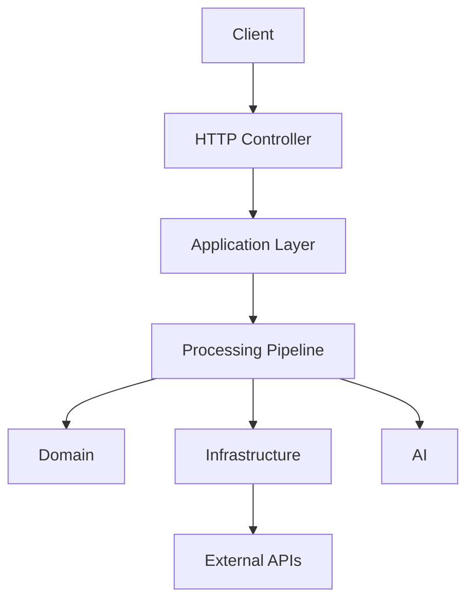
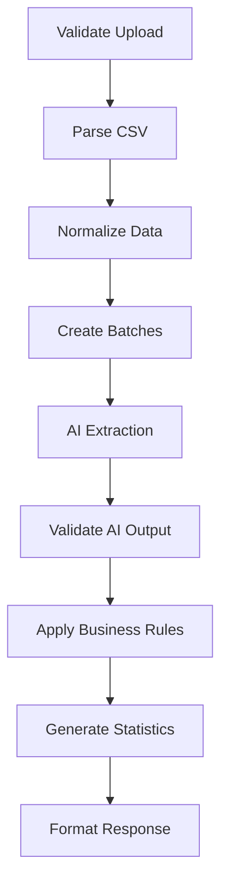
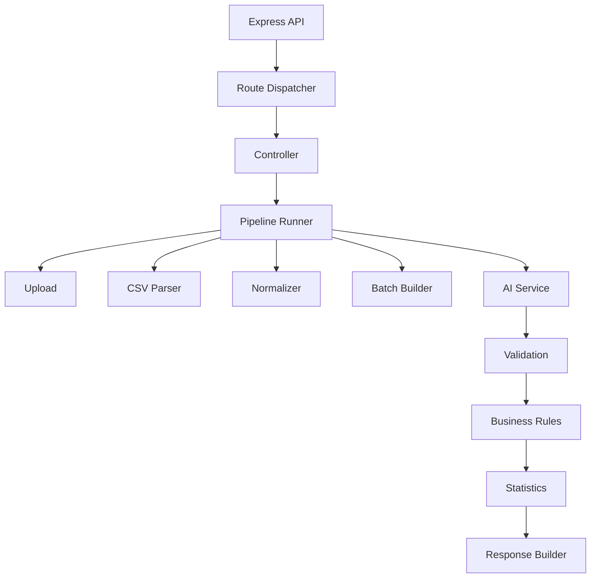

# Chapter 7 — Backend Architecture

> **Goal:** Design a backend that behaves like a production AI ingestion platform rather than a simple Express application.

## 1. Backend Philosophy

A naive backend for this problem looks like this:

```text
POST /upload → Read CSV → Call OpenAI → Return JSON
```

It works for small demos. But after a few features, everything ends up inside one service:

- CSV parsing
- Validation
- Prompt building
- AI calls
- Business rules
- Statistics
- Response formatting

Eventually you have a **1000-line service file**. That is exactly what this architecture avoids.

### Our Philosophy

The backend should be a **pipeline orchestrator**, not a collection of API endpoints.

Instead of thinking

```text
Express → Controller → AI
```

think

```text
Express → Pipeline → Independent Processing Stages → Response
```

Express is only the entry point. The actual business value lives inside the pipeline. (See [Chapter 4 — The Pipeline Architecture Mindset](04-pipeline-architecture.md) for the reasoning behind this model.)

## 2. Architectural Style

We follow a layered architecture inspired by **Clean Architecture**.



Notice: the pipeline doesn't know anything about Express. That makes it reusable.

## 3. Responsibility of Each Layer

### Controllers

Responsible only for:

- reading the request
- validating request format
- invoking the pipeline
- returning the response

Controllers never contain business logic.

### Application Layer

Coordinates modules. Think of it as

> The project manager.

It decides which stage executes next.

### Domain Layer

Contains business rules. Example:

```text
Skip record IF Email == null AND Phone == null
```

This logic belongs here.

### Infrastructure Layer

Everything external:

- OpenAI
- File System
- Logger
- Configuration
- HTTP Client

Infrastructure can change without affecting the business rules.

## 4. Backend Folder Structure

Instead of the traditional

```text
controllers/
models/
routes/
```

we organize around responsibilities:

```text
src/
    api/
        controllers/
        routes/
        middleware/
    pipeline/
        stages/
    domain/
        entities/
        rules/
        services/
    infrastructure/
        ai/
        csv/
        logger/
        config/
    shared/
        errors/
        types/
        constants/
        utils/
    app.ts
    server.ts
```

This is much easier to scale.

## 5. Pipeline Directory

This becomes the heart of the application.

```text
pipeline/
    validate-upload/
    parse-csv/
    normalize/
    batching/
    ai-extraction/
    validation/
    business-rules/
    statistics/
    formatter/
```

Every folder: one responsibility.

## 6. Request Lifecycle

Tracing one request:

```text
POST
  → Controller
  → Create Pipeline Context
  → Run Stage 1
  → Run Stage 2
  → Run Stage 3
  → Run Stage 4
  → Run Stage 5
  → Return Result
```

Notice: the controller doesn't know what happens inside.

## 7. Pipeline Context

Instead of passing twenty variables between stages, create one context object that accumulates state:

```text
Pipeline Context
  ├── Current File
  ├── Rows
  ├── Normalized Rows
  ├── Batches
  ├── Results
  ├── Statistics
  └── Errors
```

Every stage updates the context. This makes the pipeline very clean.

## 8. Pipeline Contract

Every stage follows the same interface. Conceptually:

```text
Input → Process → Output
```

Every stage should be replaceable. For example, the current parser is a **CSV Parser**; in the future it could be an **Excel Parser** — and no other code changes.

## 9. Processing Stages

The backend pipeline becomes:



This is exactly the same pipeline defined in [Chapter 5 — Product Thinking & System Architecture](05-system-architecture.md).

## 10. Controllers

Controllers should remain tiny. Think

```text
Receive Request → Call Pipeline → Return Response
```

not

```text
Receive → Parse CSV → Normalize → OpenAI → Validate → Statistics → Return
```

Controllers should be boring. That's a good thing.

## 11. Services

Each service owns one capability:

| Service | Responsibility |
|---------|----------------|
| CSV Service | Reads CSV |
| AI Service | Communicates with the LLM |
| Validation Service | Checks extracted records |
| Statistics Service | Counts imported rows |

Never mix responsibilities.

## 12. Domain Rules

This is where architectural maturity shows. Instead of writing

```text
if (email == null && phone == null)
```

inside a controller, create a named **Lead Validation Rules** module in the domain layer. The rule becomes reusable: a future importer of a different format applies the same rules unchanged.

## 13. Infrastructure

Infrastructure contains:

- OpenAI Client
- HTTP Client
- Logger
- Configuration
- Storage
- CSV Reader

Infrastructure should never contain business logic.

## 14. Middleware

Middleware only handles cross-cutting concerns:

- Request Logging
- Error Handling
- Rate Limiting
- Request ID
- File Upload
- Security Headers

Never place CRM logic here.

## 15. Error Handling

Never throw random errors. Create a structured hierarchy:

```text
ApplicationError
 ├── ValidationError
 ├── AIError
 ├── ParsingError
 ├── FileError
 ├── RateLimitError
 └── InternalError
```

Benefit: every error becomes predictable.

## 16. Logging

Every request should receive a **Request ID**. Example lifecycle:

```text
Request Received
  → CSV Parsed
  → Rows: 1400
  → Normalized
  → Created 28 batches
  → AI Processing
  → Validation Complete
  → Statistics Generated
  → Response Sent
```

If a customer reports an issue, one Request ID tells the entire story. Observability is expanded in [Chapter 15 — Observability, Telemetry & Operational Intelligence](15-observability.md).

## 17. Configuration Management

Never scatter values across files. Configuration should own:

- Max File Size
- Batch Size
- Retry Count
- Timeout
- AI Model
- Temperature
- API Keys

One source of truth.

## 18. Dependency Flow

Dependencies should only flow downward:

```text
Controller → Application → Pipeline → Domain → Infrastructure
```

Never the opposite. For example, Infrastructure should never import a Controller. This keeps coupling low.

## 19. Why the Pipeline Is Powerful

Imagine tomorrow the company says

> "Support Excel."

The current **CSV Parser** stage becomes an **Excel Parser**. Everything below stays exactly the same. Tomorrow: support PDF — replace the parser; the pipeline survives.

## 20. Backend Scalability

The current system is synchronous, but the architecture supports future evolution:

```text
Request → Queue → Worker → Pipeline → Storage → Notification
```

We don't need queues today, but we shouldn't prevent adding them tomorrow. Concurrency and orchestration are covered in [Chapter 14 — Execution Engine, Orchestration & Concurrency](14-execution-orchestration.md).

## 21. AI Isolation

One of the most important decisions: never allow business logic to directly call OpenAI. Instead:

```text
Pipeline → AI Service → OpenAI Client
```

Tomorrow, replace OpenAI with Gemini: only the AI Client changes; everything else survives. This is called the **Adapter Pattern**. The AI layer itself is designed in [Chapter 10 — AI Extraction Engine](10-ai-extraction-engine.md).

## 22. API Design

Keep APIs focused on user actions rather than internal implementation. For this system, three endpoints are sufficient:

| Endpoint | Purpose |
|----------|---------|
| `POST /preview` | Upload and preview the CSV without AI processing |
| `POST /import` | Execute the ingestion pipeline and return structured CRM data |
| `GET /health` | Health check for deployment and monitoring |

Avoid exposing internal pipeline stages as separate APIs. They are implementation details.

## 23. Response Strategy

Every API response should follow a consistent envelope:

```text
success
requestId
data
metadata
errors
```

Consistency simplifies frontend development and future integrations.

## 24. Backend Component Diagram



Notice that every component has exactly one responsibility and communicates through well-defined interfaces.

## 25. Engineering Decisions

| Decision | Reason |
|----------|--------|
| Layered architecture | Keeps responsibilities separated |
| Pipeline-based processing | Easier testing and extensibility |
| Thin controllers | Prevents business logic leakage |
| Domain-driven rules | Business logic remains reusable |
| Infrastructure isolation | External providers become replaceable |
| Structured errors | Predictable debugging and monitoring |
| Centralized configuration | Easier maintenance across environments |
| Adapter for AI providers | Swap OpenAI, Gemini, Claude with minimal changes |

## 26. Backend Principles

The backend is designed around these rules:

- **Controllers orchestrate; they do not think.**
- **Services solve one problem each.**
- **The pipeline owns the workflow.**
- **Domain rules define business behavior.**
- **Infrastructure integrates with external systems.**
- **Every processing stage has a clear contract.**
- **External dependencies are replaceable.**
- **Failures are isolated and recoverable.**

## Implementation Tasks

- [ ] **Task 7.1 — Layered backend skeleton.** Create the production-grade backend structure (`api/`, `pipeline/`, `domain/`, `infrastructure/`, `shared/`, `app.ts`, `server.ts`) with strictly downward dependency flow.
- [ ] **Task 7.2 — Layered responsibility model.** Implement thin controllers, an application coordination layer, domain rules, and infrastructure adapters with no cross-layer leakage.
- [ ] **Task 7.3 — Pipeline execution model.** Build a pipeline runner that executes stages sequentially over a shared Pipeline Context object, with each stage implementing a common Input → Process → Output contract.
- [ ] **Task 7.4 — Pipeline stage folders.** Scaffold one directory per stage: validate-upload, parse-csv, normalize, batching, ai-extraction, validation, business-rules, statistics, formatter.
- [ ] **Task 7.5 — Processing stages.** Implement the nine-stage flow: Validate Upload → Parse CSV → Normalize Data → Create Batches → AI Extraction → Validate AI Output → Apply Business Rules → Generate Statistics → Format Response.
- [ ] **Task 7.6 — Error hierarchy.** Define `ApplicationError` with `ValidationError`, `AIError`, `ParsingError`, `FileError`, `RateLimitError`, and `InternalError` subclasses, plus centralized error-handling middleware.
- [ ] **Task 7.7 — Logging strategy.** Assign a Request ID to every request and log each pipeline milestone (parsed rows, batch counts, AI processing, validation, statistics, response) under that ID.
- [ ] **Task 7.8 — Configuration management.** Centralize max file size, batch size, retry count, timeout, AI model, temperature, and API keys into a single configuration module.
- [ ] **Task 7.9 — AI abstraction layer.** Isolate all LLM access behind an AI Service and provider adapter so OpenAI can be swapped for Gemini or Claude without touching business logic.
- [ ] **Task 7.10 — API surface.** Expose exactly three endpoints — `POST /preview`, `POST /import`, `GET /health` — with a consistent response envelope (`success`, `requestId`, `data`, `metadata`, `errors`).
- [ ] **Task 7.11 — Scalability path.** Keep the pipeline decoupled from Express so a future Request → Queue → Worker → Pipeline → Storage → Notification model can be added without restructuring.

---

## Related Chapters

- [Chapter 4 — The Pipeline Architecture Mindset](04-pipeline-architecture.md) — the conceptual foundation for treating the backend as a pipeline orchestrator
- [Chapter 5 — Product Thinking & System Architecture](05-system-architecture.md) — defines the end-to-end pipeline that this backend implements
- [Chapter 8 — CSV Processing Engine](08-csv-processing-engine.md) — the first major processing stage invoked by this backend pipeline
- [Chapter 14 — Execution Engine, Orchestration & Concurrency](14-execution-orchestration.md) — how the pipeline runner executes stages and batches at scale
- [Chapter 15 — Observability, Telemetry & Operational Intelligence](15-observability.md) — expands the Request ID logging strategy into full telemetry
