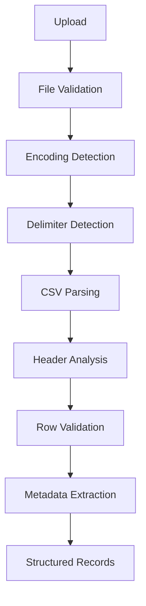
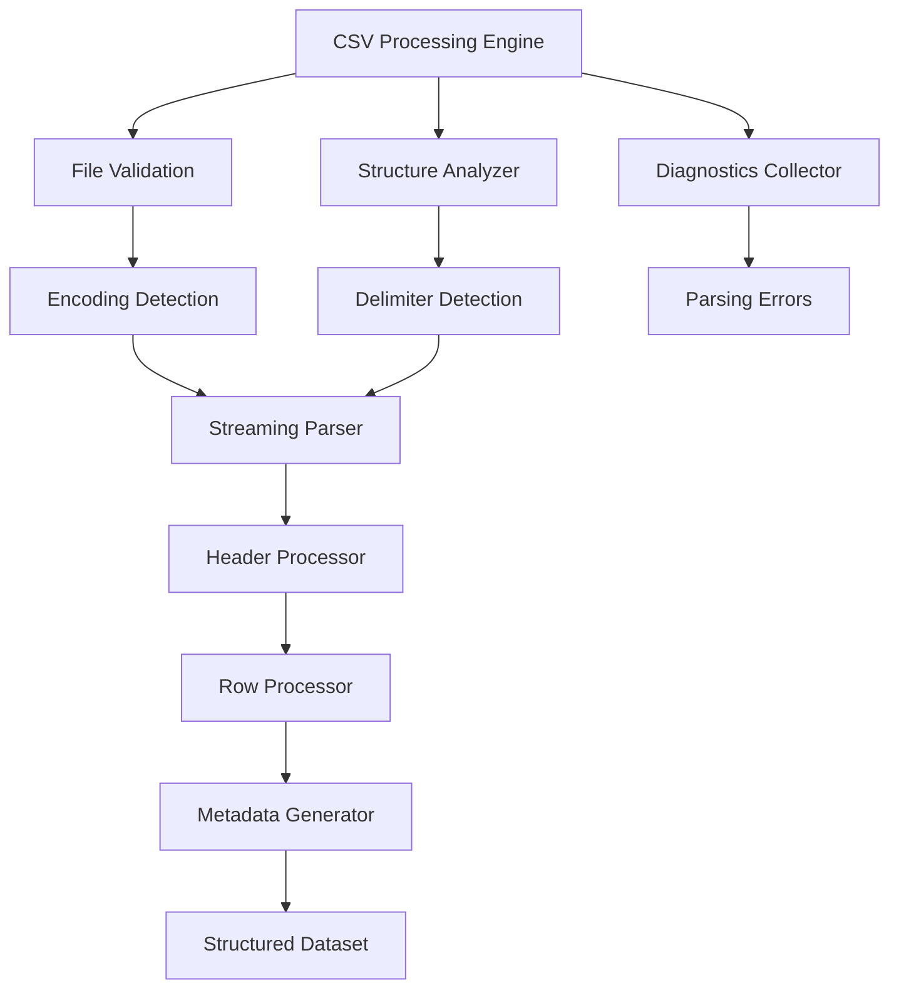

# Chapter 8 — CSV Processing Engine

> **Goal:** Build a production-grade CSV Processing Engine that can reliably ingest messy, real-world CSV files and produce a clean, structured dataset for downstream AI processing.

> **Core Principle:** **Never let the AI solve problems that deterministic code can solve first.**

## 1. Why This Module Is Critical

A naive design sends the file straight to the model:

```text
CSV → AI
```

This is a mistake. If the CSV contains malformed rows, duplicate headers, invalid encodings, inconsistent delimiters, or noisy data, the AI has to work harder, costs more, and becomes less reliable.

Instead, we build a **Data Preparation Engine** before AI:


The AI should receive **structured, predictable input**, not raw spreadsheets.

## 2. Responsibilities

The CSV Processing Engine owns **only** file ingestion and structural understanding.

It is **not** responsible for:

- CRM mapping
- AI extraction
- Business rules
- Validation of CRM fields

It is responsible for:

- Reading the file
- Understanding its structure
- Producing structured records
- Producing metadata
- Detecting parsing issues

## 3. Processing Pipeline



Each stage performs one responsibility.

## 4. Stage 1 — File Validation

Before opening the file, validate:

- Extension
- MIME type
- File size
- Empty file
- Corrupted upload

Example of an accepted file:

```text
marketing.csv
✓ CSV
✓ 2.4 MB
✓ Not Empty
✓ Accepted
```

Reject immediately if the upload is:

```text
.exe
.zip
.pdf
0 bytes
> configured limit
```

Never waste resources parsing an invalid file.

## 5. Stage 2 — Encoding Detection

Real-world CSVs use different encodings:

```text
UTF-8
UTF-8 BOM
UTF-16
ISO-8859-1
Windows-1252
```

If the encoding is wrong, names become

```text
José
Müller
François
```

instead of

```text
José
Müller
François
```

Encoding detection happens **before parsing**.

## 6. Stage 3 — Delimiter Detection

Not every CSV uses commas. Common delimiters:

```text
,
;
|
\t
```

Examples of non-comma files:

```text
Name;Email;Phone
```

```text
Name|Email|Phone
```

The engine should inspect the first few lines and infer the delimiter instead of assuming `,`.

## 7. Stage 4 — Streaming Parser

Never read the whole file into memory if you don't have to.

Bad:

```text
Read Entire File → Memory
```

Good:

```text
Read Chunk → Parse → Emit Row → Next Chunk
```

Benefits:

- lower memory usage
- scalable to large files
- faster first preview
- future-ready for very large imports

## 8. Stage 5 — Header Detection

Headers are surprisingly messy. The same concept appears as:

```text
Email
email
EMAIL
Email Address
Primary Email
Mail ID
Customer Email
```

At this stage we do **not** map them. We only identify:

- header row
- number of columns
- duplicate names
- empty names

Output example:

```text
Detected Headers: 17
Duplicate Headers: 1
Unnamed Columns: 2
```

## 9. Header Canonicalization

Normalize header formatting without changing meaning:

| Original | Canonical |
|----------|-----------|
| `Email Address` | `email address` |
| `Customer_Name` | `customer name` |
| `Lead-Owner` | `lead owner` |

This improves downstream semantic matching (see [Chapter 12 — Semantic Intelligence & Prompt Orchestration](12-semantic-intelligence.md)).

## 10. Row Parsing

Each row becomes:

```json
{
  "rowNumber": 52,
  "cells": {
      "Customer Name": "John",
      "Mail": "john@gmail.com",
      "Phone": "9876543210"
  }
}
```

Important: the parser should preserve the original values. No AI. No normalization.

## 11. Malformed Row Recovery

Real CSVs are messy. Example:

```text
John,"Hello
World",9876543210
```

Quoted fields may contain commas or line breaks. A robust CSV parser should recover these correctly instead of splitting rows incorrectly.

If a row cannot be recovered:

- record the parsing error
- skip the row
- continue processing

Never fail the entire import because of one malformed record.

## 12. Empty Row Detection

Rows like

```text
,,,,,
```

or

```text
"","",""
```

provide no value. Detect them early and mark them:

```text
Skipped
Reason: Empty Row
```

## 13. Duplicate Header Handling

Example:

```text
Email
Email
Phone
```

This creates ambiguity.

Strategy: keep both columns internally with unique identifiers while preserving the original names for diagnostics:

```text
Email
Email (2)
```

The AI can later see both values if needed.

## 14. Missing Header Strategy

Sometimes exports look like

```text
John
john@gmail.com
9876543210
```

No headers. The engine should detect this and reject the import with a clear explanation rather than guessing.

## 15. Metadata Extraction

The parser should generate metadata alongside records. Example:

| Field | Value |
|-------|-------|
| Rows | 1450 |
| Columns | 18 |
| Delimiter | Comma |
| Encoding | UTF-8 |
| Header Count | 18 |
| Blank Rows | 4 |

This metadata powers the preview UI and logging.

## 16. Column Profiling

This is an important feature that is easy to overlook. Instead of only reading values, profile every column.

Example — column `Phone`:

```text
98% Numeric
Average Length: 10
Unique Values: 1450
Missing: 2%
```

Example — column `Email`:

```text
Email Pattern: 96%
Missing: 4%
```

This information becomes extremely valuable for AI and debugging.

## 17. Data Type Inference

Without AI, infer likely data types:

| Value | Inferred Type |
|-------|---------------|
| `2026-05-14` | Date |
| `9876543210` | Phone Candidate |
| `john@gmail.com` | Email Candidate |
| `Mumbai` | Text |

This is **not** CRM mapping. It is structural understanding.

## 18. Parsing Statistics

Generate:

```text
Rows Parsed
Rows Failed
Rows Empty
Headers
Duplicate Headers
Average Columns
Missing Cells
Maximum Row Width
```

The frontend can visualize this before import.

## 19. Error Recovery

The parser should isolate failures. Instead of

```text
Import Failed
```

return

```text
Rows Parsed: 1450
Failed Rows: 2
Reason: Malformed Quotes
```

This is much more useful.

## 20. Output Contract

The parser should return a well-defined object. Conceptually:

```text
File Metadata
+
Column Metadata
+
Parsed Records
+
Parsing Diagnostics
```

Downstream stages should never need to reopen or reinterpret the original CSV.

## 21. Why This Improves AI

Instead of sending an unknown CSV, the AI receives:

- clean rows
- consistent headers
- normalized structure
- metadata
- row identifiers

That reduces ambiguity and token waste.

## 22. Future-Proof Design

Suppose tomorrow we add **Excel** support. Only the **CSV Parser** is replaced. The output contract remains identical:

```text
Metadata + Rows + Diagnostics
```

Every downstream module continues to work unchanged. This is why contracts matter more than implementations.

## 23. Internal Component Architecture



Each component has a single responsibility and contributes to the final structured dataset.

## 24. Engineering Decisions

| Decision | Why |
|----------|-----|
| Streaming parser | Handles large files efficiently |
| Automatic delimiter detection | Supports diverse CSV exports |
| Encoding detection | Prevents corrupted text |
| Header canonicalization | Improves downstream semantic matching |
| Column profiling | Gives AI richer context |
| Structured diagnostics | Easier debugging and UX |
| Contract-based output | Enables parser replacement without pipeline changes |

## 25. Architectural Improvement Over the Assignment

The original assignment says:

> "Parse CSV."

Our architecture expands that into a dedicated ingestion subsystem that understands the **structure and quality** of the dataset before any AI is involved. This improves reliability, lowers LLM costs, simplifies debugging, and creates a reusable foundation for future input formats such as Excel, JSON, or APIs. (See [Chapter 1 — Assignment Specification](01-assignment-specification.md) for the original brief.)

## Implementation Tasks

- [ ] **Task 8.1 — File validation.** Validate extension, MIME type, file size, empty files, and corrupted uploads before any parsing begins.
- [ ] **Task 8.2 — Encoding detection.** Detect UTF-8, UTF-8 BOM, UTF-16, ISO-8859-1, and Windows-1252 encodings before parsing to prevent corrupted text.
- [ ] **Task 8.3 — Delimiter detection.** Inspect the first lines of the file to infer `,`, `;`, `|`, or `\t` instead of assuming commas.
- [ ] **Task 8.4 — Streaming parser.** Parse the file chunk-by-chunk, emitting rows incrementally for low memory usage and large-file scalability.
- [ ] **Task 8.5 — Header analysis.** Identify the header row, column count, duplicate names, and empty names without performing any CRM mapping.
- [ ] **Task 8.6 — Header canonicalization.** Normalize header formatting (case, underscores, hyphens) without changing meaning to aid semantic matching.
- [ ] **Task 8.7 — Row parsing.** Emit each row as a `{ rowNumber, cells }` record that preserves original values with no normalization.
- [ ] **Task 8.8 — Malformed row recovery.** Recover quoted fields containing commas or line breaks; record and skip unrecoverable rows without failing the import.
- [ ] **Task 8.9 — Empty row detection.** Detect and mark valueless rows (`,,,,,` or `"","",""`) as skipped with reason "Empty Row".
- [ ] **Task 8.10 — Duplicate header handling.** Keep duplicate columns internally with unique identifiers (e.g., `Email`, `Email (2)`) while preserving original names for diagnostics.
- [ ] **Task 8.11 — Missing header rejection.** Detect headerless files and reject the import with a clear explanation rather than guessing.
- [ ] **Task 8.12 — Metadata extraction.** Generate file-level metadata (rows, columns, delimiter, encoding, header count, blank rows) to power the preview UI and logging.
- [ ] **Task 8.13 — Column profiling and type inference.** Profile every column (pattern match rate, average length, unique values, missing rate) and infer structural types (date, phone candidate, email candidate, text) without AI.
- [ ] **Task 8.14 — Diagnostics and output contract.** Return parsing statistics and a stable contract of File Metadata + Column Metadata + Parsed Records + Parsing Diagnostics so downstream stages never reopen the original CSV.

---

## Related Chapters

- [Chapter 7 — Backend Architecture](07-backend-architecture.md) — the pipeline that invokes this engine as its parse-csv stage
- [Chapter 9 — Data Normalization Engine](09-data-normalization-engine.md) — the next stage, which cleans and standardizes the parsed values
- [Chapter 10 — AI Extraction Engine](10-ai-extraction-engine.md) — the consumer of this engine's structured, metadata-rich output
- [Chapter 12 — Semantic Intelligence & Prompt Orchestration](12-semantic-intelligence.md) — builds on header canonicalization and column profiling for semantic mapping
- [Chapter 13 — Validation, Business Rules & Trust Engine](13-validation-trust-engine.md) — CRM-field validation, which is explicitly out of scope for this engine
