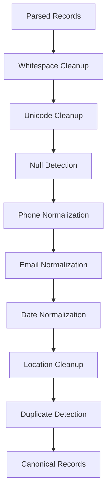
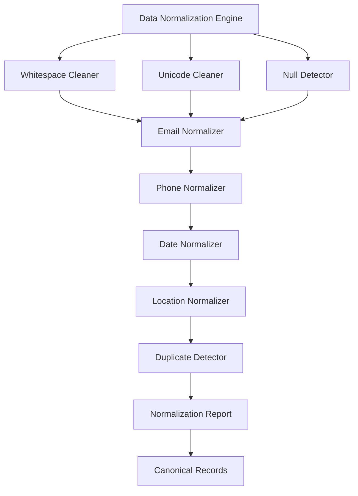

# Chapter 9 — Data Normalization Engine

> **Goal:** Transform messy, inconsistent, real-world CSV values into a clean, standardized dataset before any AI processing.

> **Core Principle:** **Every piece of deterministic cleaning done before the LLM reduces cost, improves accuracy, and lowers hallucinations.**

---

## 1. Why a Normalization Engine Exists

This is one of the biggest differences between a demo project and a production system.

A naive implementation looks like this:

```text
CSV → OpenAI → CRM JSON
```

AIDE instead inserts deterministic stages around the AI:


Why? Because AI should understand **meaning**, not fix formatting mistakes.

## 2. What is Data Normalization?

Normalization means converting different representations of the same information into one consistent representation.

Example — input:

```text
John
 john
JOHN
John
John
```

Output:

```text
John
```

Another example — input:

```text
+91 98765-43210
9876543210
(+91)9876543210
91-9876543210
```

Output:

```text
+919876543210
```

The meaning never changes. Only the representation changes.

## 3. Philosophy

Think of this engine as a **Data Refinery**: raw oil enters the refinery and petrol comes out. Similarly:

```text
Messy Data → Normalization → Clean Data
```

Only then does the data reach the AI.

## 4. Pipeline



## 5. Responsibilities

This engine owns:

- Cleaning
- Formatting
- Standardization
- Type refinement

It never:

- infers CRM fields
- maps semantics
- calls AI

Semantic mapping is the job of the AI Extraction Engine — see [Chapter 10 — AI Extraction Engine](10-ai-extraction-engine.md).

## 6. Stage 1 — Whitespace Cleanup

Real CSVs contain values like:

```text
" John "
"   Mumbai"
"john@gmail.com   "
```

Normalize to:

```text
John
Mumbai
john@gmail.com
```

Also collapse repeated spaces:

```text
John      Doe  →  John Doe
```

## 7. Stage 2 — Empty Value Detection

Many exports represent empty values differently:

```text
NULL
null
N/A
NA
-
--
Unknown
Empty String
Whitespace
```

All of these normalize to a single canonical `null`. Now every downstream stage understands missing values consistently.

## 8. Stage 3 — Unicode Normalization

Different Unicode sequences may render identically. For example, `José` can exist in multiple Unicode forms (composed vs. decomposed characters).

Normalize to a canonical representation to avoid hidden duplicates and comparison issues.

## 9. Stage 4 — Email Normalization

Example:

```text
John@GMAIL.COM
 john@gmail.com
JOHN@gmail.com
```

Normalize to:

```text
john@gmail.com
```

Also detect invalid formats. For example, `john@@gmail` is marked as `Invalid Email` — but the record is not discarded yet.

## 10. Multiple Emails

Input:

```text
john@gmail.com
john@yahoo.com
john@company.com
```

The assignment rule dictates:

- Primary → `john@gmail.com`
- Remaining → `crm_note`

Normalization prepares the values; later stages apply the business rule (see [Chapter 13 — Validation, Business Rules & Trust Engine](13-validation-trust-engine.md)).

## 11. Phone Number Normalization

This deserves its own subsystem. Examples:

```text
9876543210
+91 9876543210
91-9876543210
(+91)9876543210
98765 43210
```

Normalize to:

```text
+919876543210
```

Internally store:

```text
Country Code + National Number
```

This aligns directly with the required CRM schema.

## 12. Multiple Phone Numbers

Example:

```text
9876543210
9999999999
```

Output:

- Primary → `9876543210`
- Secondary → appended later into `crm_note`

Again: normalization prepares; business rules decide.

## 13. Date Normalization

Real-world dates:

```text
12/05/2026
2026-05-12
May 12 2026
12-May-26
2026/05/12
```

Normalize to:

```text
2026-05-12T00:00:00Z
```

Later stages convert to the desired output format. This greatly reduces ambiguity for the AI.

## 14. Name Cleanup

Example:

```text
JOHN DOE
john doe
 John Doe
```

Normalize to:

```text
John Doe
```

Also remove accidental prefixes/suffixes when appropriate, while preserving legitimate names.

## 15. Location Cleanup

Examples:

```text
Mumbai / mumbai / MUMBAI / " Mumbai"  →  Mumbai
```

State:

```text
maharashtra  →  Maharashtra
```

Country:

```text
india / INDIA  →  India
```

## 16. Company Cleanup

Example:

```text
Google Pvt Ltd
GOOGLE PRIVATE LIMITED
Google Pvt. Ltd.
```

Normalize spacing, casing, and punctuation consistently while preserving the original company identity.

## 17. Boolean Normalization

CSV values:

```text
Yes, TRUE, 1, Y, T  →  true
No, FALSE, 0, N     →  false
```

Useful for future extensibility.

## 18. Numeric Cleanup

Remove formatting artifacts:

```text
1,20,000  →  120000
₹45,000   →  45000
```

Even if not needed today, this makes the engine reusable.

## 19. Text Cleanup

Remove invisible characters:

- Zero-width spaces
- Non-breaking spaces
- Control characters
- Extra tabs

Without altering user intent.

## 20. Duplicate Value Detection

Within a record:

```text
Phone:  9876543210
Mobile: 9876543210
```

Recognize identical values so downstream logic does not treat them as separate contacts.

## 21. Noise Removal

Real exports contain label noise embedded in values:

```text
Phone: 9876543210     →  9876543210
Email:- john@gmail.com  →  john@gmail.com
```

## 22. Column Value Profiling

Enhance metadata with per-column statistics. Example for a `Phone` column:

```text
Unique:    1420
Missing:   3%
Duplicate: 1%
```

This information becomes useful for analytics and debugging.

## 23. Normalization Metadata

Don't only output cleaned data — output diagnostics:

```text
Phones Cleaned:      1380
Emails Cleaned:      1421
Dates Parsed:        1320
Unicode Fixed:       8
Whitespace Removed:  4300 fields
```

This becomes valuable in logs and monitoring (see [Chapter 15 — Observability, Telemetry & Operational Intelligence](15-observability.md)).

## 24. Normalization Rules Engine

Instead of hardcoding everything, create independent rule groups:

```text
Whitespace Rules → Text Rules → Email Rules → Phone Rules → Date Rules → Location Rules
```

Tomorrow, need PAN normalization? Add one rule. Pipeline unchanged.

## 25. Error Handling

Normalization should never stop the pipeline. Instead:

```text
Cannot Parse Date  →  Leave Original  →  Add Warning
```

or:

```text
Invalid Email  →  Mark Invalid  →  Continue
```

Recovery over failure.

## 26. Output Contract

Every record leaving this engine should contain:

- Original values (for traceability, if desired internally)
- Normalized values
- Field-level normalization diagnostics (optional but valuable)
- Record warnings

Conceptually:

```text
Original Record + Normalized Record + Normalization Report
```

## 27. Component Architecture



Every component performs exactly one transformation.

## 28. Why This Matters for AI

Instead of sending the LLM:

```text
Email : JOHN@GMAIL.COM
Phone : (+91)-98765 43210
Date  : 12-May-26
```

we send:

```text
Email : john@gmail.com
Phone : +919876543210
Date  : 2026-05-12T00:00:00Z
```

The AI now focuses on semantic extraction rather than formatting inconsistencies, resulting in:

- Higher extraction accuracy
- Lower token usage
- More consistent outputs
- Fewer retries

## 29. Engineering Decisions

| Decision | Reason |
|----------|--------|
| Normalize before AI | Reduce ambiguity and LLM workload |
| Preserve meaning | Never change user intent |
| Rule-based transformations | Deterministic, testable, inexpensive |
| Diagnostics generation | Better observability and debugging |
| Independent rule modules | Easy to extend and maintain |
| Graceful recovery | Invalid fields don't stop the pipeline |

## 30. Production Enhancement: Transformation History

This is one place where the design goes beyond a typical implementation.

Instead of mutating values directly, maintain a **transformation history** internally for each record:

```text
Original
    ↓
Trimmed Whitespace
    ↓
Normalized Email
    ↓
Standardized Phone
    ↓
Canonical Record
```

This audit trail makes debugging significantly easier. If someone asks, "Why did this phone number change?" or "Why was this email considered invalid?", you can inspect the exact sequence of transformations instead of guessing.

## Implementation Tasks

- [ ] **Task 9.1 — Deterministic normalization pipeline.** Build the ordered, single-responsibility normalization pipeline that transforms parsed records into canonical records.
- [ ] **Task 9.2 — Whitespace and Unicode normalization.** Trim values, collapse repeated spaces, and normalize Unicode to a canonical form.
- [ ] **Task 9.3 — Null value normalization.** Detect all empty-value representations (NULL, N/A, -, Unknown, whitespace, etc.) and map them to a canonical `null`.
- [ ] **Task 9.4 — Email normalization.** Lowercase and trim emails, detect invalid formats, and mark them without discarding records.
- [ ] **Task 9.5 — Phone normalization.** Standardize phone numbers to `+<country code><national number>` form, storing country code and national number separately.
- [ ] **Task 9.6 — Date normalization.** Parse heterogeneous date formats into a canonical ISO-8601 UTC representation.
- [ ] **Task 9.7 — Name, company, and location normalization.** Apply consistent casing, spacing, and punctuation cleanup while preserving identity.
- [ ] **Task 9.8 — Boolean and numeric normalization.** Map boolean variants to `true`/`false` and strip numeric formatting artifacts (separators, currency symbols).
- [ ] **Task 9.9 — Duplicate detection.** Recognize identical values across fields within a record (e.g., Phone vs. Mobile).
- [ ] **Task 9.10 — Noise removal.** Strip label prefixes (`Phone:`, `Email:-`) and invisible characters from values.
- [ ] **Task 9.11 — Normalization diagnostics.** Emit per-run diagnostics (counts of cleaned phones, emails, dates, Unicode fixes, whitespace removals) and per-column value profiles.
- [ ] **Task 9.12 — Rule-based architecture.** Implement normalization as independent, pluggable rule groups so new rules (e.g., PAN) can be added without pipeline changes.
- [ ] **Task 9.13 — Stable output contract.** Produce records containing original values, normalized values, diagnostics, and warnings for downstream AI stages.
- [ ] **Task 9.14 — Transformation history.** Maintain an internal per-record audit trail of every transformation applied, for debugging and traceability.

---

## Related Chapters

- [Chapter 8 — CSV Processing Engine](08-csv-processing-engine.md) — produces the parsed records this engine normalizes
- [Chapter 10 — AI Extraction Engine](10-ai-extraction-engine.md) — consumes the canonical records this engine emits
- [Chapter 13 — Validation, Business Rules & Trust Engine](13-validation-trust-engine.md) — applies the business rules (primary email/phone, `crm_note`) that normalization prepares for
- [Chapter 15 — Observability, Telemetry & Operational Intelligence](15-observability.md) — surfaces the normalization diagnostics in logs and monitoring
