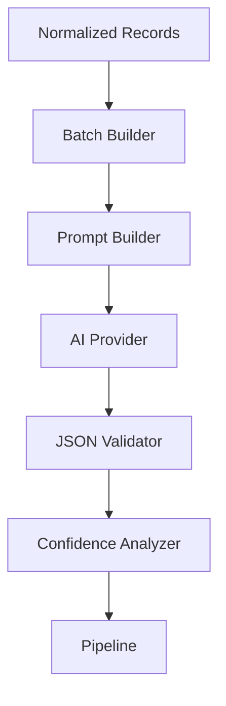
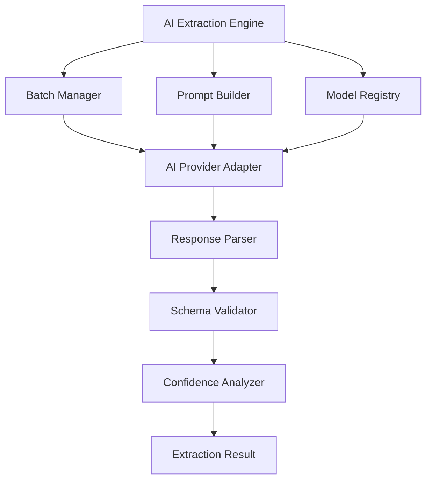
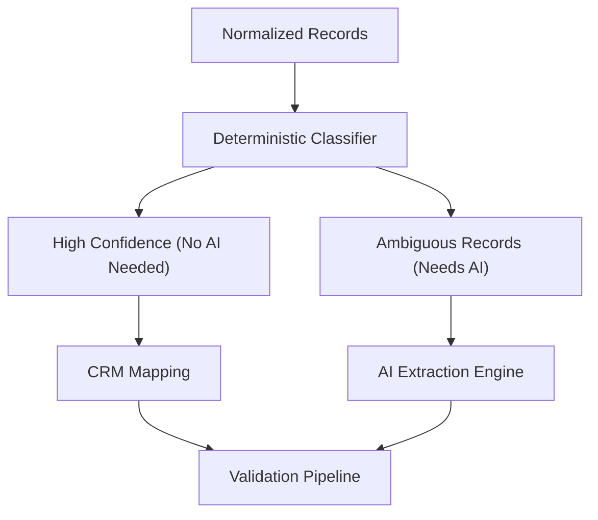

# Chapter 10 — AI Extraction Engine

> **Goal:** Design an enterprise-grade AI Extraction Engine that intelligently maps heterogeneous CSV data into the GrowEasy CRM schema while remaining deterministic, observable, provider-agnostic, fault-tolerant, and cost-efficient.

> **Core Principle:** **The AI is an expert consultant—not the owner of the system. The application remains the source of truth.**

---

## 1. The Biggest Mistake Developers Make

Most AI applications look like this:

```text
CSV → GPT → JSON
```

That is **AI-first architecture**. It is fragile.

AIDE instead builds:

```text
CSV → Deterministic Pipeline → AI → Deterministic Validation → Business Rules
```

AI becomes only one stage.

## 2. What Is the AI Engine?

The AI Engine is **not** a wrapper around an LLM API. It is an intelligent subsystem responsible for:

- semantic understanding
- ambiguity resolution
- intelligent mapping

It is **not** responsible for:

- validation
- business rules
- retries
- statistics
- formatting
- API responses

## 3. Responsibilities

The AI Engine owns:

- Semantic field mapping
- Understanding unknown headers
- Extracting CRM fields
- Understanding notes
- Mapping statuses
- Understanding free-form text

It never owns:

- Validation
- Skip logic
- Phone normalization
- Date formatting
- Statistics

Normalization is handled upstream (see [Chapter 9 — Data Normalization Engine](09-data-normalization-engine.md)); validation and skip logic downstream (see [Chapter 13 — Validation, Business Rules & Trust Engine](13-validation-trust-engine.md)).

## 4. AI Pipeline

Instead of `Rows → OpenAI`, the engine is a pipeline of single-responsibility components:



Each component has one responsibility.

## 5. Internal Architecture



Notice: the provider is just one component.

## 6. Why AI Is Needed

Deterministic logic cannot solve headers like:

```text
Lead Contact  →  Phone?
```

or:

```text
Primary Reach  →  Email? Phone? Owner?
```

Only semantic understanding solves that. That is where AI shines.

## 7. Semantic Understanding

Different CSVs express the same concept with different headers:

| CSV header | Value | Meaning |
|------------|-------|---------|
| `Customer` | John | Name |
| `Lead Name` | John | Name |
| `Owner` | John | Lead Owner |

Only AI understands that `Customer → Name` while `Owner → Lead Owner`. That is semantic mapping. The prompt strategies behind it are covered in [Chapter 11 — Prompt Engineering & Semantic Intelligence](11-prompt-engineering.md).

## 8. AI Provider Abstraction

Never directly call OpenAI. Instead:

```text
Pipeline → AI Adapter → Provider
```

The provider could be:

```text
OpenAI
Claude
Gemini
Local Model
Azure OpenAI
```

Tomorrow, switch providers — no business logic changes.

## 9. Model Registry

Never hardcode models. Instead, a Model Registry offers, for example:

```text
GPT-4.1
GPT-4o
Claude Sonnet
Gemini Pro
```

Configuration decides, not code.

## 10. Batch Manager

Never send 5000 rows to the AI in one request. Instead:

```text
5000 rows → batches of 50 → processed in parallel
```

Advantages:

- smaller context
- easier retry
- lower latency
- lower cost

## 11. Intelligent Batching

Instead of fixed batches, batch by:

- token count
- row complexity
- average cell size

Example: 100 short rows → one batch; 20 huge rows → one batch. Much smarter than a fixed row count.

## 12. Prompt Builder

The Prompt Builder is **not** the prompt. It constructs prompts dynamically:

```text
Batch + Metadata + Rules + Schema  →  Prompt
```

This keeps prompt generation centralized.

## 13. Context Builder

Instead of sending only rows, send:

```text
Headers → Column Types → Metadata → Rows → Expected Schema
```

The richer the context, the better the mapping.

## 14. AI Provider

The provider only does:

```text
Prompt → LLM → Response
```

Nothing else. No retries. No validation. No parsing.

## 15. Response Parser

The AI returns text; the pipeline needs a structured object. The parser converts:

```text
LLM Output → JSON Object
```

before validation.

## 16. JSON Repair Layer

Sometimes the AI returns broken JSON:

```text
{
"name":"John"
```

Instead of immediately retrying, attempt repair:

```text
Broken JSON → Repair → Valid? → Continue
                        ↓
                    Else Retry
```

This saves tokens.

## 17. Schema Validation

Every response must satisfy the CRM schema. Examples:

```text
email       →  string|null
mobile      →  string|null
crm_status  →  enum
```

Invalid? Reject.

## 18. Confidence Analysis

Even when JSON is valid, confidence may be poor. Example — the AI maps:

```text
Manager → Company
```

Suspicious. The confidence layer can flag it as `Low Confidence`; later, this can feed a human-review workflow (optional future feature).

## 19. Hallucination Prevention

The AI should never invent values — for example, filling in `Country → India` unless evidence exists.

Rules:

- Never guess
- Never invent
- Never fill missing values
- Unknown → `null`

This is critical.

## 20. AI Output Contract

The AI must only return a **structured CRM object**:

- No explanations
- No markdown
- No reasoning
- No comments

Only valid JSON. This dramatically simplifies parsing.

## 21. Parallel Processing

Suppose there are 20 batches. Instead of processing them sequentially (`1 → 2 → 3`), process several at once in parallel — but respect provider limits. Concurrency should be configurable. Orchestration details are covered in [Chapter 14 — Execution Engine, Orchestration & Concurrency](14-execution-orchestration.md).

## 22. Rate Limiting

AI providers have limits. The engine needs:

```text
Queue → Worker → Wait → Retry
```

Never spam the API.

## 23. Retry Strategy

Each failure class has its own handling:

| Failure | Response |
|---------|----------|
| Timeout | Retry |
| Rate limit | Exponential backoff |
| Malformed JSON | Repair, then retry |
| Provider down | Fail the batch, continue the pipeline |

Never crash the whole import.

## 24. Timeout Strategy

Never wait forever:

```text
30 seconds → Timeout → Retry
```

Timeouts should be configurable.

## 25. Cost Optimization

AI costs money. Optimization ideas:

### Remove unnecessary columns

Instead of sending 50 columns, send the 18 useful ones.

### Remove empty values

Instead of sending `City: null`, don't include empty fields in the prompt unless context requires them.

### Shorten headers

Internally map `Customer Email Address → email`. Fewer tokens.

### Batch efficiently

Avoid 1 row per request.

## 26. Caching

Imagine identical imports: same batch → same result. A future optimization:

```text
Prompt Hash → Cache → Reuse
```

No API call. Huge savings.

## 27. Observability

Track everything:

```text
Model Used → Tokens → Latency → Retries → Failures → Cost Estimate → Success Rate
```

Later, this feeds a dashboard (see [Chapter 15 — Observability, Telemetry & Operational Intelligence](15-observability.md)).

## 28. AI Metrics

Monitor:

- Average response time
- Average tokens
- Average records per second
- Average confidence
- Batch failure rate
- Provider errors

These metrics tell you if the system is healthy.

## 29. AI Engine State Machine

Every batch follows a predictable lifecycle:

```text
Pending → Prompt Generated → Submitted → Processing → Response Received → Validated → Completed
```

or, on error:

```text
… → Failed → Retry → Completed
```

State machines eliminate ambiguity.

## 30. AI Component Contracts

Every module has one responsibility:

| Component | Responsibility |
|------------|----------------|
| Batch Manager | Build optimal batches |
| Prompt Builder | Construct prompts |
| Context Builder | Prepare semantic context |
| Provider Adapter | Talk to LLM |
| Response Parser | Convert text → JSON |
| JSON Repair | Fix malformed responses |
| Schema Validator | Validate structure |
| Confidence Analyzer | Detect suspicious mappings |
| Metrics Collector | Measure AI performance |

No overlap.

## 31. Future Multi-Agent Evolution

Today, one AI produces the CRM JSON. In the future, the same pipeline can host specialized agents:

```text
Semantic Mapping Agent
        ↓
Contact Extraction Agent
        ↓
Address Extraction Agent
        ↓
CRM Status Agent
        ↓
Validation Agent
        ↓
Merge Agent
```

This architecture naturally supports specialized agents without changing the pipeline. See [Chapter 20 — Future Evolution & Platform Vision](20-future-evolution.md).

## 32. AI Engine Architecture

The full end-to-end flow of the engine:

```text
AI Extraction Engine
        │
  Batch Manager
        ▼
 Context Builder
        ▼
 Prompt Builder
        ▼
Provider Adapter
        ▼
 Response Parser
        ▼
   JSON Repair
        ▼
Schema Validator
        ▼
Confidence Analyzer
        ▼
Metrics Collector
        ▼
Structured CRM Data
```

Every stage has a well-defined contract and can evolve independently.

## 33. Engineering Decisions

| Decision | Reason |
|----------|--------|
| Provider abstraction | Swap LLMs without affecting business logic |
| Dynamic prompt builder | Centralized prompt management |
| Token-aware batching | Lower cost and higher throughput |
| Structured JSON output | Easier validation |
| JSON repair before retry | Reduce unnecessary API calls |
| Schema validation | Never trust raw AI output |
| Confidence analysis | Detect ambiguous mappings |
| Metrics collection | Production observability |
| Parallel execution | Faster imports while respecting rate limits |

## 34. Architectural Improvement: Hybrid Extraction Engine

The assignment assumes **every row goes to the LLM**. A production system shouldn't do that. Instead, introduce a **Hybrid Extraction Engine**:



Examples:

- A value matching an email regex does **not** need AI to know it's an email.
- A value matching a phone pattern does **not** need AI to know it's a phone.
- A header literally named `email` or `phone` is deterministic.

Reserve the LLM for what it's uniquely good at:

- Semantic column mapping (`Lead Contact`, `Primary Reach`, `Client Representative`)
- Interpreting free-form notes
- Resolving ambiguous relationships
- Mapping to constrained CRM enums

> **Design Rationale:** This hybrid architecture yields **lower AI cost**, **lower latency**, **higher accuracy**, **fewer hallucinations**, **easier testing**, and **better scalability**. It is the kind of design decision associated with production experience rather than assignment-driven development.

## Implementation Tasks

- [ ] **Task 10.1 — Provider-agnostic AI architecture.** Build an AI adapter layer so the pipeline never calls a specific LLM provider directly.
- [ ] **Task 10.2 — Token-aware batch manager.** Split normalized records into batches sized by token count, row complexity, and average cell size.
- [ ] **Task 10.3 — Dynamic prompt builder.** Construct prompts centrally from batch, metadata, rules, and the expected schema.
- [ ] **Task 10.4 — Context builder.** Assemble headers, column types, metadata, rows, and expected schema into rich semantic context for each request.
- [ ] **Task 10.5 — Provider adapter.** Implement the minimal `Prompt → LLM → Response` component with no retries, validation, or parsing.
- [ ] **Task 10.6 — Response parser.** Convert raw LLM text output into structured JSON objects.
- [ ] **Task 10.7 — JSON repair layer.** Attempt to repair malformed JSON responses before spending tokens on a retry.
- [ ] **Task 10.8 — Schema validation.** Validate every AI response against the CRM schema (types and enums) and reject invalid output.
- [ ] **Task 10.9 — Confidence analysis.** Flag suspicious or low-confidence field mappings for downstream handling.
- [ ] **Task 10.10 — Retry and timeout strategies.** Implement per-failure-class handling: retry on timeout, exponential backoff on rate limits, repair-then-retry on malformed JSON, fail-batch-and-continue when the provider is down, with configurable timeouts.
- [ ] **Task 10.11 — Rate limiting.** Add a queue/worker mechanism that respects provider limits and never spams the API.
- [ ] **Task 10.12 — Observability and AI metrics.** Collect model, token, latency, retry, failure, cost, confidence, and success-rate metrics per batch.
- [ ] **Task 10.13 — Parallel execution model.** Process batches concurrently with configurable concurrency, respecting provider limits.
- [ ] **Task 10.14 — Model registry.** Drive model selection (GPT-4.1, GPT-4o, Claude Sonnet, Gemini Pro, …) from configuration, not code.
- [ ] **Task 10.15 — Prompt-hash caching.** Cache extraction results keyed by prompt hash so identical batches skip the API call.
- [ ] **Task 10.16 — Hybrid deterministic + AI extraction.** Add a deterministic classifier that routes high-confidence records straight to CRM mapping and sends only ambiguous records to the LLM.
- [ ] **Task 10.17 — Multi-agent evolution path.** Keep component contracts stable so specialized agents (mapping, contact, address, status, validation, merge) can replace the single AI stage later.

---

## Related Chapters

- [Chapter 9 — Data Normalization Engine](09-data-normalization-engine.md) — supplies the clean canonical records this engine extracts from
- [Chapter 11 — Prompt Engineering & Semantic Intelligence](11-prompt-engineering.md) — engineers the prompts the Prompt Builder constructs
- [Chapter 12 — Semantic Intelligence & Prompt Orchestration](12-semantic-intelligence.md) — orchestrates the semantic-mapping intelligence this engine relies on
- [Chapter 13 — Validation, Business Rules & Trust Engine](13-validation-trust-engine.md) — the deterministic validation stage that never trusts raw AI output
- [Chapter 14 — Execution Engine, Orchestration & Concurrency](14-execution-orchestration.md) — runs the parallel batch execution and rate-limited workers
