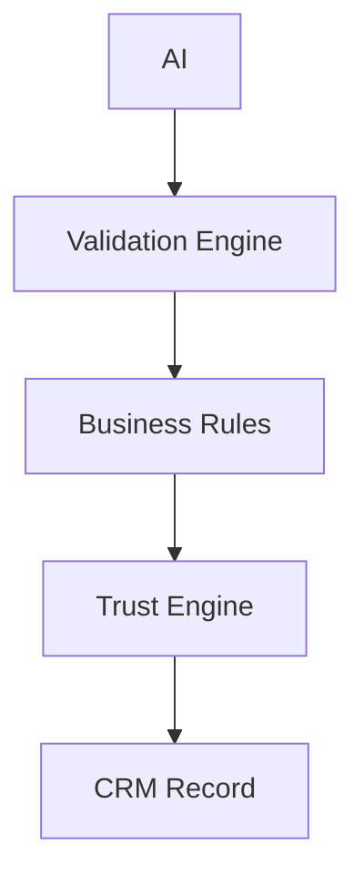
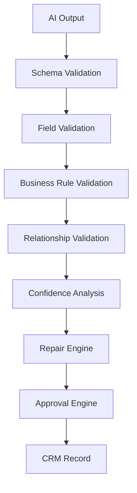
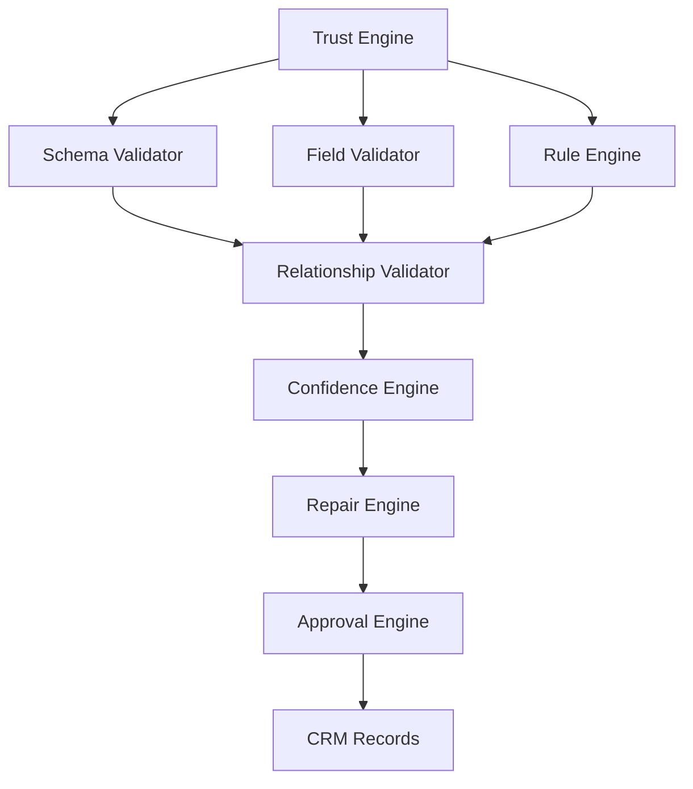
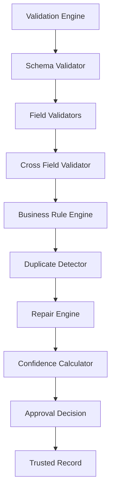

# Chapter 13 — Validation, Business Rules & Trust Engine

> **Goal:** Build a deterministic trust layer that verifies, repairs, enriches, and approves AI output before it becomes a CRM record.

> **Core Principle:** **Never trust AI output. Verify everything.**

The chapters up to this point designed **how to extract data** (see [Chapter 10 — AI Extraction Engine](10-ai-extraction-engine.md) and [Chapter 12 — Semantic Intelligence & Prompt Orchestration](12-semantic-intelligence.md)). From here onward, the question is no longer *"Can the AI extract data?"* — it becomes *"Can we trust the extracted data?"* This is where most AI projects fail.

## 1. Why a Validation Engine?

The naive design wires the model straight into storage:

```text
AI → Database
```

This is extremely dangerous. Suppose the AI returns:

```json
{
  "email": "john@gmail",
  "crm_status": "INTERESTED",
  "country": "Mars"
}
```

Everything in that object is wrong — the email is malformed, the status is not a known enum value, and the country does not exist. A production system never allows AI to directly create business objects. Instead:



## 2. Philosophy

Think of the AI as a junior employee. No organization lets a junior employee directly update the production CRM — someone reviews the work first. The Validation Engine is that reviewer.

## 3. Validation Pipeline

Every AI output passes through a fixed sequence of stages, and every stage increases confidence:



## 4. Trust Levels

Not every record is equally trustworthy, so records are classified rather than treated uniformly:

```text
High Confidence   → Auto Import
Medium Confidence → Repair → Import
Low Confidence    → Skip → Review
```

Future versions could expose the review queue as a user-facing feature.

## 5. Validation Architecture

Validation isn't one function — it's an ecosystem of cooperating components:



## 6. Schema Validation

The first check verifies structure. If the schema expects `email` to be `string | null` and the AI returns `email: []`, the value is rejected immediately. Every field must satisfy the schema before any deeper validation runs.

## 7. Required Structure Validation

Every record must contain the complete set of expected fields:

```text
created_at
name
email
mobile
company
...
crm_status
```

Missing fields are filled with `null`. The engine never allows inconsistent objects — every record downstream has an identical shape.

## 8. Field Validators

Every field has its own validator, and each validator owns exactly one responsibility:

| Validator | Checks |
|-----------|--------|
| Email Validator | RFC format |
| Phone Validator | Digits |
| Country Validator | Known country |
| Status Validator | Enum membership |

## 9. Email Validation

Email syntax is checked deterministically:

| Input | Verdict |
|-------|---------|
| `john@gmail` | Invalid |
| `john@@gmail.com` | Invalid |
| `john@gmail.com` | Valid |

Never ask the AI to validate email syntax — this is a solved, deterministic problem.

## 10. Phone Validation

Likewise deterministic:

| Input | Verdict |
|-------|---------|
| `9876543210` | Valid |
| `abc123` | Invalid |

## 11. Date Validation

The requirement is that `created_at` must work with:

```javascript
new Date(created_at)
```

Validation checks that the value is:

- parsable
- not corrupted
- normalized

If a date fails these checks, it is either repaired or set to `null`.

## 12. Enum Validation

The CRM status field allows exactly four values:

```text
GOOD_LEAD_FOLLOW_UP
DID_NOT_CONNECT
BAD_LEAD
SALE_DONE
```

If the AI returns `Interested`, the value is invalid. The engine attempts a repair; if repair fails, the field becomes `null`. The system never invents enum values.

## 13. Data Source Validation

The data source field is restricted to the known set:

```text
leads_on_demand
meridian_tower
eden_park
varah_swamy
sarjapur_plots
```

Anything else becomes `null`.

## 14. Cross-Field Validation

One field alone isn't enough — fields must be consistent with each other.

Example — an impossible combination that must be flagged:

```text
Country Code: +91
Country:      USA
```

Example — a suspicious combination:

```text
City:    Mumbai
Country: Germany
```

Relationship validation detects contradictions that per-field validators cannot see.

## 15. Business Rules Engine

Assignment-level rules belong here, not in the AI layer. Example — the skip rule:

```text
IF email IS NULL AND phone IS NULL → SKIP record
```

This is business logic, executed deterministically by a rule — never delegated to the AI.

## 16. Duplicate Contact Rules

Within a single record, contact values can repeat:

```text
Primary Email:   john@gmail.com
Secondary Email: john@gmail.com
```

This is a duplicate — keep one. When a record has multiple phone numbers, keep the first as the primary and move the others into `crm_note`, exactly as the assignment requires.

## 17. CRM Note Builder

One of the most overlooked components. It merges the leftover signal into a single field:

```text
Additional Emails + Additional Phones + Remarks + Comments → crm_note
```

with consistent formatting, so no extracted information is silently lost.

## 18. Repair Engine

Validation failures don't always require rejection. Many values can be repaired deterministically:

| Input | Repair | Result |
|-------|--------|--------|
| `GOOD LEAD` | Enum normalization | `GOOD_LEAD_FOLLOW_UP` |
| `india` | Case normalization | `India` |
| ` john@gmail.com` | Trim whitespace | Valid email |

The policy is: **repair first, reject later.** This maximizes the import success rate without compromising correctness.

## 19. Confidence Engine

Every record receives a numeric score built from weighted signals:

| Signal | Adjustment |
|--------|-----------|
| Email valid | +20 |
| Phone valid | +20 |
| Name present | +10 |
| Status known | +10 |
| Contradiction detected | -30 |

Example final score: **78%**.

## 20. Trust Categories

Instead of a binary valid/invalid decision, the score maps to a trust category:

| Score | Category | Action |
|-------|----------|--------|
| 90–100 | Trusted | Auto Import |
| 70–90 | Good | Import |
| 40–70 | Repair | Revalidate |
| Below 40 | — | Skip |

## 21. Duplicate Detection

Suppose the CSV contains both:

```text
John        john@gmail.com
John Doe    john@gmail.com
```

This is a potential duplicate. The engine flags it but does **not** remove it automatically — future CRM integrations may decide how to merge or discard flagged duplicates.

## 22. Record Fingerprinting

Each record is given an internal identity — a hash of:

```text
Email + Phone + Name → Fingerprint
```

Fingerprints are useful for:

- deduplication
- analytics
- caching

## 23. Validation Reports

Every record produces per-field diagnostics:

```text
Validated:  ✓
Email:      ✓
Phone:      ✓
Status:     ✓
Country:    ×
Repaired:   1
Warnings:   2
```

This makes debugging individual records straightforward.

## 24. Validation Metrics

The system also aggregates run-level metrics — ideal for dashboards (see [Chapter 15 — Observability](15-observability.md)):

```text
Records:    1500
Valid:      1438
Repaired:   41
Skipped:    21
Duplicates: 18
```

## 25. Error Categories

The engine never throws a generic "Validation Failed". Every failure carries a category:

```text
Schema Error
Business Rule Error
Relationship Error
Repair Failure
Confidence Failure
```

Categorized errors give clear diagnostics and enable targeted handling.

## 26. Validation Rule Registry

Instead of scattering `if (...)` checks everywhere, rules are organized in a registry:

```text
Schema Rules
Email Rules
Phone Rules
Business Rules
Relationship Rules
Repair Rules
```

A registry keeps the rule set discoverable and easy to maintain.

## 27. Rule Execution Engine

Rules execute independently:

```text
Rule 1 → Rule 2 → Rule 3 → Rule 4
```

A single rule failure does **not** stop the remaining validations — the engine collects **all** issues for a record, so one pass reveals every problem.

## 28. Validation Pipeline State Machine

Every record moves through a predictable state machine:

```text
Pending → Schema → Field → Relationship → Business → Repair → Confidence → Approved
```

or terminates in:

```text
→ Rejected
```

## 29. Validation Architecture

The complete end-to-end flow, fully deterministic with no AI involvement:



## 30. Why This Matters

Suppose the AI provider changes behavior tomorrow — prompt quality drops and extraction accuracy falls. Without validation, garbage enters the CRM. With this architecture, validation catches:

- invalid enums
- broken emails
- impossible relationships
- duplicates
- missing contacts
- malformed dates

The CRM remains protected regardless of upstream model quality.

## 31. One Major Improvement Beyond the Assignment

### Explainable Validation

Every accepted or rejected record carries a validation audit:

```text
Record #214
Score: 92%

Passed
  ✓ Email
  ✓ Phone
  ✓ Status
  ✓ Schema

Warnings
  Country inferred from phone code not used.

Repairs
  Whitespace removed from email.
```

Now every import decision is explainable. When asked *why* a record was skipped, the answer is never "validation failed" — it is a concrete audit trail:

```text
Record 214
→ Missing Email
→ Missing Phone
→ Business Rule BR-001 triggered
→ Skipped
```

This is the level of observability expected in production systems.

## 32. Engineering Decisions

| Decision | Reason |
|----------|--------|
| AI output never trusted directly | Prevents invalid CRM records |
| Multi-layer validation | Isolates responsibilities |
| Rule registry | Easier maintenance |
| Repair before rejection | Improves import success rate |
| Confidence scoring | More nuanced than pass/fail |
| Validation reports | Better debugging and UX |
| Cross-field validation | Detects contradictions |
| Record fingerprinting | Supports deduplication and analytics |
| Explainable validation | Makes every decision auditable |

## 33. Architecture Status

At this point, the system is no longer just an **AI-powered CSV importer**. It has become a **production-grade AI ingestion platform** with:

- Reliable ingestion (Chapters 5–9)
- Intelligent semantic extraction (Chapters 10–12)
- Deterministic trust and validation (this chapter)

The remaining chapters focus on **operational excellence**: high-throughput batch execution ([Chapter 14](14-execution-orchestration.md)), observability, resilience, deployment, testing, and future evolution into a scalable AI data platform.

## Implementation Tasks

- [ ] **Task 13.1 — Schema Validation Engine.** Verify every AI output object against the expected field types, rejecting structurally invalid values.
- [ ] **Task 13.2 — Field Validators.** Implement single-responsibility validators for email (RFC format), phone (digits), country (known list), and status (enum).
- [ ] **Task 13.3 — Required Structure Validation.** Guarantee every record contains the full field set, filling missing fields with `null`.
- [ ] **Task 13.4 — Cross-Field Relationship Validation.** Detect contradictions between fields such as country code vs. country and city vs. country.
- [ ] **Task 13.5 — Business Rule Engine.** Implement deterministic business rules, including skipping records with neither email nor phone.
- [ ] **Task 13.6 — Duplicate Detection.** Flag potential duplicate records (same email, similar name) without removing them automatically.
- [ ] **Task 13.7 — CRM Note Builder.** Merge additional emails, additional phones, remarks, and comments into a consistently formatted `crm_note`.
- [ ] **Task 13.8 — Repair Engine.** Deterministically repair fixable values (enum normalization, casing, whitespace) before considering rejection.
- [ ] **Task 13.9 — Confidence Scoring.** Compute a weighted per-record confidence score from field validity, presence, and contradictions.
- [ ] **Task 13.10 — Trust Categories.** Map confidence scores to trust bands (Trusted / Good / Repair / Skip) that drive the import decision.
- [ ] **Task 13.11 — Record Fingerprinting.** Generate a hash of email + phone + name per record for deduplication, analytics, and caching.
- [ ] **Task 13.12 — Validation Reports.** Emit per-record diagnostics listing passed checks, repairs, and warnings.
- [ ] **Task 13.13 — Validation Metrics.** Aggregate run-level counts (valid, repaired, skipped, duplicates) for dashboards.
- [ ] **Task 13.14 — Rule Registry & Execution Engine.** Organize validation rules in a registry and execute them independently, collecting all issues rather than failing fast.
- [ ] **Task 13.15 — Explainable Validation Audit.** Attach a full audit trail to every accepted or rejected record explaining the decision.

---

## Related Chapters

- [Chapter 10 — AI Extraction Engine](10-ai-extraction-engine.md) — produces the untrusted AI output this trust layer verifies
- [Chapter 12 — Semantic Intelligence & Prompt Orchestration](12-semantic-intelligence.md) — the prompt layer whose quality variations validation defends against
- [Chapter 14 — Execution Engine, Orchestration & Concurrency](14-execution-orchestration.md) — runs validation at scale across parallel batches
- [Chapter 15 — Observability, Telemetry & Operational Intelligence](15-observability.md) — consumes validation reports and metrics
- [Chapter 9 — Data Normalization Engine](09-data-normalization-engine.md) — deterministic normalization that precedes AI extraction and validation
