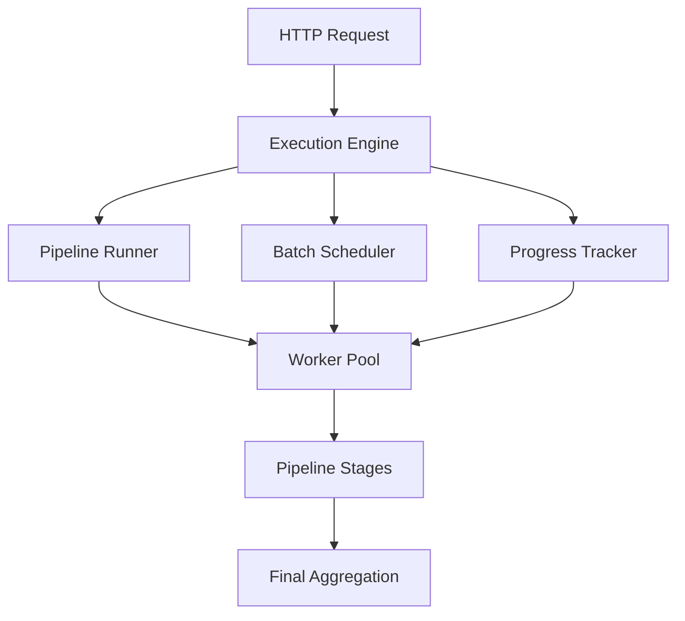
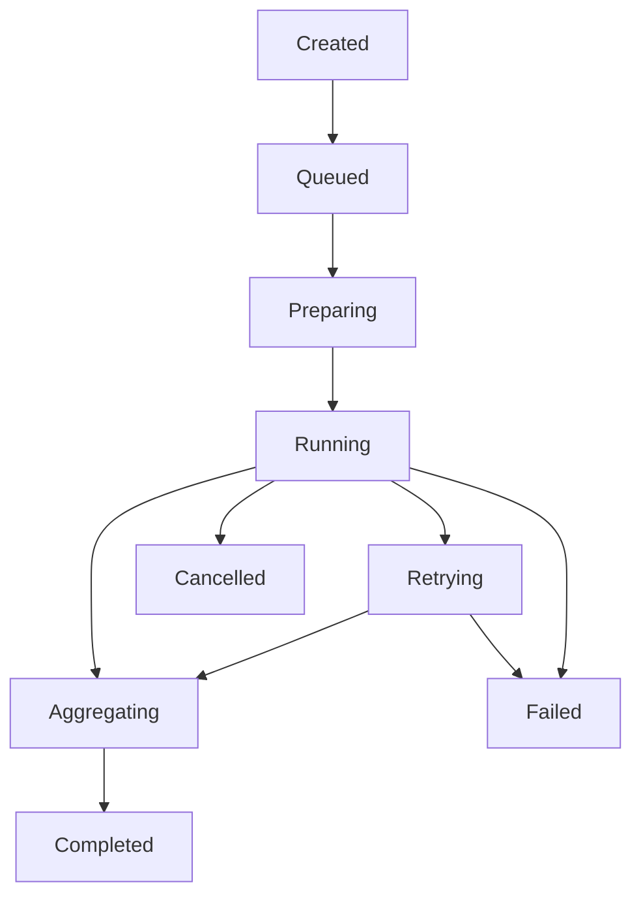
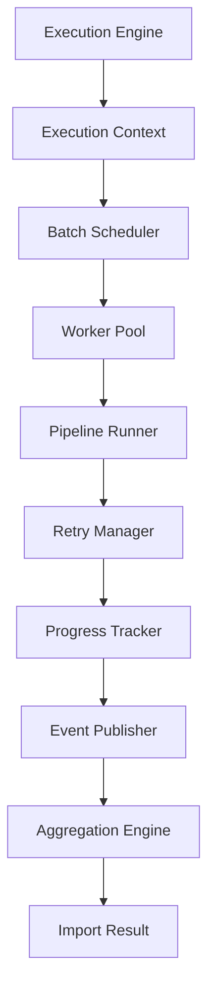

# Chapter 14 — Execution Engine, Orchestration & Concurrency

> **Goal:** Build a resilient execution engine capable of orchestrating the entire import pipeline with concurrency, fault isolation, retries, progress tracking, and future horizontal scalability.

> **Core Principle:** **The pipeline defines WHAT happens. The Execution Engine decides HOW it happens.**

The previous chapters built the intelligence of the system — extraction, semantics, and trust. This chapter addresses execution architecture: an AI system isn't just about making correct decisions, it's about executing thousands of operations reliably, efficiently, and observably.

## 1. Why We Need an Execution Engine

It's tempting to assume the pipeline executes itself:

```text
CSV → Parse → Normalize → AI → Validate → Done
```

Reality is different. Someone has to decide:

- when to start
- how many batches to run
- what to retry
- how to recover
- how to report progress
- when to stop

That "someone" is the Execution Engine.

## 2. Pipeline vs Execution Engine

These are different concepts:

- The **pipeline** defines **WHAT** happens.
- The **Execution Engine** defines **HOW** it happens.

Example — the pipeline says:

```text
Normalize → AI → Validate
```

The Execution Engine says:

```text
Run 6 batches → Retry Batch 3 → Pause → Continue → Merge Results
```

## 3. System Architecture

The Execution Engine owns orchestration:



## 4. Responsibilities

The Execution Engine **owns**:

- Pipeline orchestration
- Batch scheduling
- Concurrency
- Retry strategy
- Progress tracking
- Timeouts
- Failure isolation
- Metrics collection

It **never owns**:

- AI logic
- Validation logic
- Business rules

Those live in the pipeline stages (see [Chapter 10 — AI Extraction Engine](10-ai-extraction-engine.md) and [Chapter 13 — Validation, Business Rules & Trust Engine](13-validation-trust-engine.md)).

## 5. Execution Lifecycle

Every import follows the same lifecycle, so every import has a predictable state:

```text
Created → Queued → Preparing → Executing → Validating → Aggregating → Completed
```

or terminates in:

```text
→ Failed
```

## 6. Import Context

Every execution gets its own context — the single object that every subsystem reads and updates. Conceptually it contains:

```text
Request ID
Uploaded File
Metadata
Current Stage
Completed Batches
Statistics
Errors
Execution State
```

## 7. Batch Scheduler

Suppose the CSV contains 5000 rows. The scheduler — not the pipeline — decides the batching:

```text
Batch 1 → Rows 1–100
Batch 2 → Rows 101–200
Batch 3 → Rows 201–300
...
```

Keeping batching out of the pipeline keeps the pipeline pure and the scheduling policy replaceable.

## 8. Dynamic Batch Size

Never hardcode a batch size like `100 rows`. Instead, size batches based on:

- token count
- average row width
- provider limits
- memory
- latency

Large rows → smaller batches. Small rows → larger batches. This is much more efficient than a fixed size.

## 9. Worker Pool

Never create unlimited parallel tasks. Instead, the Execution Engine feeds a bounded worker pool:

```text
Execution Engine → Worker Pool → Worker 1 | Worker 2 | Worker 3 | Worker 4
```

Workers process batches independently.

## 10. Parallel Processing

Instead of processing batches sequentially (`Batch 1 → Batch 2 → Batch 3`), run them in parallel:

```text
Batch 1  Batch 2  Batch 3  Batch 4  → Parallel
```

This yields a massive performance gain on large imports.

## 11. Configurable Concurrency

Different AI providers have different limits, so concurrency is configuration, not code:

| Environment | Workers |
|-------------|---------|
| Development | 2 |
| Production | 8 |
| Enterprise | 20 |

Changing environments requires no code changes.

## 12. Stage Execution

Each worker executes the full pipeline for its batch:

```text
Normalize → Prompt → AI → Validate → Repair
```

Every batch runs independently of the others.

## 13. Failure Isolation

Imagine batch 17 fails.

Bad architecture: the entire import fails.

Good architecture:

```text
Batch 17      → Retry
Other Batches → Continue
```

Never stop everything because of one failure.

## 14. Retry Strategy

Different failure types deserve different recovery strategies:

| Failure | Action |
|---------|--------|
| AI Timeout | Retry |
| Rate Limit | Backoff + Retry |
| Network Error | Retry |
| Invalid JSON | Repair → Retry |
| Validation Failure | Skip Record |
| Internal Bug | Fail Batch |

## 15. Retry Queue

Failed batches flow into a dedicated retry queue — simple and predictable:

```text
Failed → Retry Queue → Worker → Completed
```

## 16. Timeout Manager

Every stage has a timeout — the system never waits forever:

| Stage | Timeout |
|-------|---------|
| CSV Parse | 20 sec |
| AI | 45 sec |
| Validation | 10 sec |

## 17. Cancellation Support

If the user closes the browser, should the server stop? Not necessarily. The execution context supports a clean cancellation path:

```text
Running → Cancellation Requested → Safe Shutdown
```

A future API could cancel execution cleanly:

```text
DELETE /import/{id}
```

## 18. Progress Tracker

The frontend should never guess progress. The Execution Engine reports each phase, with percentages:

```text
Preparing → Parsing → Normalizing → Processing AI → Validation → Finalizing
```

## 19. Progress Events

Every stage emits events:

```text
Batch Started → AI Started → AI Finished → Validation Finished → Batch Complete
```

These events feed the UI, logs, and metrics.

## 20. Aggregation Engine

Workers finish independently, so one component must merge the results:

```text
Batch 1 + Batch 2 + Batch 3 → Aggregation → One Result
```

Aggregation also combines:

- statistics
- skipped records
- diagnostics
- warnings

## 21. Partial Success

One of the most important concepts in the execution layer. Imagine 20 batches: 18 succeed, 2 fail.

Never return:

```text
Import Failed
```

Return:

```text
Imported: 1800
Skipped:  43
Failed:   2 batches
```

Users strongly prefer partial success over all-or-nothing failure.

## 22. Execution State Machine

Every import moves through a well-defined state machine, which makes debugging much easier:



## 23. Event Bus

Instead of modules calling each other directly, subsystems publish events:

```text
Batch Completed → Event Bus → Progress Tracker → Logger → Metrics → Dashboard
```

This gives low coupling and easy extension — new consumers subscribe without touching the engine.

## 24. Execution Metrics

The engine collects:

```text
Rows/sec
Batches/sec
Average AI Time
Retry Count
Worker Utilization
Success Rate
```

These metrics reveal bottlenecks (see [Chapter 15 — Observability](15-observability.md)).

## 25. Memory Management

Avoid accumulating everything in RAM.

Bad:

```text
All Batches → Memory → Merge
```

Better:

```text
Batch → Process → Aggregate → Release Memory
```

Releasing batch memory as soon as it is aggregated allows much larger imports.

## 26. Backpressure Control

Suppose the AI provider slows down. Without backpressure:

```text
Workers → Keep Creating Requests → Queue Explosion
```

Instead, the Execution Engine monitors throughput. If downstream slows, the scheduler temporarily reduces concurrency. This keeps the system stable under load.

## 27. Observability

Every execution produces structured telemetry:

```text
Import ID
Execution Timeline
Worker Timeline
Retries
Latency
Cost
Validation Score
```

This enables debugging without reproducing the issue.

## 28. Future Queue Integration

Today the import can execute synchronously. Tomorrow it can move behind a job queue:

```text
Upload → Job Queue → Worker Service → Pipeline → Database → Notification
```

Crucially, the Execution Engine itself doesn't change — only the execution mode changes.

## 29. Execution Engine Architecture

Each subsystem owns exactly one responsibility:



## 30. Engineering Decisions

| Decision | Reason |
|----------|--------|
| Separate execution from pipeline | Clear separation of orchestration and business logic |
| Worker pool | Controlled parallelism |
| Dynamic batching | Better throughput and token efficiency |
| Failure isolation | One batch doesn't break the entire import |
| Partial success | Better user experience |
| Event-driven progress | Decoupled architecture |
| Aggregation engine | Deterministic final result |
| Backpressure control | Stable under varying provider latency |
| Configurable concurrency | Easy deployment across environments |

## 31. Production Enhancement Beyond the Assignment

### Adaptive Execution Engine

Instead of fixed concurrency, let the engine adjust itself automatically from live metrics:

```text
Current Metrics
  Provider Latency
  Rate Limit Errors
  CPU Usage
  Memory Usage
        ↓
Adaptive Scheduler
        ↓
Concurrency = 3  or  Concurrency = 8
```

Examples of adaptive behavior:

- AI responses are fast → increase concurrency.
- Rate-limit responses increase → reduce concurrency.
- Memory pressure grows → shrink batch size.
- Token usage spikes → reduce parallel AI requests.

This creates a **self-tuning execution engine** that maximizes throughput while respecting system constraints — a pattern commonly used in production data-processing systems.

## 32. Architecture Status

The platform has now evolved into a **production-grade AI data ingestion system** with four major architectural pillars:

1. **Data Intelligence** (CSV parsing, normalization)
2. **Semantic Intelligence** (AI extraction, prompt orchestration)
3. **Trust Layer** (validation, business rules, repair)
4. **Execution Layer** (scheduling, concurrency, recovery, progress)

The remaining chapters focus on **operational excellence** — logging, monitoring, testing, deployment, security, and long-term maintainability — transforming the project from a robust application into a production-ready platform.

## Implementation Tasks

- [ ] **Task 14.1 — Execution Engine.** Build the orchestration layer that owns scheduling, concurrency, retries, timeouts, progress, and metrics — but no business logic.
- [ ] **Task 14.2 — Import Execution Context.** Create a per-import context holding request ID, file, metadata, current stage, completed batches, statistics, errors, and execution state.
- [ ] **Task 14.3 — Batch Scheduler.** Split input rows into batches outside the pipeline, keeping batching policy replaceable.
- [ ] **Task 14.4 — Dynamic Batch Sizing.** Size batches from token count, row width, provider limits, memory, and latency instead of a hardcoded constant.
- [ ] **Task 14.5 — Worker Pool.** Implement a bounded pool of workers that process batches independently.
- [ ] **Task 14.6 — Configurable Concurrency.** Expose worker count as environment configuration (e.g., 2 dev / 8 prod / 20 enterprise).
- [ ] **Task 14.7 — Retry Manager.** Map each failure type (timeout, rate limit, network, invalid JSON, validation, internal bug) to its recovery strategy and route failed batches through a retry queue.
- [ ] **Task 14.8 — Timeout Manager.** Enforce per-stage timeouts (e.g., parse 20 s, AI 45 s, validation 10 s).
- [ ] **Task 14.9 — Cancellation Support.** Support a Running → Cancellation Requested → Safe Shutdown path, enabling a future `DELETE /import/{id}` API.
- [ ] **Task 14.10 — Progress Tracker.** Report named phases with percentages so the frontend never guesses progress.
- [ ] **Task 14.11 — Event Bus.** Publish batch and stage lifecycle events consumed by the progress tracker, logger, metrics, and dashboard.
- [ ] **Task 14.12 — Aggregation Engine.** Merge per-batch results, statistics, skipped records, diagnostics, and warnings into one deterministic result.
- [ ] **Task 14.13 — Partial Success Strategy.** Report imported/skipped/failed counts rather than failing an entire import when some batches fail.
- [ ] **Task 14.14 — Execution State Machine.** Model every import as Created → Queued → Preparing → Running → Retrying → Aggregating → Completed / Cancelled / Failed.
- [ ] **Task 14.15 — Backpressure Control.** Monitor downstream throughput and reduce concurrency when the AI provider slows.
- [ ] **Task 14.16 — Execution Metrics.** Collect rows/sec, batches/sec, average AI time, retry count, worker utilization, and success rate.
- [ ] **Task 14.17 — Adaptive Execution Strategy.** Tune concurrency and batch size automatically from live latency, rate-limit, CPU, memory, and token-usage signals.

---

## Related Chapters

- [Chapter 13 — Validation, Business Rules & Trust Engine](13-validation-trust-engine.md) — the validation stage each worker executes per batch
- [Chapter 8 — CSV Processing Engine](08-csv-processing-engine.md) — the parsing stage orchestrated at the start of every import
- [Chapter 10 — AI Extraction Engine](10-ai-extraction-engine.md) — the AI stage whose latency and rate limits drive scheduling decisions
- [Chapter 15 — Observability, Telemetry & Operational Intelligence](15-observability.md) — consumes execution events, metrics, and telemetry
- [Chapter 16 — Reliability, Resilience & Fault Tolerance](16-reliability-resilience.md) — extends retry, isolation, and backpressure into full fault tolerance
