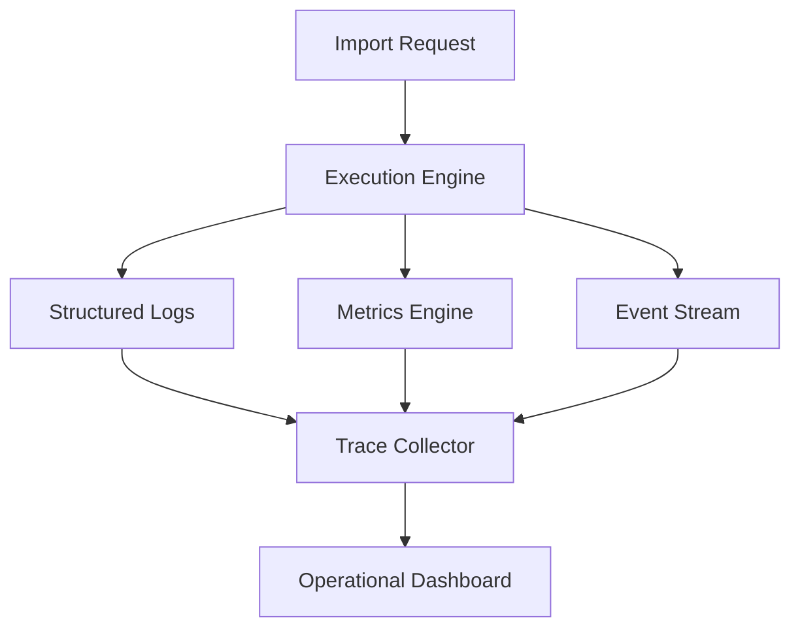
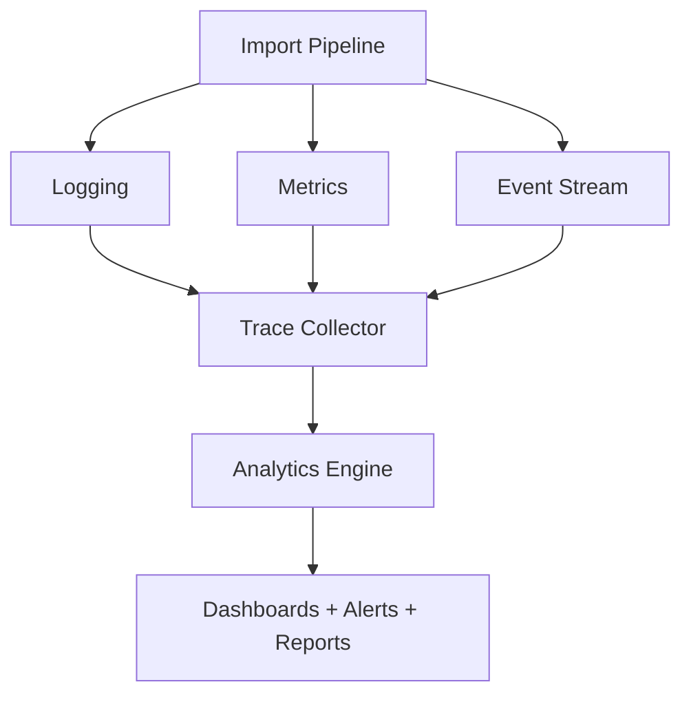
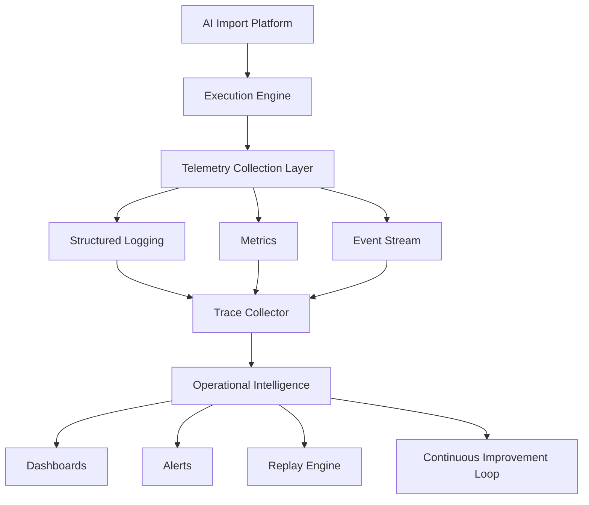

# Chapter 15 — Observability, Telemetry & Operational Intelligence

With the execution layer complete (see [Chapter 14 — Execution Engine, Orchestration & Concurrency](14-execution-orchestration.md)), the focus shifts to what separates good software from production software. Production systems must answer one question:

> **Can I operate this system at 2 AM when something goes wrong?**

> **Goal:** Design a complete observability platform that allows developers and operators to understand, debug, monitor, optimize, and continuously improve the AI ingestion engine in production.

> **Core Principle:** **If you cannot observe your system, you cannot operate or improve it.**

---

## 1. Why Observability Matters

Suppose a user reports:

> "My CSV imported incorrectly."

Without observability, there is no way to reconstruct what happened. With observability, the full story of the import is recoverable:

```text
Import #48291
  → CSV Parsed
  → 1452 rows
  → AI Batch #12 Failed
  → Retried
  → JSON Repair Applied
  → Validation repaired 17 records
  → Final Success 98.4%
```

You know exactly what happened at every step.

---

## 2. Monitoring vs Logging vs Observability

These terms are frequently confused, but each answers a different question.

### Logging

Answers: **What happened?**

```text
CSV uploaded
Rows parsed
AI completed
```

### Metrics

Answers: **How often?**

```text
Average latency
Error rate
Imports/hour
```

### Tracing

Answers: **Where did time go?**

```text
Upload → Parser → AI → Validation → Response
```

### Observability

Answers: **Why did this happen?**

Observability combines all of the above:

```text
Logs + Metrics + Tracing + Events
```

---

## 3. Architecture



---

## 4. Three Levels of Observability

### Level 1 — Application

Questions:

- Is the server alive?
- Memory?
- CPU?
- Requests?

### Level 2 — Pipeline

Questions:

- Which stage failed?
- How many retries?
- AI latency?

### Level 3 — Business

Questions:

- Imported records
- Skipped records
- Accuracy
- Success rate

---

## 5. Request Correlation

Every import receives an **Import ID**, for example:

```text
IMP-2026-000421
```

Every log, every metric, every event, and every trace contains the Import ID. With a single correlation key threading through all telemetry, debugging becomes trivial.

---

## 6. Structured Logging

Don't write:

```text
Import completed.
```

Instead:

```json
{
  "importId": "IMP-421",
  "stage": "AI",
  "batch": 7,
  "latency": 1820,
  "tokens": 612,
  "status": "success"
}
```

Machines can search this. Humans can read it.

---

## 7. Logging Levels

```text
DEBUG → INFO → WARN → ERROR → FATAL
```

Example mapping:

| Level | Example |
|-------|---------|
| DEBUG | Batch Created |
| INFO | Import Started |
| WARN | Low Confidence Mapping |
| ERROR | AI Timeout |

---

## 8. Pipeline Timeline

Every request creates a timeline:

```text
Upload      12ms
Parse       104ms
Normalize   32ms
AI          1840ms
Validation  46ms
Response    12ms
```

With a per-stage timeline, bottlenecks are obvious.

---

## 9. Stage Telemetry

Every stage reports:

```text
Start Time → End Time → Duration → Status → Warnings
```

Nothing in the pipeline is invisible.

---

## 10. Metrics Architecture

```text
Pipeline → Metrics Collector → Aggregator → Dashboard
```

No module calculates metrics directly — collection is centralized.

---

## 11. System Metrics

Track basic infrastructure health:

```text
CPU
Memory
Disk
Network
Open Connections
Worker Count
```

---

## 12. Pipeline Metrics

Track where time is spent:

```text
CSV Parse Time
Normalization Time
AI Time
Validation Time
Aggregation Time
```

---

## 13. AI Metrics

Critical metrics for the AI layer:

```text
Prompt Tokens
Completion Tokens
Latency
Retries
Cost
Confidence
Repair Rate
```

This is the foundation of the AI cost dashboard.

---

## 14. Import Metrics

Business-facing metrics:

```text
Rows Imported
Rows Skipped
Duplicates
Validation Errors
Repair Count
Success Rate
```

These are the numbers product managers care about.

---

## 15. Trace Architecture

Every request creates one trace:

```text
Request → Parse → Normalize → AI → Validate → Merge → Response
```

Each step is a **span**; the entire flow is a **trace**.

---

## 16. Distributed Tracing (Future)

Suppose that tomorrow the AI, database, queue, and storage become separate services. One trace still follows everything:


Designing trace propagation from day one makes the system production-ready for a service split.

---

## 17. Event Stream

Everything important emits an event. Examples:

```text
Import Started
Batch Created
Batch Failed
Retry
Validation Completed
Import Finished
```

Events drive dashboards.

---

## 18. Operational Dashboard

Opening `/admin` shows a live operational view:

```text
Active Imports    17
Workers           8
Average AI Time   1.8 sec
Current Queue     4
Success Rate      98%
```

This is how production systems are monitored.

---

## 19. AI Cost Dashboard

Track:

```text
Total Tokens
Cost Today
Average Cost/Import
Most Expensive Dataset
Cost by Provider
```

Without this, costs become surprises.

---

## 20. Performance Dashboard

```text
Average Import   3.1 sec
P95              5.4 sec
Slowest Stage    AI
Fastest Stage    Validation
```

Optimization starts here.

---

## 21. Quality Dashboard

Track quality, not only performance:

```text
Average Confidence    92%
Repair Rate           6%
Validation Failures   2%
Skipped               1.4%
```

With these signals, changes in AI output quality are detected rather than discovered by users.

---

## 22. Error Dashboard

Aggregate failures and rank errors by frequency:

```text
AI Timeout       21
Malformed CSV    13
Invalid JSON     7
Prompt Failure   2
```

---

## 23. Audit Trail

Every import becomes replayable:

```text
Upload → Headers → Normalization → Prompt Version → AI Response → Validation → Final CRM
```

Useful for debugging and compliance.

---

## 24. Alerting

Production systems don't wait for users to report problems. Example alert rules:

```text
AI Error Rate > 10%        → Alert
Import Latency > 15 sec    → Alert
Cost > Daily Budget        → Alert
```

---

## 25. SLA Monitoring

Suppose the target is:

```text
95% of imports complete in < 5 sec
```

Track it continuously. On violation, alert.

---

## 26. Anomaly Detection

Detect deviations from normal behavior:

- AI latency normally **2 sec**, suddenly **12 sec** → anomaly.
- Repair rate normally **4%**, suddenly **28%** → likely a prompt regression or a provider issue.

---

## 27. Business Intelligence

A management-level dashboard built on operational data:

```text
Most Common Source        Facebook
Average Import Size
Top Validation Errors
Top Missing Fields
Average CRM Quality Score
```

Business insights emerge directly from operational telemetry.

---

## 28. Operational Intelligence Engine



Everything feeds one intelligence layer.

---

## 29. Engineering Decisions

| Decision | Reason |
|----------|--------|
| Structured logs | Searchable and machine-readable |
| Request correlation IDs | End-to-end debugging |
| Distributed tracing | Understand latency |
| Metrics aggregation | Performance monitoring |
| Event-driven telemetry | Decoupled observability |
| AI cost metrics | Budget control |
| Quality metrics | Detect prompt regressions |
| Dashboards | Operational visibility |
| Alerting | Proactive issue detection |

---

## 30. AI Decision Replay

> **Design Rationale:** This capability is what makes the project resemble an internal platform rather than a one-off importer.

Store enough metadata to replay an import **without requiring the original user upload**:

```text
Import Metadata
+ Normalized Records
+ Prompt Version
+ Model
+ Validation Rules
    ↓
Replay Engine
```

The replay engine can then answer questions such as:

- What would Prompt v12 produce on last week's imports?
- Did changing the validation rules improve quality?
- How much money would we save by switching models?
- Would a new prompt reduce skipped records?

This transforms production data into a regression testing and optimization dataset. (See [Chapter 12 — Semantic Intelligence & Prompt Orchestration](12-semantic-intelligence.md) for prompt versioning.)

---

## 31. Complete Observability Architecture



---

## Implementation Tasks

- [ ] **Task 15.1 — Structured Logging System.** Implement JSON-structured logs with stage, batch, latency, token, and status fields.
- [ ] **Task 15.2 — Correlation ID Strategy.** Generate an Import ID per request and thread it through every log, metric, event, and trace.
- [ ] **Task 15.3 — Metrics Collection Engine.** Build a centralized collector/aggregator so no module calculates metrics directly.
- [ ] **Task 15.4 — Pipeline Telemetry.** Record start time, end time, duration, status, and warnings for every pipeline stage.
- [ ] **Task 15.5 — AI Cost Monitoring.** Track prompt/completion tokens, latency, retries, cost, confidence, and repair rate per import.
- [ ] **Task 15.6 — Distributed Tracing Architecture.** Model each request as a trace of per-stage spans, propagatable across future services.
- [ ] **Task 15.7 — Event Streaming.** Emit events for import lifecycle milestones (started, batch created/failed, retry, validated, finished).
- [ ] **Task 15.8 — Operational Dashboard.** Build an `/admin` view showing active imports, workers, AI time, queue depth, and success rate.
- [ ] **Task 15.9 — Quality Dashboard.** Surface average confidence, repair rate, validation failures, and skip rate.
- [ ] **Task 15.10 — Performance Dashboard.** Show average and P95 import times plus slowest/fastest stages.
- [ ] **Task 15.11 — Error Analytics.** Aggregate and rank failures by category and frequency.
- [ ] **Task 15.12 — Alerting System.** Fire alerts on AI error rate, import latency, and daily cost budget thresholds.
- [ ] **Task 15.13 — SLA Monitoring.** Continuously track the latency SLA (e.g. 95% of imports under 5 sec) and alert on violations.
- [ ] **Task 15.14 — Anomaly Detection.** Detect deviations in AI latency and repair rate that indicate prompt regressions or provider issues.
- [ ] **Task 15.15 — Audit Trail.** Persist the full per-import chain from upload through final CRM output for debugging and compliance.
- [ ] **Task 15.16 — AI Decision Replay Engine.** Store import metadata, normalized records, prompt version, model, and validation rules to replay imports against new prompts, models, or rules.

---

## Architecture Status

At this stage, the project has evolved well beyond an assignment into an **AI-native data processing platform** with five architectural layers:

```text
┌──────────────────────────────────────┐
│         Presentation Layer           │
│     (Next.js Workflow & Dashboard)   │
├──────────────────────────────────────┤
│         Execution Layer              │
│ Scheduling • Workers • Progress      │
├──────────────────────────────────────┤
│      Intelligence Layer              │
│ AI • Semantic Mapping • Prompts      │
├──────────────────────────────────────┤
│        Trust Layer                   │
│ Validation • Rules • Repair          │
├──────────────────────────────────────┤
│    Operational Intelligence Layer    │
│ Logs • Metrics • Traces • Alerts     │
└──────────────────────────────────────┘
```

This layered architecture is what you would expect to see in a production AI platform rather than a one-off CSV importer. The remaining chapters focus on resilience, security, testing, deployment, and evolving the platform into a reusable ingestion framework.

---

## Related Chapters

- [Chapter 14 — Execution Engine, Orchestration & Concurrency](14-execution-orchestration.md) — the execution layer that all telemetry in this chapter instruments
- [Chapter 16 — Reliability, Resilience & Fault Tolerance](16-reliability-resilience.md) — reliability metrics and failure timelines build directly on this observability stack
- [Chapter 12 — Semantic Intelligence & Prompt Orchestration](12-semantic-intelligence.md) — prompt versioning that powers the AI Decision Replay engine
- [Chapter 13 — Validation, Business Rules & Trust Engine](13-validation-trust-engine.md) — the repair and validation signals surfaced on the quality dashboard
- [Chapter 19 — Platform Engineering, DevOps & Production Deployment](19-platform-engineering-devops.md) — deploying and operating the dashboards and alerting in production
