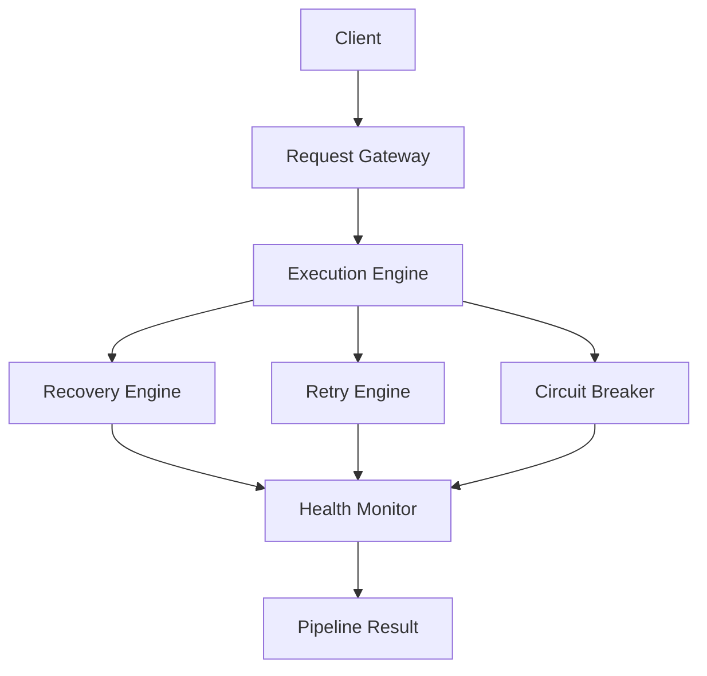
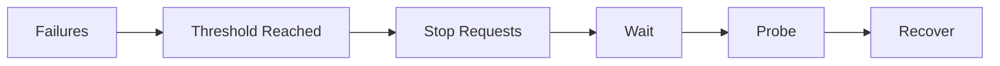
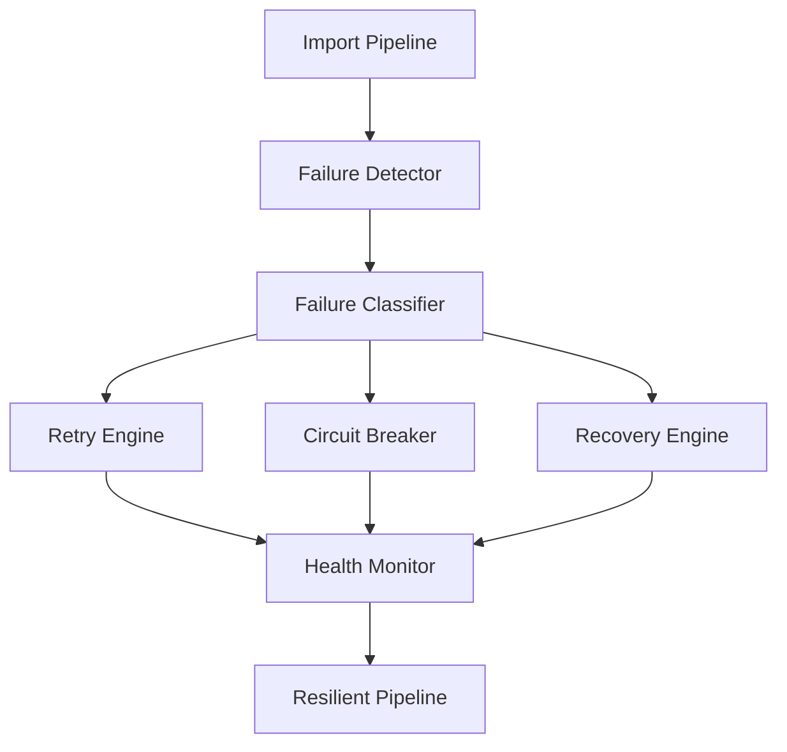

# Chapter 16 — Reliability, Resilience & Fault Tolerance

With the entire runtime architecture in place (Chapters 5–15), this chapter answers one of the biggest questions every senior engineer asks before shipping:

> **"What happens when something goes wrong?"**

Production software is not defined by how it behaves when everything works. It is defined by how gracefully it behaves when **everything fails**.

> **Goal:** Build a system that continues operating under failures, degrades gracefully, recovers automatically, and never loses user work.

> **Core Principle:** **Failures are expected. Reliability comes from recovering, not from assuming failures never happen.**

---

## 1. What is Reliability?

Reliability does not mean "no bugs." Production reliability means:

```text
Failures → Detected → Contained → Recovered → User Impact Minimized
```

A reliable system still experiences failures. The difference is that **users barely notice them**.

---

## 2. Failure Domains

Before designing recovery, classify failures:

```text
Infrastructure
Application
External Services
User Data
AI Provider
Network
Configuration
```

Every category requires different handling.

---

## 3. Reliability Architecture



Reliability is an independent layer, not logic scattered through the pipeline.

---

## 4. Failure Classification

Instead of a generic `Error`, every failure gets a category:

```text
CSV_PARSE_ERROR
AI_TIMEOUT
NETWORK_FAILURE
RATE_LIMIT
VALIDATION_FAILURE
CONFIGURATION_ERROR
UNKNOWN
```

Classification determines recovery.

---

## 5. Recoverable vs Non-Recoverable

Not all failures deserve retries.

### Recoverable — retry

```text
Network timeout
Rate limit
Temporary AI outage
DNS issue
```

### Non-Recoverable — return immediately, no retry

```text
Corrupted CSV
Invalid schema
Unsupported file
Missing headers
```

---

## 6. Circuit Breaker

Suppose the AI provider becomes unstable. Without protection:

```text
500 Requests → 500 Failures
```

With a circuit breaker:



This protects both your system and the provider.

---

## 7. Retry Engine

Retries are not simply "try again." Every retry has a policy:

```text
Retry Count
Delay
Backoff
Jitter
Timeout
Abort Threshold
```

Recovery should be predictable.

---

## 8. Exponential Backoff

Instead of fixed intervals (`1 sec, 1 sec, 1 sec`), use:

```text
1 sec → 2 sec → 4 sec → 8 sec
```

This reduces pressure on recovering services.

---

## 9. Jitter

If 100 requests retry simultaneously, they create another outage. Instead:

```text
Retry → Random Delay → Spread Requests
```

Simple. Effective.

---

## 10. Health Checks

Every critical component reports health:

| Component | Status |
|-----------|--------|
| CSV Parser | Healthy |
| AI Provider | Healthy |
| Validation | Healthy |
| Queue | Healthy |

One dashboard, entire system.

---

## 11. Dependency Health

External dependencies need independent monitoring:

```text
AI Provider
Storage
Redis
Database
Authentication
```

One unhealthy dependency shouldn't make diagnosis difficult.

---

## 12. Graceful Degradation

Suppose the AI provider is unavailable. Bad architecture: everything breaks. Better:

```text
Upload       ✓
Preview      ✓
Validation   ✓
AI           Unavailable → Meaningful Error
```

Users can still interact with most of the application.

---

## 13. Checkpointing

Large imports shouldn't restart from zero. Suppose a 5000-row import fails at batch 42: restart from **batch 42**, not batch 1. This is a huge improvement for large datasets.

---

## 14. Import Recovery

Store execution state:

```text
Completed: 38 batches
Remaining: 12 batches
```

Resume later. Very useful for future asynchronous imports.

---

## 15. Idempotency

Suppose the user clicks **Import** twice. Without idempotency:

```text
Duplicate CRM Records
```

With idempotency:

```text
Same Request → Already Processing → Return Existing Result
```

Critical for distributed systems.

---

## 16. Safe State Transitions

Never allow illegal transitions such as:

```text
Completed → Running
```

Every state transition should be validated. Valid flow:

```text
Queued → Running → Completed
```

---

## 17. Dead Letter Queue (Future)

If a batch fails repeatedly, don't retry forever:

```text
Failed → Dead Letter Queue → Manual Inspection
```

This protects the system.

---

## 18. Bulkhead Pattern

Don't let one subsystem consume everything. Example:

```text
AI Workers    limit 8
Validation    limit 4
```

Independent resource pools keep failure isolated.

---

## 19. Timeout Strategy

Every dependency gets its own timeout:

| Dependency | Timeout |
|------------|---------|
| CSV | 10 sec |
| AI | 45 sec |
| Validation | 15 sec |
| Storage | 5 sec |

Never wait indefinitely.

---

## 20. Resource Protection

Protect against:

```text
Huge CSV → Memory Exhaustion
Millions of Rows → Worker Starvation
```

Set limits. Reject gracefully.

---

## 21. Memory Safety

Instead of loading the entire dataset into RAM, use:

```text
Streaming → Batch → Release Memory → Next Batch
```

Reliable under load. (See [Chapter 8 — CSV Processing Engine](08-csv-processing-engine.md) for the streaming parser.)

---

## 22. Partial Failure Strategy

Suppose 3 of 100 batches fail. Don't discard the 97 successful batches. Return:

```text
Imported: 97%
Failed:   3%
Diagnostics Included
```

Business users value usable results.

---

## 23. Data Integrity

Never partially update one record. Either the record is **complete** or the record is **rejected**. Avoid half-valid CRM objects.

---

## 24. Resilience Policies

Every subsystem has a resilience profile:

| Component | Policy |
|-----------|--------|
| CSV Parser | Fail Fast |
| Normalizer | Continue with Warnings |
| AI Provider | Retry + Circuit Breaker |
| Validator | Continue Per Record |
| Aggregator | Partial Success |
| Response Builder | Always Return Summary |

No subsystem invents its own behavior.

---

## 25. Chaos Thinking

Ask questions before production. What happens if:

- AI is down?
- Internet disconnects?
- CSV contains 1 million rows?
- JSON repair fails?
- Every retry fails?
- User refreshes midway?
- Two imports arrive simultaneously?

If the architecture has answers, it's resilient.

---

## 26. Reliability Metrics

Track:

```text
Mean Time To Recovery
Failure Rate
Retry Success
Availability
Recovery Time
Import Completion Rate
```

Reliability should be measurable. (These feed the dashboards from [Chapter 15 — Observability, Telemetry & Operational Intelligence](15-observability.md).)

---

## 27. Failure Timeline

Every incident gets a timeline:

```text
14:02  Import Started
14:03  AI Timeout
14:03  Retry
14:04  Recovered
14:05  Completed
```

This dramatically reduces debugging time.

---

## 28. Self-Healing

Instead of requiring operator intervention, the platform should recover when possible. Examples:

```text
Rate Limit → Backoff → Retry → Recovered
```

```text
Malformed JSON → Repair → Validated
```

Automation reduces operational burden.

---

## 29. Reliability Architecture (Complete)



Recovery is its own subsystem, not scattered across the codebase.

---

## 30. Engineering Decisions

| Decision | Reason |
|----------|--------|
| Failure classification | Different failures need different recovery |
| Circuit breaker | Prevent cascading failures |
| Exponential backoff | Respect external services |
| Checkpointing | Resume large imports efficiently |
| Idempotency | Prevent duplicate imports |
| Partial success | Maximize usable output |
| Health monitoring | Detect issues early |
| Bulkheads | Isolate resource exhaustion |
| Graceful degradation | Preserve user experience |
| Self-healing | Reduce manual intervention |

---

## 31. Reliability Policy Engine

> **Design Rationale:** This is what distinguishes the project as an internal platform rather than a coding exercise.

Instead of hardcoding retry and recovery logic throughout the codebase, define recovery behavior declaratively:

```text
Component → Policy Registry → Execution Policy → Recovery Strategy
```

Example policies:

| Component | Retry | Timeout | Circuit Breaker | Recovery |
|-----------|-------|---------|-----------------|----------|
| AI Provider | 3 | 45 sec | Enabled | Retry then Fail Batch |
| CSV Parser | 0 | 15 sec | Disabled | Fail Fast |
| Validator | 0 | 10 sec | Disabled | Skip Record |
| Aggregator | 1 | 30 sec | Disabled | Partial Result |

Benefits:

- One source of truth for resilience behavior.
- Easier testing.
- Environment-specific policies (development vs production).
- New providers inherit reliability automatically.

Operational behavior becomes configurable rather than embedded in business logic — a mark of architectural maturity.

---

## Implementation Tasks

- [ ] **Task 16.1 — Reliability Layer.** Build reliability as an independent layer between the execution engine and the pipeline result.
- [ ] **Task 16.2 — Failure Classification.** Categorize every failure (CSV_PARSE_ERROR, AI_TIMEOUT, NETWORK_FAILURE, RATE_LIMIT, VALIDATION_FAILURE, CONFIGURATION_ERROR, UNKNOWN).
- [ ] **Task 16.3 — Recoverable vs Non-Recoverable Errors.** Route recoverable failures to retry and fail non-recoverable ones immediately.
- [ ] **Task 16.4 — Circuit Breaker.** Stop requests to an unstable provider after a failure threshold, then probe and recover.
- [ ] **Task 16.5 — Retry Engine.** Implement policy-driven retries with count, delay, backoff, jitter, timeout, and abort threshold.
- [ ] **Task 16.6 — Exponential Backoff & Jitter.** Space retries exponentially and randomize delays to avoid retry storms.
- [ ] **Task 16.7 — Health Monitoring.** Report per-component and per-dependency health on one dashboard.
- [ ] **Task 16.8 — Graceful Degradation.** Keep upload, preview, and validation working with a meaningful error when AI is unavailable.
- [ ] **Task 16.9 — Checkpointing.** Persist batch progress so failed imports restart from the failing batch, not from zero.
- [ ] **Task 16.10 — Import Recovery.** Store execution state (completed/remaining batches) so imports can resume later.
- [ ] **Task 16.11 — Idempotency.** Detect duplicate import requests and return the existing result instead of creating duplicate CRM records.
- [ ] **Task 16.12 — Safe State Transitions.** Validate every import state transition (Queued → Running → Completed) and reject illegal ones.
- [ ] **Task 16.13 — Dead Letter Queue (future).** Route repeatedly failing batches to a dead letter queue for manual inspection.
- [ ] **Task 16.14 — Bulkhead Isolation.** Give AI workers and validation independent resource pools with hard limits.
- [ ] **Task 16.15 — Resource Protection.** Enforce size and row limits with graceful rejection to prevent memory exhaustion and worker starvation.
- [ ] **Task 16.16 — Partial Failure Handling.** Return successful batches with diagnostics for failed ones instead of discarding the whole import.
- [ ] **Task 16.17 — Reliability Metrics.** Track MTTR, failure rate, retry success, availability, recovery time, and import completion rate.
- [ ] **Task 16.18 — Self-Healing.** Automate recovery paths (backoff-retry on rate limits, JSON repair on malformed output).
- [ ] **Task 16.19 — Reliability Policy Engine.** Define per-component retry/timeout/circuit-breaker/recovery behavior declaratively in a policy registry.

---

## Architecture Status

The platform now has **six distinct architectural layers**:

```text
┌──────────────────────────────────────────┐
│          Presentation Layer              │
├──────────────────────────────────────────┤
│            Execution Layer               │
├──────────────────────────────────────────┤
│         Intelligence Layer               │
├──────────────────────────────────────────┤
│            Trust Layer                   │
├──────────────────────────────────────────┤
│     Operational Intelligence Layer       │
├──────────────────────────────────────────┤
│    Reliability & Resilience Layer        │
└──────────────────────────────────────────┘
```

At this point, the application is designed not only to process data intelligently, but also to **survive failures predictably**, which is a defining characteristic of production-grade systems. The next layer of concern — authentication boundaries, secure file handling, prompt injection defense, secrets management, and compliance-oriented design — is covered in [Chapter 17 — Security, Privacy & AI Safety](17-security-ai-safety.md).

---

## Related Chapters

- [Chapter 15 — Observability, Telemetry & Operational Intelligence](15-observability.md) — the telemetry stack that surfaces reliability metrics and failure timelines
- [Chapter 14 — Execution Engine, Orchestration & Concurrency](14-execution-orchestration.md) — the worker, batching, and state machinery that checkpointing and bulkheads protect
- [Chapter 17 — Security, Privacy & AI Safety](17-security-ai-safety.md) — the next hardening layer: security, privacy, and AI safety
- [Chapter 8 — CSV Processing Engine](08-csv-processing-engine.md) — the streaming parser underlying the memory-safety strategy
- [Chapter 13 — Validation, Business Rules & Trust Engine](13-validation-trust-engine.md) — per-record validation and JSON repair used in self-healing
