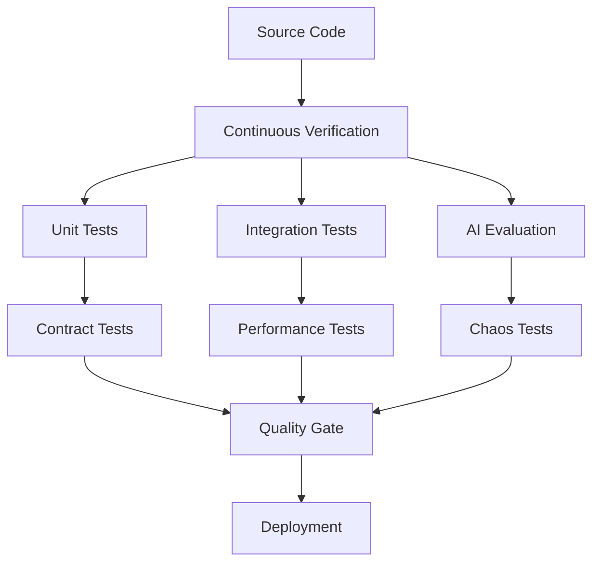
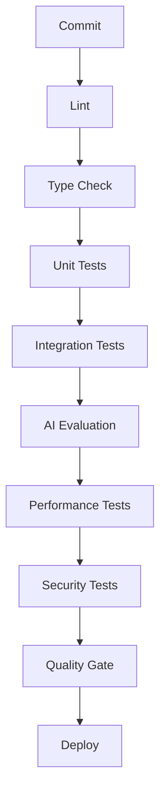
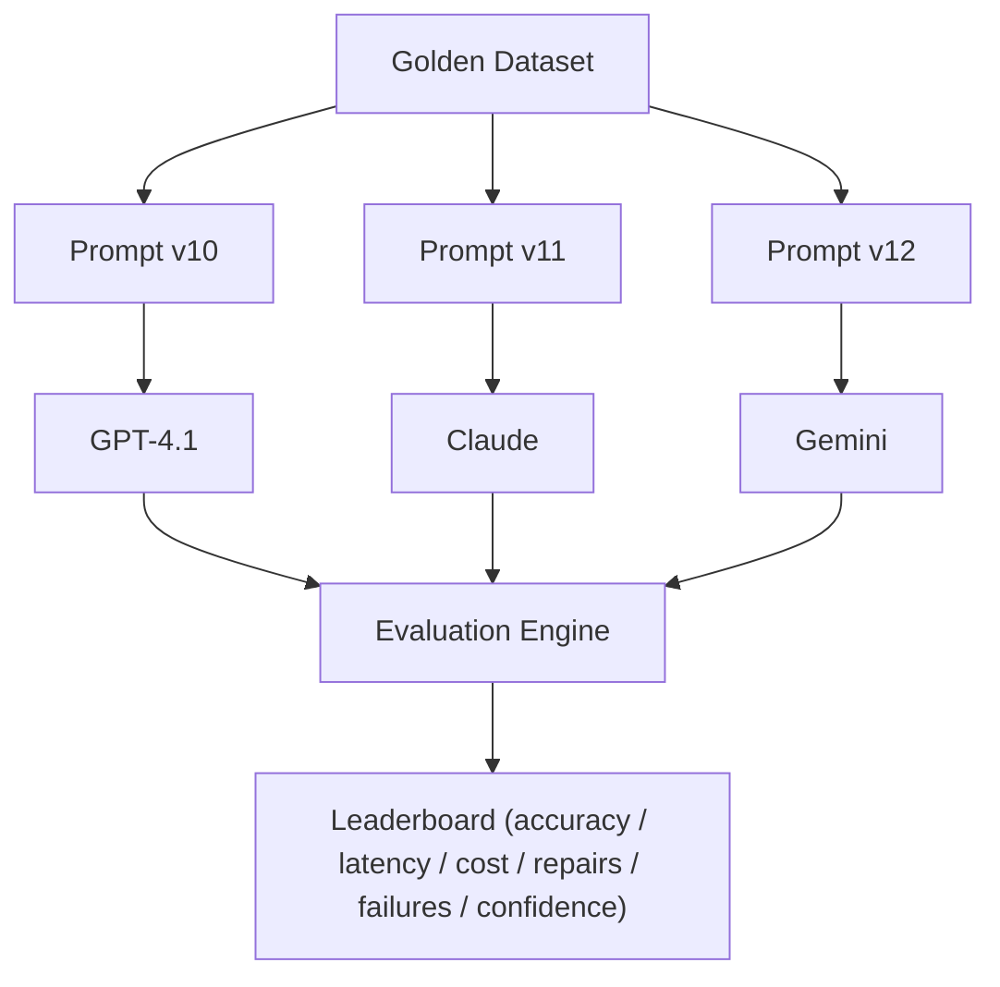

# Chapter 18 — Quality Engineering, Testing & Continuous Verification

Testing is one of the most overlooked topics in AI engineering. Most test suites look like:

```text
assert(email == "john@gmail.com")
```

That is **software testing**. This project is not just software — it is an **AI system**, and AI systems require an entirely different philosophy of testing.

> **Goal:** Design a comprehensive quality engineering platform that continuously verifies deterministic code, AI behavior, prompt quality, business rules, performance, resilience, and deployment safety.

> **Core Principle:** **Production quality is engineered continuously — not inspected at the end.**

---

## 1. What Does "Correct" Mean?

Traditional software has binary correctness: `2 + 2 → 4`. Pass or fail.

AI doesn't work like that. Given the input header:

```text
Lead Contact
```

the model might return `Phone`, `Primary Phone`, or `Mobile` — and all may be acceptable.

Testing AI requires measuring **quality**, not exact strings.

---

## 2. Quality Architecture

Quality is a pipeline.



---

## 3. Testing Pyramid

Most projects stop at the classic pyramid — few E2E tests over many unit tests. AI systems need an extended pyramid:

```text
               E2E

        Integration

     AI Evaluation

   Contract Testing

      Unit Tests
```

Notice that **AI Evaluation is its own layer**.

---

## 4. Unit Testing

Every deterministic module must be independently testable:

- CSV Parser
- Phone Normalizer
- Email Validator
- Date Formatter
- Rule Engine
- Duplicate Detector

No AI required. These should execute in milliseconds.

---

## 5. Integration Testing

Verify subsystem interaction:

```text
Parser → Normalizer → Validator
```

Components that are correct independently may still fail together. Integration tests answer whether they remain correct in combination.

---

## 6. Contract Testing

Every interface has a contract:

- The Parser always returns `NormalizedRecord[]`.
- The AI Engine always accepts a `Batch`.
- The Validator always returns a `ValidationResult`.

Contracts prevent accidental API breakage between subsystems.

---

## 7. Pipeline Testing

Instead of testing only components, test **stages**:

```text
CSV → Normalize → AI → Validate → Aggregate
```

Every transition between stages should be verified.

---

## 8. End-to-End Testing

Simulate real users, exactly as they experience the product:

```text
Upload CSV → Preview → Import → Progress → Results
```

---

## 9. AI Evaluation Framework

This is where AI systems differ from conventional software. Instead of asserting exact output, measure quality against an evaluation dataset:

```text
CSV → Expected CRM → AI Output → Comparison
```

The comparison generates metrics rather than pass/fail assertions.

---

## 10. Golden Dataset

Create **100+ real CSVs** across representative categories:

```text
Facebook
Google Ads
Real Estate
Excel
Agency
CRM Export
Messy CSV
```

Never modify these files. They become your benchmark.

---

## 11. Ground Truth

Every golden dataset needs an expected CRM output:

```text
CSV → Human-Verified CRM
```

This human-verified output becomes the **Ground Truth**. Everything compares against it.

---

## 12. AI Regression Testing

Suppose prompt v7 scores 97% against the golden dataset, and prompt v8 scores 92%. **Reject v8.**

Never deploy prompt regressions. Treat prompts like production code. (Prompt versioning is covered in [Chapter 11 — Prompt Engineering & Semantic Intelligence](11-prompt-engineering.md).)

---

## 13. Prompt Benchmarking

Every prompt version runs against the golden dataset, collecting:

```text
Accuracy
Latency
Tokens
Cost
Skipped Records
```

Prompt improvements become measurable rather than anecdotal.

---

## 14. Model Benchmarking

Run the same dataset against multiple providers:

| Model | Accuracy |
|-------|----------|
| GPT-4.1 | 97% |
| Claude | 95% |
| Gemini | 96% |

Provider decisions become data-driven.

---

## 15. Quality Metrics

Measure **field-level accuracy**, not only overall accuracy:

| Field | Accuracy |
|--------|----------|
| Email | 100% |
| Phone | 99% |
| Name | 98% |
| Status | 96% |
| Company | 94% |

---

## 16. Semantic Accuracy

Some outputs differ but are equivalent. `Mobile Number` mapping to `Phone` is correct even though the strings differ.

Evaluation needs **semantic comparison**, not string comparison.

---

## 17. Business Rule Testing

Every rule gets tests. Example — the skip rule:

```text
No Email AND No Phone → Skip
```

Every business rule should have **positive**, **negative**, and **boundary** tests. (The rule engine itself is designed in [Chapter 13 — Validation, Business Rules & Trust Engine](13-validation-trust-engine.md).)

---

## 18. Mutation Testing

Suppose a developer changes the Phone Validator and existing tests still pass. Are the tests actually verifying anything?

Mutation testing intentionally breaks code. If tests still pass, the tests are weak. Excellent for production systems.

---

## 19. Property-Based Testing

Instead of fixed inputs, generate thousands. Example:

```text
Phone Normalizer → Random Phones → Always Valid Output
```

Great for parsers and normalizers.

---

## 20. Fuzz Testing

Attack your parser. Generate:

```text
Random CSV
Broken Quotes
Huge Cells
Unicode
Null Bytes
Malformed Headers
```

The parser must **never crash**.

---

## 21. Load Testing

Test 10 imports, then 100, then 1000. Measure:

- latency
- throughput
- memory
- CPU
- retries

Know your limits before production does.

---

## 22. Stress Testing

Push beyond the limits:

```text
1 GB CSV
500k Rows
Thousands of Columns
```

The system should fail gracefully, not unpredictably.

---

## 23. Soak Testing

Run continuously — for example, 24 hours of thousands of imports — to detect:

- memory leaks
- resource exhaustion
- performance degradation

---

## 24. Chaos Testing

Break things intentionally:

- AI unavailable
- Slow network
- Disk full
- Timeout
- Corrupted response
- Worker crash

Verify recovery in each case. Chaos proves the resilience patterns of [Chapter 16 — Reliability, Resilience & Fault Tolerance](16-reliability-resilience.md) actually work.

---

## 25. Security Testing

Automate the attack scenarios from [Chapter 17 — Security, Privacy & AI Safety](17-security-ai-safety.md):

- oversized uploads
- malformed CSVs
- prompt injection
- formula injection
- invalid content types
- abuse scenarios

Security is continuously tested, not manually checked.

---

## 26. Snapshot Testing

Useful for the frontend. Snapshot the preview table and the results table to detect unintended UI regressions.

---

## 27. Accessibility Testing

Quality includes usability. Verify:

- keyboard navigation
- focus order
- contrast
- screen readers
- responsive layouts

Production software serves all users.

---

## 28. Continuous Verification Pipeline

Nothing reaches production without verification.



---

## 29. Quality Gates

Deployment only proceeds if thresholds are met:

| Gate | Threshold |
|------|-----------|
| Coverage | > 90% |
| AI Accuracy | > 95% |
| Performance | < 5 sec |
| Security | 0 critical findings |
| Build | Pass |

These gates prevent regressions from reaching production.

---

## 30. Test Data Management

Don't use random CSVs forever. Maintain curated datasets:

```text
Simple
Medium
Complex
Malformed
Huge
Multilingual
Ambiguous
```

Version them like code.

---

## 31. AI Evaluation Dashboard

Track quality over time, per prompt version:

```text
Prompt Version → Accuracy → Cost → Latency → Skipped → Repair Rate
```

Prompt changes become measurable trends rather than one-off experiments.

---

## 32. Engineering Decisions

| Decision | Reason |
|----------|--------|
| AI evaluation separate from unit tests | AI outputs are probabilistic |
| Golden datasets | Stable benchmarking |
| Prompt regression testing | Prevent quality degradation |
| Contract tests | Protect subsystem interfaces |
| Property-based tests | Explore edge cases automatically |
| Chaos testing | Validate resilience |
| Security testing | Catch vulnerabilities early |
| Continuous quality gates | Prevent broken deployments |

---

## 33. Production Enhancement: AI Evaluation Lab

This enhancement makes the project operate like an internal AI platform. Instead of simply running tests, create an evaluation platform.



This enables experiments like:

- Which model performs best?
- Which prompt is cheapest?
- Which provider has the best latency?
- Did yesterday's prompt improve extraction?

Instead of guessing, the platform continuously measures quality.

> **Design Rationale:** Very few projects include an evaluation framework, but mature AI teams rely on systems like this to evolve prompts and models safely.

---

## 34. Complete Quality Engineering Architecture

Quality is treated as an architectural subsystem rather than a collection of isolated tests.

```text
                 Source Code
                       │
              Continuous Verification
                       ▼
      ┌────────────┬────────────┬────────────┐
      ▼            ▼            ▼
 Unit Tests  Integration  AI Evaluation
      ▼            ▼            ▼
 Contract   Performance   Security
      ▼            ▼            ▼
   Chaos     Accessibility  UI Tests
      └────────────┼────────────┘
                   ▼
             Quality Gate
                   ▼
            Deployment Ready
```

---

## Implementation Tasks

- [ ] **Task 18.1 — Unit testing strategy.** Cover every deterministic module (parser, normalizers, validators, rule engine, duplicate detector) with millisecond-fast tests.
- [ ] **Task 18.2 — Integration testing.** Verify parser → normalizer → validator subsystem interactions.
- [ ] **Task 18.3 — Contract testing.** Assert the input/output contracts of every subsystem interface.
- [ ] **Task 18.4 — Pipeline testing.** Verify every stage transition from CSV through aggregation.
- [ ] **Task 18.5 — End-to-end testing.** Automate the upload → preview → import → progress → results user journey.
- [ ] **Task 18.6 — AI evaluation framework.** Build the CSV → expected CRM → AI output comparison harness that produces quality metrics.
- [ ] **Task 18.7 — Golden dataset.** Assemble 100+ immutable real-world CSVs across all source categories.
- [ ] **Task 18.8 — Ground truth dataset.** Produce human-verified expected CRM output for every golden CSV.
- [ ] **Task 18.9 — Prompt regression testing.** Benchmark every prompt version against the golden dataset and reject regressions.
- [ ] **Task 18.10 — Model benchmarking.** Run the same dataset across providers to make model selection data-driven.
- [ ] **Task 18.11 — Field-level accuracy metrics.** Report per-field accuracy, not just an overall score, including semantic (not string) comparison.
- [ ] **Task 18.12 — Business rule testing.** Give every rule positive, negative, and boundary tests.
- [ ] **Task 18.13 — Mutation testing.** Verify test-suite strength by intentionally breaking code.
- [ ] **Task 18.14 — Property-based testing.** Generate thousands of random inputs for normalizers and parsers.
- [ ] **Task 18.15 — Fuzz testing.** Attack the parser with random, malformed, and hostile CSV inputs; it must never crash.
- [ ] **Task 18.16 — Load testing.** Measure latency, throughput, memory, CPU, and retries at 10/100/1000 concurrent imports.
- [ ] **Task 18.17 — Stress testing.** Push beyond limits (1 GB files, 500k rows) and verify graceful failure.
- [ ] **Task 18.18 — Soak testing.** Run continuous imports for 24 hours to detect leaks and degradation.
- [ ] **Task 18.19 — Chaos testing.** Inject AI outages, slow networks, disk-full, timeouts, corrupted responses, and worker crashes; verify recovery.
- [ ] **Task 18.20 — Security testing.** Automate oversized-upload, malformed-CSV, prompt-injection, formula-injection, and abuse scenarios.
- [ ] **Task 18.21 — Snapshot and accessibility testing.** Snapshot key UI tables and verify keyboard navigation, focus order, contrast, screen readers, and responsive layouts.
- [ ] **Task 18.22 — Continuous verification pipeline and quality gates.** Wire lint, types, tests, AI evaluation, performance, and security into a gated deployment pipeline.
- [ ] **Task 18.23 — Test data management.** Maintain versioned datasets spanning simple to ambiguous cases.
- [ ] **Task 18.24 — AI Evaluation Lab.** Build the prompt × model evaluation platform with an evaluation engine, dashboard, and leaderboard.

---

## Architecture Status

The platform now contains **eight major engineering layers**:

```text
┌──────────────────────────────────────────────┐
│          Presentation Layer                  │
├──────────────────────────────────────────────┤
│            Execution Layer                   │
├──────────────────────────────────────────────┤
│          Intelligence Layer                  │
├──────────────────────────────────────────────┤
│             Trust Layer                      │
├──────────────────────────────────────────────┤
│      Operational Intelligence Layer          │
├──────────────────────────────────────────────┤
│      Reliability & Resilience Layer          │
├──────────────────────────────────────────────┤
│      Security, Privacy & AI Safety Layer     │
├──────────────────────────────────────────────┤
│      Quality Engineering Layer               │
└──────────────────────────────────────────────┘
```

The result is not just an application but a platform that can **continuously verify its own correctness** across deterministic code, AI behavior, infrastructure, performance, and user experience.

---

## Related Chapters

- [Chapter 11 — Prompt Engineering & Semantic Intelligence](11-prompt-engineering.md) — the prompt versions that regression testing and benchmarking protect
- [Chapter 13 — Validation, Business Rules & Trust Engine](13-validation-trust-engine.md) — the business rules exercised by rule testing
- [Chapter 16 — Reliability, Resilience & Fault Tolerance](16-reliability-resilience.md) — the resilience mechanisms that chaos testing verifies
- [Chapter 17 — Security, Privacy & AI Safety](17-security-ai-safety.md) — the defenses exercised by automated security testing
- [Chapter 19 — Platform Engineering, DevOps & Production Deployment](19-platform-engineering-devops.md) — the CI/CD pipeline that hosts the quality gates
