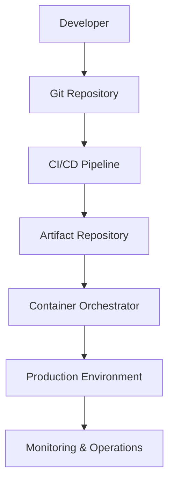
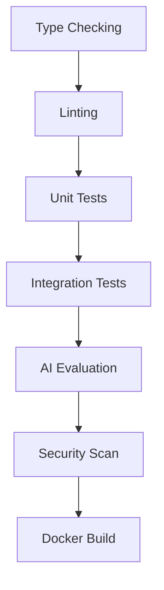
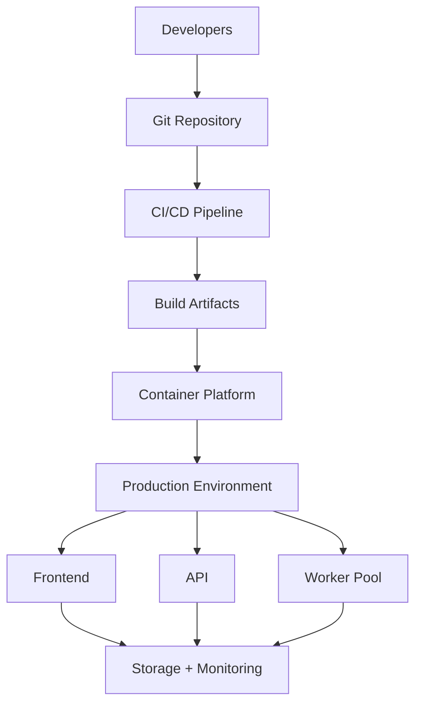
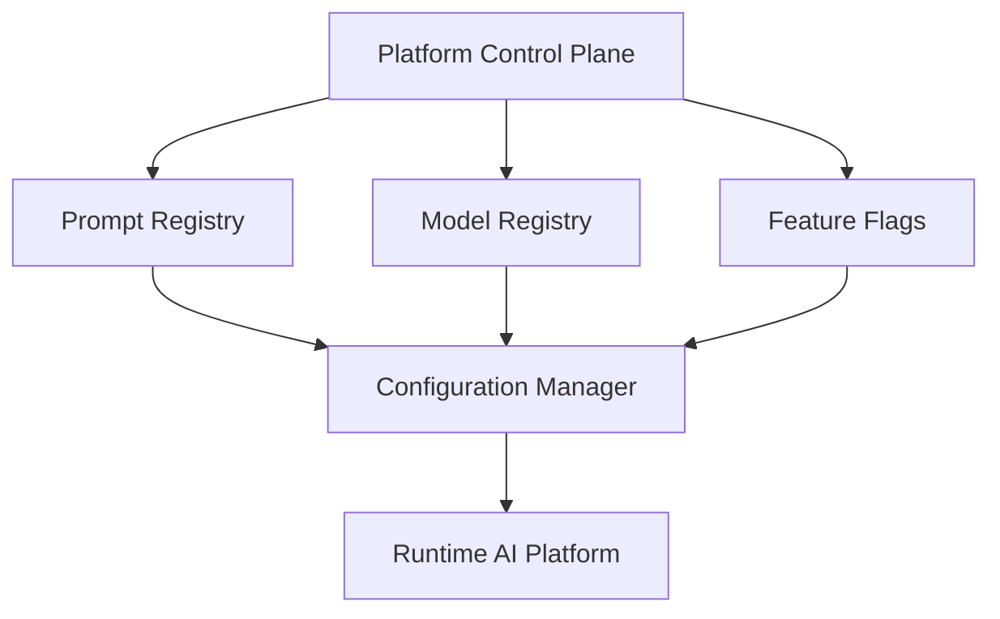

# Chapter 19 — Platform Engineering, DevOps & Production Deployment

This chapter marks the final transition from **Software Engineering** to **Platform Engineering**. The preceding chapters built an excellent application; this one answers a different question:

> **How do we deploy, operate, scale, and evolve this application in production?**

> **Goal:** Transform the AI CSV Importer into a production-ready cloud platform with automated deployment, scalable infrastructure, disaster recovery, environment isolation, and operational excellence.

> **Core Principle:** **Applications solve business problems. Platforms enable applications to evolve safely.**

---

## 1. What is Platform Engineering?

A naive view of deployment looks like this:

```text
git push → Vercel
```

Production deployment is much more:

```text
Developer → CI/CD → Infrastructure → Deployment → Monitoring → Rollback → Operations
```

Deployment is an ecosystem.

---

## 2. Production Platform Architecture



Notice: developers never deploy manually.

---

## 3. Environment Strategy

Never use a single environment. Instead, promote through a chain:

```text
Development → Testing → Staging → Production
```

Each environment has different:

- secrets
- AI keys
- logging
- limits
- monitoring

---

## 4. Environment Isolation

Each environment should be isolated.

Development:

```text
Fake Data → Cheap AI → Verbose Logs
```

Production:

```text
Real Data → Production AI → Secure Logs
```

Never mix them.

---

## 5. Infrastructure Layers

```text
Frontend → API → Execution Workers → Storage → Monitoring → Secrets → Networking
```

Each layer can scale independently.

---

## 6. Containerization

Every component becomes an independent container:

```text
Next.js      → Container
Express API  → Container
Worker       → Container
```

Containers provide:

- portability
- reproducibility
- consistency

---

## 7. Immutable Deployments

Never modify running servers. Instead:

```text
Old Version → New Container → Traffic Switch → Delete Old
```

Deployments become predictable.

---

## 8. CI/CD Philosophy

Every commit should automatically verify quality.

Pipeline:

```text
Commit → Build → Test → Security Scan → Package → Deploy
```

No manual deployments.

---

## 9. Build Pipeline

A production build should include:



Failure anywhere stops the deployment. The AI Evaluation stage runs the evaluation harness described in [Chapter 18 — Quality Engineering, Testing & Continuous Verification](18-quality-engineering.md).

---

## 10. Artifact Strategy

Build once. Deploy many.

```text
Source Code → Build → Artifact → Development → Staging → Production
```

Never rebuild between environments.

---

## 11. Infrastructure as Code

Infrastructure should live in version control.

Not:

```text
Manual Server Setup
```

Instead:

```text
Infrastructure Definition → Version Control → Provision → Consistent Infrastructure
```

Servers become reproducible.

---

## 12. Configuration Management

Separate code from configuration.

```text
Application → Configuration → Environment Variables → Secrets
```

Same code. Different environments.

---

## 13. Secrets Management

Never expose:

- API Keys
- Database Passwords
- AI Tokens
- JWT Secrets

The runtime retrieves secrets securely. Developers never hardcode credentials. (See [Chapter 17 — Security, Privacy & AI Safety](17-security-ai-safety.md) for the broader security model.)

---

## 14. Deployment Strategies

Several deployment patterns exist.

### Rolling Deployment

```text
Server 1 → Update → Server 2 → Update
```

Minimal downtime.

### Blue-Green Deployment

```text
Blue (Running) | Green (New) → Switch Traffic
```

Instant rollback.

### Canary Deployment

```text
5% Traffic → Monitor → 25% → 50% → 100%
```

Safest production rollout.

---

## 15. Rollback Strategy

Deployment failed? Never panic.

```text
Current → Rollback → Previous Stable Version
```

Rollback must be automatic.

---

## 16. Scalability

Separate scaling dimensions:

```text
Frontend → Horizontal
API      → Horizontal
Workers  → Horizontal
AI       → External
```

Every subsystem scales independently.

---

## 17. Stateless Services

The API should remain stateless:

```text
Request → Any Instance → Response
```

State belongs in:

- storage
- queues
- caches

Not application memory.

---

## 18. Storage Strategy

Different data deserves different storage.

| Data | Storage |
|-------|---------|
| Temporary Uploads | Temporary filesystem/object storage |
| Import Metadata | Database |
| Logs | Log backend |
| Metrics | Time-series storage |
| Cached AI Results | Cache |
| Audit Trails | Persistent database |

One storage system should not serve every purpose.

---

## 19. Queue-Based Evolution

The current architecture:

```text
Client → API → AI → Response
```

Future:

```text
Client → API → Queue → Worker Cluster → Result Store → Notification
```

The platform architecture remains unchanged. This evolution path builds on the execution model in [Chapter 14 — Execution Engine, Orchestration & Concurrency](14-execution-orchestration.md).

---

## 20. Auto Scaling

Monitor:

```text
Queue Length → Worker Count → Scale Up
```

Later:

```text
Queue Empty → Scale Down
```

Infrastructure adapts automatically.

---

## 21. Disaster Recovery

Ask: "What if production disappears?"

We need:

- backups
- recovery plan
- redeployment strategy
- configuration recovery

Recovery procedures should be documented and tested.

---

## 22. Backup Strategy

Back up:

- configuration
- metadata
- audit records
- prompt registry
- evaluation datasets

Temporary uploads generally don't require long-term backups.

---

## 23. Operational Runbooks

Every production issue should have documentation.

Examples:

```text
AI Provider Down   → Runbook
Deployment Failed  → Runbook
High Memory        → Runbook
```

Operators shouldn't invent recovery steps during incidents.

---

## 24. Platform Metrics

Measure platform health:

```text
Deployment Frequency → Rollback Rate → Availability → Recovery Time → Queue Length → Worker Utilization
```

Platform engineering is measurable. These metrics extend the observability stack from [Chapter 15 — Observability, Telemetry & Operational Intelligence](15-observability.md).

---

## 25. Release Management

Every deployment gets:

```text
Version → Build Number → Prompt Version → Model Version → Migration Version
```

Complete traceability.

---

## 26. Feature Flags

Don't deploy unfinished features. Deploy them hidden, then enable later.

Example:

```text
Semantic Memory: OFF → Testing → ON
```

Safer than long-lived branches.

---

## 27. Operational Dashboard

The platform dashboard shows:

```text
Deployments | Workers | Queue | Errors | Latency | AI Cost | CPU | Memory | Availability
```

Everything operators need.

---

## 28. Platform Architecture



Platform concerns remain separate from business logic.

---

## 29. Engineering Decisions

| Decision | Reason |
|----------|--------|
| Multi-environment deployment | Safe promotion to production |
| Containerization | Consistent runtime behavior |
| Build once, deploy many | Identical artifacts across environments |
| Infrastructure as Code | Repeatable infrastructure |
| Blue-Green / Canary deployments | Reduced deployment risk |
| Stateless services | Easy horizontal scaling |
| Queue-ready architecture | Future asynchronous processing |
| Feature flags | Safe incremental releases |
| Runbooks | Faster incident response |
| Automated rollback | Minimize production downtime |

---

## 30. Production Enhancement Beyond the Assignment

This is the capability that makes the project resemble an internal AI platform.

### AI Platform Control Plane

Instead of deploying only application code, introduce a **control plane** responsible for managing AI behavior.



Responsibilities:

- Switch AI providers without redeploying.
- Roll back prompt versions independently of application releases.
- Gradually enable new AI features.
- Configure model routing.
- Manage operational policies.

This decouples **AI evolution** from **application deployment**, allowing prompt and model improvements to be released independently.

---

## 31. Platform Maturity Model

At the end of this chapter, the platform has evolved into a complete production system:

```text
┌──────────────────────────────────────────────┐
│            Application Layer                 │
├──────────────────────────────────────────────┤
│          Execution Platform                  │
├──────────────────────────────────────────────┤
│         AI Intelligence Platform             │
├──────────────────────────────────────────────┤
│          Trust & Validation                  │
├──────────────────────────────────────────────┤
│     Observability & Operations               │
├──────────────────────────────────────────────┤
│       Reliability & Recovery                 │
├──────────────────────────────────────────────┤
│      Security & Governance                   │
├──────────────────────────────────────────────┤
│      Continuous Quality Platform             │
├──────────────────────────────────────────────┤
│      Deployment & Infrastructure             │
└──────────────────────────────────────────────┘
```

---

## Architecture Status After This Chapter

The result is a **production-grade AI platform architecture** composed of **nine engineering layers**:

```text
┌──────────────────────────────────────────────┐
│          Presentation Layer                  │
├──────────────────────────────────────────────┤
│            Execution Layer                   │
├──────────────────────────────────────────────┤
│          Intelligence Layer                  │
├──────────────────────────────────────────────┤
│             Trust Layer                      │
├──────────────────────────────────────────────┤
│      Operational Intelligence Layer          │
├──────────────────────────────────────────────┤
│      Reliability & Resilience Layer          │
├──────────────────────────────────────────────┤
│      Security, Privacy & AI Safety Layer     │
├──────────────────────────────────────────────┤
│      Quality Engineering Layer               │
├──────────────────────────────────────────────┤
│   Platform Engineering & Infrastructure      │
└──────────────────────────────────────────────┘
```

At this stage, the design has gone well beyond the original assignment: not just a CSV importer, but a **deployable AI ingestion platform** that addresses architecture, operations, resilience, testing, security, and deployment.

The story does not end at deployment. The next stage covers **Product Thinking & Evolution Strategy** — the AI roadmap (OCR, Excel, PDF, CRM connectors), plugin architecture, multi-tenant design, billing and usage metering, API versioning, workflow automation, human-in-the-loop review, knowledge base integration, multi-agent orchestration, and long-term platform evolution over the next 2–3 years. That stage answers not just **"How do we build it?"**, but **"How does this become a real product?"** — see [Chapter 20 — Future Evolution & Platform Vision](20-future-evolution.md).

---

## Implementation Tasks

- [ ] **Task 19.1 — Multi-environment deployment strategy.** Define the Development → Testing → Staging → Production promotion chain with per-environment secrets, AI keys, logging, limits, and monitoring.
- [ ] **Task 19.2 — Environment isolation.** Isolate environments so development (fake data, cheap AI, verbose logs) never mixes with production (real data, production AI, secure logs).
- [ ] **Task 19.3 — Containerized architecture.** Package the frontend, API, and workers as independent containers for portability, reproducibility, and consistency.
- [ ] **Task 19.4 — CI/CD pipeline.** Automate Commit → Build → Test → Security Scan → Package → Deploy so no deployment is manual.
- [ ] **Task 19.5 — Build pipeline.** Implement the full build gate: type checking, linting, unit tests, integration tests, AI evaluation, security scan, and Docker build, with failure anywhere stopping deployment.
- [ ] **Task 19.6 — Artifact management.** Build once and deploy the identical artifact to development, staging, and production; never rebuild between environments.
- [ ] **Task 19.7 — Infrastructure as Code.** Keep infrastructure definitions in version control and provision environments reproducibly.
- [ ] **Task 19.8 — Configuration management.** Separate code from configuration via environment variables and externalized settings.
- [ ] **Task 19.9 — Secrets management.** Retrieve API keys, database passwords, AI tokens, and JWT secrets securely at runtime; never hardcode credentials.
- [ ] **Task 19.10 — Deployment strategies.** Support Rolling, Blue-Green, and Canary deployment patterns for progressively safer rollouts.
- [ ] **Task 19.11 — Automated rollback.** Make rollback to the previous stable version automatic on deployment failure.
- [ ] **Task 19.12 — Stateless service architecture.** Keep API instances stateless, with state held in storage, queues, and caches.
- [ ] **Task 19.13 — Storage strategy.** Map each data class (uploads, metadata, logs, metrics, AI cache, audit trails) to its appropriate storage backend.
- [ ] **Task 19.14 — Queue-ready evolution path.** Design the API so the synchronous flow can evolve into Queue → Worker Cluster → Result Store → Notification without architectural change.
- [ ] **Task 19.15 — Auto scaling.** Scale workers up on queue length and down when the queue empties.
- [ ] **Task 19.16 — Disaster recovery planning.** Document and test backups, recovery plans, redeployment strategy, and configuration recovery.
- [ ] **Task 19.17 — Backup strategy.** Back up configuration, metadata, audit records, the prompt registry, and evaluation datasets (temporary uploads excluded).
- [ ] **Task 19.18 — Operational runbooks.** Write runbooks for known incident classes (AI provider down, deployment failed, high memory) so operators never improvise recovery.
- [ ] **Task 19.19 — Platform metrics.** Track deployment frequency, rollback rate, availability, recovery time, queue length, and worker utilization.
- [ ] **Task 19.20 — Release management and feature flags.** Version every deployment (build, prompt, model, migration versions) and ship unfinished features behind flags enabled later.
- [ ] **Task 19.21 — AI Platform Control Plane.** Build the control plane (prompt registry, model registry, feature flags, configuration manager) that decouples AI evolution from application deployment.

---

## Related Chapters

- [Chapter 14 — Execution Engine, Orchestration & Concurrency](14-execution-orchestration.md) — the worker and execution model that the queue-based evolution path and auto scaling build on
- [Chapter 15 — Observability, Telemetry & Operational Intelligence](15-observability.md) — the telemetry stack that platform metrics and the operational dashboard extend
- [Chapter 16 — Reliability, Resilience & Fault Tolerance](16-reliability-resilience.md) — failure handling that disaster recovery and rollback strategies depend on
- [Chapter 18 — Quality Engineering, Testing & Continuous Verification](18-quality-engineering.md) — the test and AI-evaluation gates embedded in the CI/CD build pipeline
- [Chapter 20 — Future Evolution & Platform Vision](20-future-evolution.md) — the product-evolution roadmap that follows production deployment
