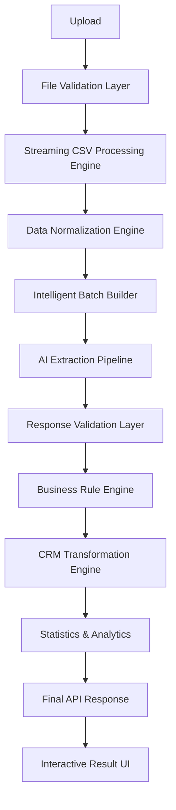
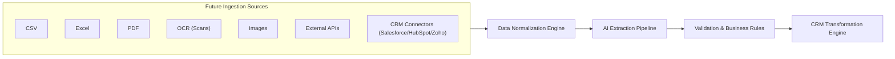

# Chapter 20 — Future Evolution & Platform Vision

## 1. From CSV Importer to AI Data Platform

The end state of this system is not a CSV importer. It is an **AI Data Platform** — the AI Data Ingestion Engine (AIDE) described in [Chapter 3 — Engineering Roadmap & Methodology](03-engineering-roadmap.md), of which the GrowEasy assignment is merely the first client.

The distinction is architectural. A naive solution is:

```text
CSV → GPT → JSON
```

The platform is a staged pipeline in which every stage is an independent engine, and the CSV file is just one of many possible entry points:



Because the CSV Processing Engine is only the first stage of the pipeline, every future ingestion format below plugs in **upstream of the Data Normalization Engine** — the normalization, AI extraction, validation, business-rule, and CRM transformation stages remain unchanged. That is the payoff of the pipeline architecture (see [Chapter 4 — The Pipeline Architecture Mindset](04-pipeline-architecture.md)).



## 2. Excel Ingestion

Excel is the most requested sibling of CSV. Real-world lead data frequently arrives as `.xlsx` workbooks with multiple sheets, merged cells, and formatting noise. Supporting Excel means converting workbook content into the same clean record stream the CSV engine already produces, so everything downstream — normalization, extraction, validation — works untouched.

### Implementation Tasks

- [ ] **Task 20.1 — Excel adapter.** Build an `.xlsx`/`.xls` ingestion adapter that emits the same normalized record stream as the CSV Processing Engine.
- [ ] **Task 20.2 — Sheet selection UX.** Let users pick which worksheet (or all) to import, with per-sheet preview.

## 3. PDF Ingestion

Lead lists are often shared as PDF exports or reports. PDF ingestion extracts tabular and semi-structured text from documents and routes it into the extraction pipeline, where the AI's semantic mapping is even more valuable than for CSV because PDFs rarely carry a clean tabular schema.

### Implementation Tasks

- [ ] **Task 20.3 — PDF text and table extraction.** Extract text and detected tables from PDFs into candidate records.
- [ ] **Task 20.4 — Layout-aware chunking.** Chunk PDF content so each AI batch receives coherent, record-shaped input.

## 4. OCR for Scanned Documents

Some lead data exists only as scans — printed forms, faxed sheets, photographed registers. An OCR stage converts scanned documents into machine-readable text, which then flows through the same PDF/tabular extraction path.

### Implementation Tasks

- [ ] **Task 20.5 — OCR stage.** Integrate an OCR engine that converts scanned pages into text for the extraction pipeline.
- [ ] **Task 20.6 — OCR confidence gating.** Attach OCR confidence scores to extracted text and route low-confidence records to review rather than silently importing them.

## 5. Image Ingestion

Beyond scans, leads arrive as images: screenshots of chats, photos of business cards, exported dashboards. Image ingestion treats a picture as a data source, using vision-capable models or OCR to lift structured contact data out of pixels.

### Implementation Tasks

- [ ] **Task 20.7 — Image-to-record extraction.** Accept image uploads and extract candidate lead fields via a vision/OCR path.
- [ ] **Task 20.8 — Business-card preset.** Provide a tuned extraction preset for business-card-style images (name, company, phone, email).

## 6. API-Based Ingestion

Files are a snapshot; APIs are a feed. API-based ingestion lets external systems push leads directly into the pipeline (or lets AIDE pull from them), turning the importer into a continuously fed ingestion service rather than a manual upload tool.

### Implementation Tasks

- [ ] **Task 20.9 — Ingestion API.** Expose an authenticated API endpoint that accepts lead payloads and routes them through normalization, extraction, and validation.
- [ ] **Task 20.10 — Pull-based source jobs.** Support scheduled pulls from external APIs with the same batching and retry semantics as file imports.

## 7. CRM Connectors: Salesforce, HubSpot, Zoho

Once records are extracted and validated, the natural next step is delivering them directly into the CRMs teams already use. Native connectors for **Salesforce**, **HubSpot**, and **Zoho** would map the unified CRM record onto each vendor's object model, making AIDE a bridge between messy source data and clean CRM state.

### Implementation Tasks

- [ ] **Task 20.11 — Connector abstraction.** Define a connector interface that maps the unified CRM record to a vendor-specific payload.
- [ ] **Task 20.12 — Salesforce connector.** Implement lead push to Salesforce through the connector interface.
- [ ] **Task 20.13 — HubSpot connector.** Implement lead push to HubSpot through the connector interface.
- [ ] **Task 20.14 — Zoho connector.** Implement lead push to Zoho through the connector interface.

## 8. Incremental Imports

Today an import is a one-shot batch. Incremental imports make re-uploading the same (grown) file safe: the system recognizes previously imported records, imports only what is new or changed, and reports the delta instead of duplicating leads.

### Implementation Tasks

- [ ] **Task 20.15 — Record fingerprinting.** Fingerprint imported records (for example, by email/phone identity) so repeat imports can be detected.
- [ ] **Task 20.16 — Delta import mode.** Add an import mode that skips already-imported records and reports new/changed/duplicate counts.

## 9. Human-in-the-Loop Review

AI extraction will always have a residual band of uncertainty. A human-in-the-loop review queue routes low-confidence or rule-flagged records to a person for approval or correction before they enter the CRM — combining AI throughput with human judgment where it matters. This extends the confidence-check philosophy of [Chapter 13 — Validation, Business Rules & Trust Engine](13-validation-trust-engine.md).

### Implementation Tasks

- [ ] **Task 20.17 — Review queue.** Route low-confidence or rule-flagged records into a review queue instead of auto-importing them.
- [ ] **Task 20.18 — Review UI.** Build an approve/edit/reject interface where reviewers can correct fields before final import.
- [ ] **Task 20.19 — Feedback capture.** Record reviewer corrections as labeled examples for prompt and model improvement.

## 10. Fine-Tuned Extraction Models

The general-purpose LLM is the starting point, not the ceiling. Accumulated import history — source columns, extracted fields, reviewer corrections — becomes training data for a **fine-tuned extraction model** specialized in CRM field mapping, improving accuracy and reducing per-record cost and latency relative to prompting a general model.

### Implementation Tasks

- [ ] **Task 20.20 — Training data pipeline.** Collect anonymized input/output pairs (source record → validated CRM record) from production imports and reviews.
- [ ] **Task 20.21 — Fine-tuned model evaluation.** Fine-tune an extraction model and benchmark it against the prompted baseline on the regression fixture suite before rollout.

---

## Related Chapters

- [Chapter 3 — Engineering Roadmap & Methodology](03-engineering-roadmap.md) — the roadmap whose Volume 18 this chapter expands
- [Chapter 4 — The Pipeline Architecture Mindset](04-pipeline-architecture.md) — why new sources plug in without rewriting the pipeline
- [Chapter 10 — AI Extraction Engine](10-ai-extraction-engine.md) — the extraction core that fine-tuned models would replace or augment
- [Chapter 13 — Validation, Business Rules & Trust Engine](13-validation-trust-engine.md) — the confidence machinery behind human-in-the-loop review
- [Chapter 18 — Quality Engineering, Testing & Continuous Verification](18-quality-engineering.md) — the regression suite used to evaluate fine-tuned models
