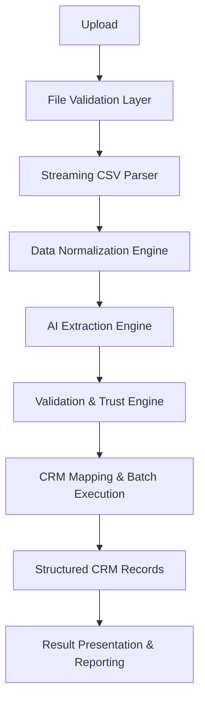

# AI Data Ingestion Engine (AIDE) — Architecture & Engineering Handbook

> **Project Codename:** AI Data Ingestion Engine (AIDE), also referred to as the GrowEasy Smart Import Engine.

This handbook documents the complete architecture of an AI-powered data-ingestion platform. Its first client application is an **AI-powered CSV Importer** that extracts CRM lead information from *any* valid CSV format — Facebook Lead exports, Google Ads exports, real-estate CRM exports, sales reports, agency spreadsheets — and maps them into a canonical CRM schema using large language models.

The core engineering challenge is not parsing CSV files. It is accepting files with **unknown column names, layouts, and structures**, and still extracting the required CRM fields accurately, safely, and at scale.

## How the System Works

At the highest level, the platform is a staged processing pipeline in which every stage has a well-defined contract (see [Chapter 4 — The Pipeline Architecture Mindset](04-pipeline-architecture.md)):

Around this pipeline sit the production concerns that turn an application into a platform: observability, reliability, security, quality engineering, and platform/DevOps engineering (Chapters 15–19).

## How to Read This Book

The book is organized into six parts. Each design chapter (5–19) corresponds to one *engineering volume* — a self-contained unit of design that could be implemented independently and merged into production — and ends with an **Implementation Tasks** checklist.

### Part I — Foundations

| Chapter | Contents |
|---------|----------|
| [Chapter 1 — Assignment Specification](01-assignment-specification.md) | The original product requirements: functional requirements, CRM field schema, AI extraction rules, evaluation criteria |
| [Chapter 2 — Solution Analysis & Design Approach](02-solution-analysis.md) | Problem decomposition; the naive solution vs. the engineered solution |
| [Chapter 3 — Engineering Roadmap & Methodology](03-engineering-roadmap.md) | The 18-volume production roadmap and how it maps to this book's chapters |
| [Chapter 4 — The Pipeline Architecture Mindset](04-pipeline-architecture.md) | Why a staged pipeline with per-stage contracts beats request–response architecture |

### Part II — System & Application Architecture

| Chapter | Contents |
|---------|----------|
| [Chapter 5 — Product Thinking & System Architecture](05-system-architecture.md) | Requirements, personas, system goals, high-level architecture, module boundaries, technology decisions |
| [Chapter 6 — Frontend Architecture](06-frontend-architecture.md) | App shell, upload/preview/confirm/result modules, state management, responsive tables |
| [Chapter 7 — Backend Architecture](07-backend-architecture.md) | API design, service layering, contracts, persistence |

### Part III — The Data Pipeline

| Chapter | Contents |
|---------|----------|
| [Chapter 8 — CSV Processing Engine](08-csv-processing-engine.md) | Streaming parsing, encoding, dialect detection, malformed-input handling |
| [Chapter 9 — Data Normalization Engine](09-data-normalization-engine.md) | Canonicalizing values before AI sees them: dates, phones, emails, whitespace, locales |

### Part IV — The AI Core

| Chapter | Contents |
|---------|----------|
| [Chapter 10 — AI Extraction Engine](10-ai-extraction-engine.md) | Batch LLM extraction, model I/O contracts, cost and token management |
| [Chapter 11 — Prompt Engineering & Semantic Intelligence](11-prompt-engineering.md) | The prompt templates that drive field mapping and extraction |
| [Chapter 12 — Semantic Intelligence & Prompt Orchestration](12-semantic-intelligence.md) | The orchestration engine around prompts: routing, fallbacks, schema enforcement |
| [Chapter 13 — Validation, Business Rules & Trust Engine](13-validation-trust-engine.md) | Enforcing CRM enums, formats, and business rules; deciding what to trust from the model |

### Part V — Running at Scale

| Chapter | Contents |
|---------|----------|
| [Chapter 14 — Execution Engine, Orchestration & Concurrency](14-execution-orchestration.md) | Batch processing, job orchestration, concurrency control, backpressure |
| [Chapter 15 — Observability, Telemetry & Operational Intelligence](15-observability.md) | Logging, metrics, tracing, dashboards, operational insight |
| [Chapter 16 — Reliability, Resilience & Fault Tolerance](16-reliability-resilience.md) | Retries, circuit breakers, graceful degradation, failure isolation |
| [Chapter 17 — Security, Privacy & AI Safety](17-security-ai-safety.md) | Input security, data privacy, prompt-injection defense, AI safety controls |

### Part VI — Delivery & Evolution

| Chapter | Contents |
|---------|----------|
| [Chapter 18 — Quality Engineering, Testing & Continuous Verification](18-quality-engineering.md) | Testing pyramid, AI evaluation framework, golden datasets, quality gates |
| [Chapter 19 — Platform Engineering, DevOps & Production Deployment](19-platform-engineering-devops.md) | CI/CD, environments, infrastructure, disaster recovery, operational excellence |
| [Chapter 20 — Future Evolution & Platform Vision](20-future-evolution.md) | Excel/PDF/OCR ingestion, CRM connectors, human-in-the-loop review, fine-tuned models |

## Design Principles

Three principles recur throughout the book:

> **Applications solve business problems. Platforms enable applications to evolve safely.**

> Think in terms of a **processing pipeline** where each stage has a well-defined contract — not in terms of Frontend ↔ Backend ↔ AI. That makes the system easier to test, easier to debug, and much easier to extend.

> AI output is a **proposal**, not a fact. Every model response passes through validation and trust scoring before it becomes a CRM record.
